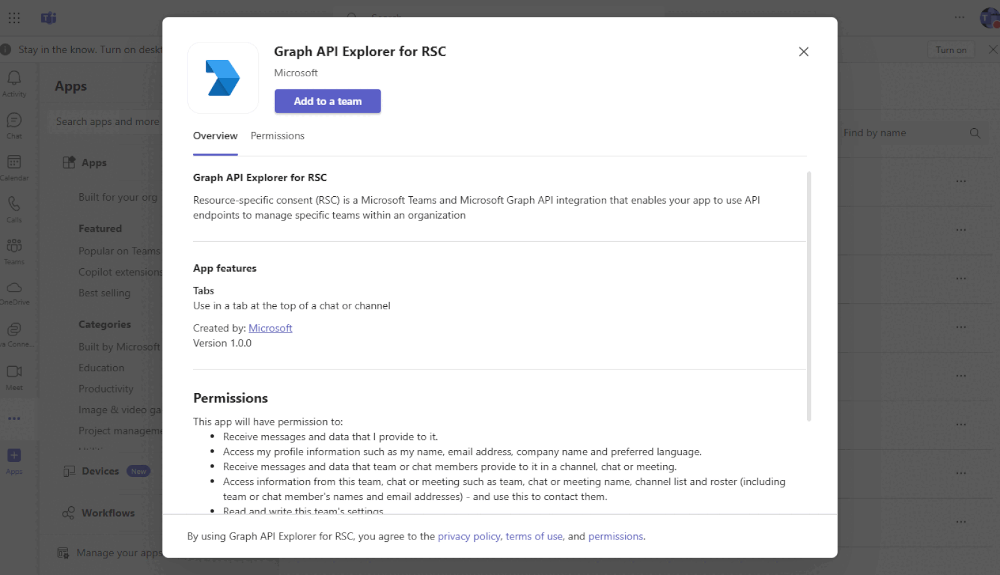

# Resource specific consent with Graph API

This sample demonstrates how to use [Resource Specific Consent](https://learn.microsoft.com/microsoftteams/platform/graph-api/rsc/grant-resource-specific-consent) to call Graph API in Microsoft teams channel and group chat. You can observe the real API response with the scope installed.

## Included Features
* Tab
* RSC Permissions
* Graph
* Tab App in team channel
* Tab App in group chat


## Prerequisites

- [NodeJS](https://nodejs.org/en/) version v16.14.2 or Higher Version
- [dev tunnel](https://learn.microsoft.com/en-us/azure/developer/dev-tunnels/get-started?tabs=windows) or [ngrok](https://ngrok.com/) latest version or equivalent tunnelling solution
- [M365 developer account](https://docs.microsoft.com/microsoftteams/platform/concepts/build-and-test/prepare-your-o365-tenant) or access to a Teams account with the appropriate permissions to install an app.
- [Teams Toolkit for VS Code](https://marketplace.visualstudio.com/items?itemName=TeamsDevApp.ms-teams-vscode-extension)

## Interaction with app


## Run the app (Using Teams Toolkit for Visual Studio Code)

The simplest way to run this sample in Teams is to use Teams Toolkit for Visual Studio Code.

1. Ensure you have downloaded and installed [Visual Studio Code](https://code.visualstudio.com/docs/setup/setup-overview)
1. Install the [Teams Toolkit extension](https://marketplace.visualstudio.com/items?itemName=TeamsDevApp.ms-teams-vscode-extension)
1. Select **File > Open Folder** in VS Code and choose this samples directory from the repo
1. Using the extension, sign in with your Microsoft 365 account where you have permissions to upload custom apps

### Debug in team channel
1. Select **Debug > Debug in team channel for RSC permissions** or **F5** to run the app in a Teams web client
1. In the browser that launches, select the **Add to a team** button to install the app to a team channel
1. Click **Save** to finish the App configureation
   
### Debug in group chat
1. Select **Debug > Debug in group chat for RSC permissions** to run the app in a Teams web client
1. In the browser that launches, select the **Add to a chat** button to install the app to a group chat
1. Click **continue** when popuping devtunnel dialog
1. Click **Save** to finish the App configureation

> If you do not have permission to upload custom apps (sideloading), Teams Toolkit will recommend creating and using a Microsoft 365 Developer Program account - a free program to get your own dev environment sandbox that includes Teams.

## Note
- Due to the length limit of the RSC permission in manifest, separate permission lists are used for team channel and group chat under the `setupManifest` folder.  Every time, debug launch will load the permissions in corresponding team/chat file and write them into the the section of `authorization.permissions.resourceSpecific` in `appManifest/manifest.json`

- The sample provide several parameters in request url and request body. Parameters in format `{...}` will be replaced with default value automatically when the request sent. Parameters in format `[...]` should be replaced by users.

- The sample collects the tenantId, userId, teamId, channelId and chatId information in `views/RSCGraphAPI.ejs` using team-js SDK.

- The sample creates an Aad App using `aad.manifest.json` with basic `User.Read` permission only. The token used to call Graph API is generated as following. The scope for the token is `https://graph.microsoft.com/.default`
``` js
// graph/credential.js
const tenantId = process.env.TenantId;
const clientId = process.env.ClientId;
const clientSecret = process.env.ClientSecret;
const credential = new identity.ClientSecretCredential(tenantId, clientId, clientSecret);

// graph/client.js
const token = await credential.getToken(
    "https://graph.microsoft.com/.default"
);
axios.defaults.headers.common["Authorization"] = `Bearer ${token.token}`; 
```

**App review:**


**Team installation:**


**Chat installation:**


**Graph API response:**


## Further Reading.

- [Graph RSC](https://learn.microsoft.com/microsoftteams/platform/graph-api/rsc/resource-specific-consent)
- [Upload app manifest file](https://docs.microsoft.com//microsoftteams/platform/concepts/deploy-and-publish/apps-upload#load-your-package-into-teams) (zip file) to your team.


