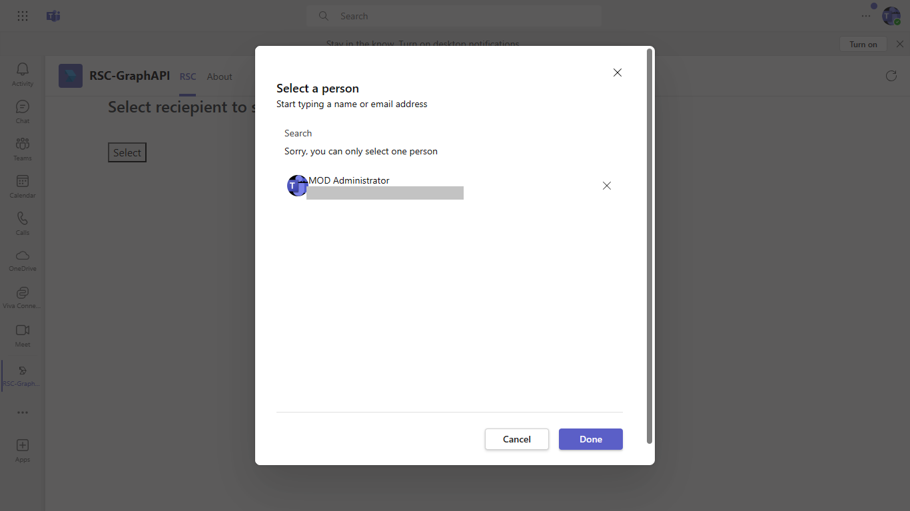
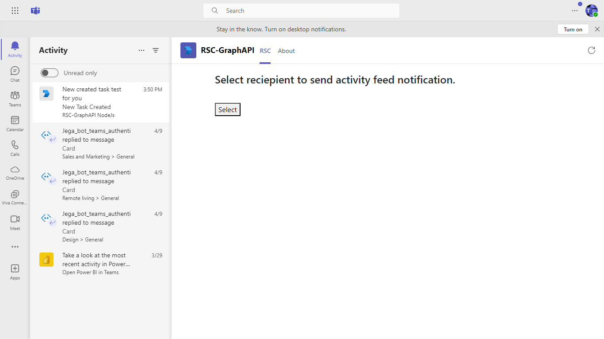

# RSC with Graph API

This sample application showcases how to implement Resource Specific Consent (RSC) for accessing Microsoft Graph APIs within Microsoft Teams. It provides capabilities for requesting permissions, interacting through a Teams tab, and managing user notifications, enhancing the app's integration and usability.

## Included Features
* Tabs
* RSC Permissions

## Interaction with app


## Try it yourself - experience the App in your Microsoft Teams client
Please find below demo manifest which is deployed on Microsoft Azure and you can try it yourself by uploading the app manifest (.zip file link below) to your teams and/or as a personal app. (Uploading must be enabled for your tenant, [see steps here](https://docs.microsoft.com/microsoftteams/platform/concepts/build-and-test/prepare-your-o365-tenant#enable-custom-teams-apps-and-turn-on-custom-app-uploading)).

**RSC with Graph API:** [Manifest](/samples/graph-rsc/csharp/demo-manifest/graph-rsc.zip)

## Prerequisites

- [.NET Core SDK](https://dotnet.microsoft.com/download) version 6.0

  ```bash
  # determine dotnet version
  dotnet --version
  ```

- [Graph explorer](https://developer.microsoft.com//graph/graph-explorer)    

- [Teams Toolkit for Visual Studio](https://learn.microsoft.com/en-us/microsoftteams/platform/toolkit/toolkit-v4/install-teams-toolkit-vs?pivots=visual-studio-v17-7)

## Run the app (Using Teams Toolkit for Visual Studio)

The simplest way to run this sample in Teams is to use Teams Toolkit for Visual Studio.
1. Install Visual Studio 2022 **Version 17.14 or higher** [Visual Studio](https://visualstudio.microsoft.com/downloads/)
1. Install Teams Toolkit for Visual Studio [Teams Toolkit extension](https://learn.microsoft.com/en-us/microsoftteams/platform/toolkit/toolkit-v4/install-teams-toolkit-vs?pivots=visual-studio-v17-7)
1. In the debug dropdown menu of Visual Studio, select default startup project > **Microsoft Teams (browser)**
1. Right-click the 'M365Agent' project in Solution Explorer and select **Microsoft 365 Agents Toolkit > Select Microsoft 365 Account**
1. Sign in to Microsoft 365 Agents Toolkit with a **Microsoft 365 work or school account**
1. Set `Startup Item` as `Microsoft Teams (browser)`.
1. Press F5, or select Debug > Start Debugging menu in Visual Studio to start your app
    </br>
1. In the opened web browser, select Add button to install the app in Teams
> If you do not have permission to upload custom apps (uploading), Microsoft 365 Agents Toolkit will recommend creating and using a Microsoft 365 Developer Program account - a free program to get your own dev environment sandbox that includes Teams.

### Register your app with Azure AD.

  1. Register a new application in the [Microsoft Entra ID – App Registrations](https://go.microsoft.com/fwlink/?linkid=2083908) portal.
  2. Select **New Registration** and on the *register an application page*, set following values:
      * Set **name** to your app name.
      * Choose the **supported account types** (any account type will work)
      * Leave **Redirect URI** empty.
      * Choose **Register**.
  3. On the overview page, copy and save the **Application (client) ID, Directory (tenant) ID**. You'll need those later when updating your Teams application manifest and in the appsettings.json.
  4. Navigate to **API Permissions**, and make sure to add the follow permissions:
   Select Add a permission
      * Select Add a permission
      * Select Microsoft Graph -\> Delegated permissions.
      * `User.Read` (enabled by default)
      * Click on Add permissions. Please make sure to grant the admin consent for the required permissions.


## Setup

1) Register your app with Microsoft identity platform via the Microsoft Entra ID portal (Microsoft Entra ID app registration)
    - Your app must be registered in the Microsoft Entra ID portal to integrate with the Microsoft identity platform and call Microsoft Graph APIs. See [Register an application with the Microsoft identity platform](https://docs.microsoft.com/graph/auth-register-app-v2). 
**Note** -  Make sure you have added below permissions
1. `TeamsAppInstallation.ReadForUser.All` as Application level 
2. `TeamsActivity.Send` as Application level 

2) Clone the repository
   ```bash
   git clone https://github.com/OfficeDev/microsoft-teams-samples.git
   ```

3) Build your solution
      - Launch Visual Studio
      - File -> Open -> Project/Solution
      - Navigate to `samples/graph-rsc` folder
      - Select `RSCDemo.sln` file
      - Build the solution

4) Run ngrok - point to port 3978

   ```bash
   ngrok http 3978 --host-header="localhost:3978"
   ```  

   Alternatively, you can also use the `dev tunnels`. Please follow [Create and host a dev tunnel](https://learn.microsoft.com/en-us/azure/developer/dev-tunnels/get-started?tabs=windows) and host the tunnel with anonymous user access command as shown below:

   ```bash
   devtunnel host -p 3978 --allow-anonymous
   ```

5)  Update appsettings.json
    - Update configuration for `<<Client Id>>`, `<<Client Secret>>` and ``<<Tenant Id>>`` with the ```MicrosoftAppId``` ,  ```MicrosoftAppPassword``` and ```TenantId``` which was generated while doing Microsoft Entra ID app registration in your Azure Portal.

6) Run the bot from Visual Studio: 
    - Press `F5` to run the project

7) Setup the `manifest.json` in the `/appPackage` folder 
   Replace the following details:
    - Replace `<<Your Microsoft APP Id>>` at all the places with your MicrosoftAppId received while doing Microsoft Entra ID app registration in Azure portal
    - `[Your tunnel Domain]` with base Url domain. E.g. if you are using ngrok it would be `https://1234.ngrok-free.app` then your domain-name will be `1234.ngrok-free.app` and if you are using dev tunnels then your domain will be like: `12345.devtunnels.ms`.
    - **Zip** up the contents of the `appPackage` folder to create a `manifest.zip`
    - **Upload** the `manifest.zip` to Teams (in the Apps view click "Upload a custom app")

## Running the sample

**App review:**
 

**App permission:**
 

**Permission list:**
 

 **Tab Page**


**Select Reciepient**


**Sent Notification**


## Further Reading.

- [Graph RSC](https://learn.microsoft.com/microsoftteams/platform/graph-api/rsc/resource-specific-consent)
- [Upload app manifest file](https://docs.microsoft.com/microsoftteams/platform/concepts/deploy-and-publish/apps-upload#load-your-package-into-teams) (zip file) to your team.

