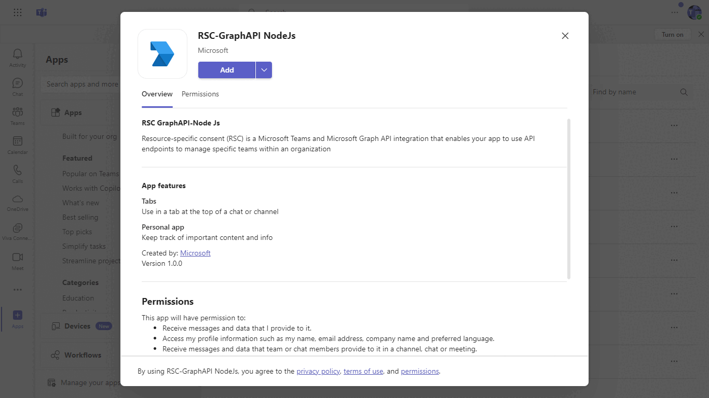
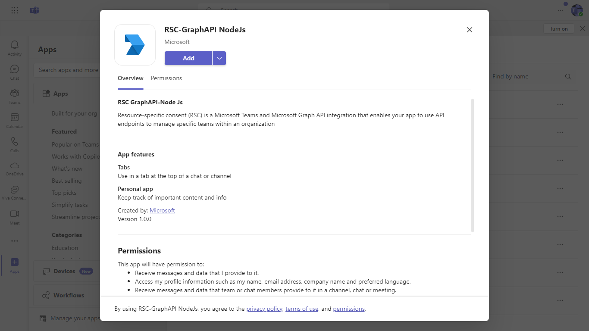
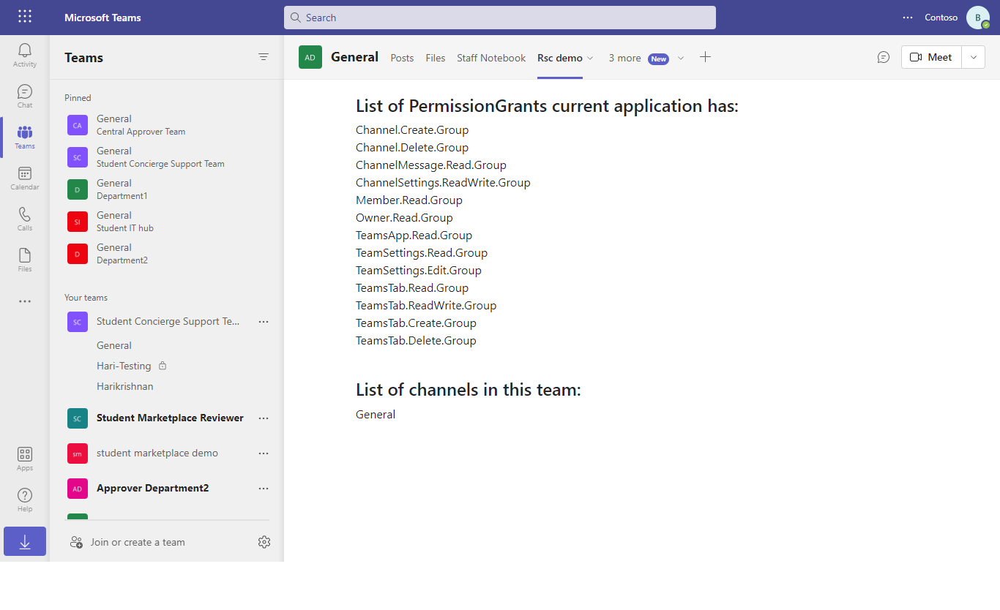

# Resource specific consent with Graph API

This sample illustrates you can use [Resource Specific Consent](https://docs.microsoft.com/microsoftteams/platform/graph-api/rsc/resource-specific-consent) to call Graph API.

## Included Features
* Tabs
* RSC Permissions

## Interaction with app.



## Try it yourself - experience the App in your Microsoft Teams client
Please find below demo manifest which is deployed on Microsoft Azure and you can try it yourself by uploading the app package (.zip file link below) to your teams and/or as a personal app. (Sideloading must be enabled for your tenant, [see steps here](https://docs.microsoft.com/microsoftteams/platform/concepts/build-and-test/prepare-your-o365-tenant#enable-custom-teams-apps-and-turn-on-custom-app-uploading)).

**RSC with Graph API:** [Manifest](/samples/graph-rsc/csharp/demo-manifest/graph-rsc.zip)

## Prerequisites

- [NodeJS](https://nodejs.org/en/) version v16.14.2 or Higher Version
- [ngrok](https://ngrok.com/) or equivalent tunnelling solution
- [M365 developer account](https://docs.microsoft.com/microsoftteams/platform/concepts/build-and-test/prepare-your-o365-tenant) or access to a Teams account with the appropriate permissions to install an app.

## Setup
1) Register your app with Microsoft identity platform via the Azure AD portal (AAD app registration in Azure portal)
    - Your app must be registered in the Azure AD portal to integrate with the Microsoft identity platform and call Microsoft Graph APIs. See [Register an application with the Microsoft identity platform](https://docs.microsoft.com/graph/auth-register-app-v2). 

2) Clone the repository

    ```bash
    git clone https://github.com/OfficeDev/Microsoft-Teams-Samples.git
    ```

3) In a terminal, navigate to `samples/graph-rsc/nodejs`

4) Install modules

    ```bash
    npm install
    ```

5) Run ngrok - point to port 3978

    ```bash
    ngrok http 3978 --host-header="localhost:3978"
    ```

6) Update the `.env` file configuration (ClientId, ClientSecret) for the bot to use the Microsoft App Id and App Password from the AAD app registration in your Azure Portal or from Bot Framework registration. (Note the App Password is referred to as the "client secret" in the azure portal and you can always create a new client secret anytime.)

7) Run your bot at the command line:

    ```bash
    npm start
    ```

8) __*This step is specific to Teams.*__
    - **Edit** the `manifest.json` contained in the  `teamsManifest` folder to replace your Microsoft App Id (that was created when you registered your bot earlier) *everywhere* you see the place holder string `<<app id>>` (depending on the scenario the Microsoft App Id may occur multiple times in the `manifest.json`)
    - `[Your Ngrok Domain]` with base Url domain. E.g. if you are using ngrok it would be `https://1234.ngrok-free.app` then your domain-name will be `1234.ngrok-free.app`.
    - **Zip** up the contents of the `teamsManifest` folder to create a `manifest.zip`
    - **Upload** the `manifest.zip` to Teams (in the Apps view click "Upload a custom app")

##  Running the sample

**App review:**


**App permission:**


**Permission list:**


## Further Reading.

- [Graph RSC](https://learn.microsoft.com/microsoftteams/platform/graph-api/rsc/resource-specific-consent)
- [Upload app manifest file](https://docs.microsoft.com//microsoftteams/platform/concepts/deploy-and-publish/apps-upload#load-your-package-into-teams) (zip file) to your team.


