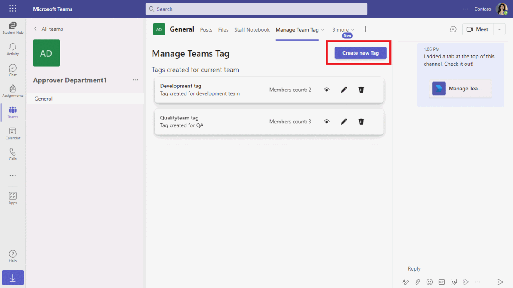
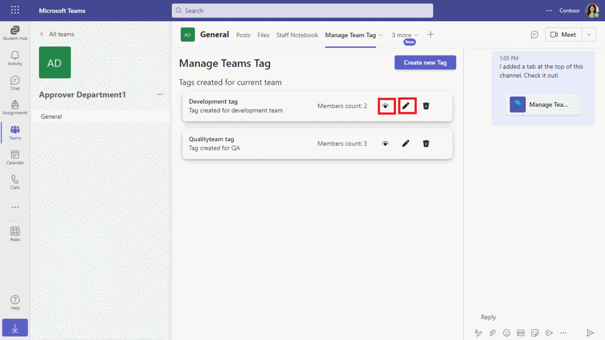
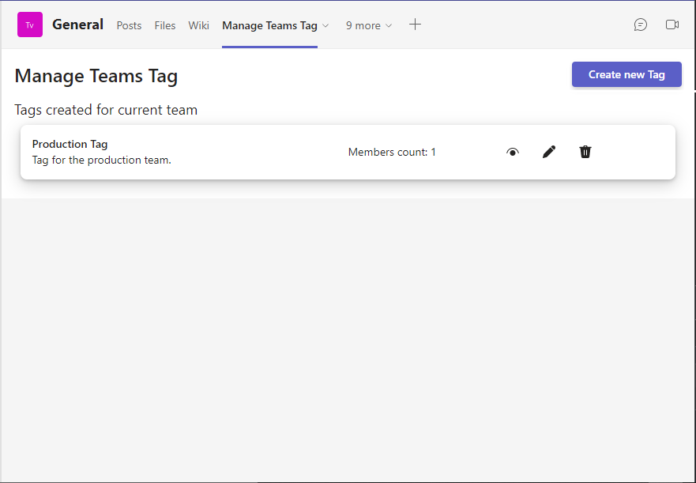
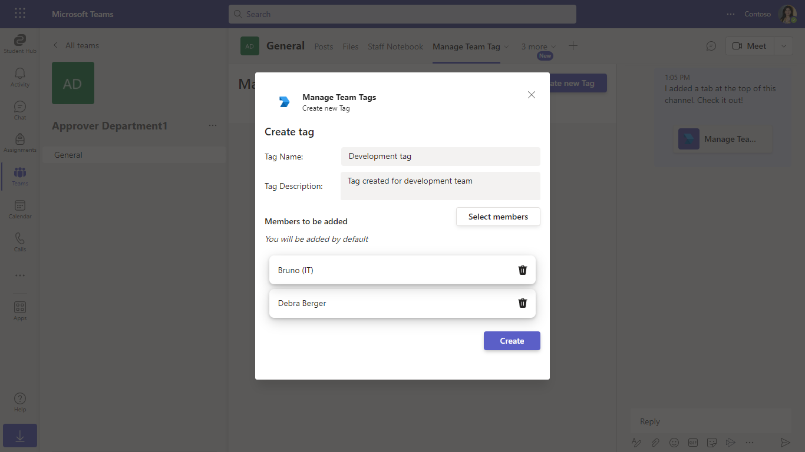

# Graph teams tag

This sample application illustrates how to implement CRUD operations for team tags using the Microsoft Graph API within a Microsoft Teams tab. Users can easily create, update, and manage tags, with full integration of Teams Single Sign-On (SSO) and Graph API functionalities, providing a complete solution for teamwork and collaboration.

## Included Features
* Teams SSO (tabs)
* Graph API
* Teamwork Tags

## Interaction with app

**Tag creation flow*


**Tag updation flow*


## Prerequisites

- Microsoft Teams is installed and you have an account (not a guest account)
-  .[NET 6.0](https://dotnet.microsoft.com/en-us/download) SDK.
    ```bash
        # determine dotnet version
        dotnet --version
    ```
-  [dev tunnel](https://learn.microsoft.com/en-us/azure/developer/dev-tunnels/get-started?tabs=windows) or [ngrok](https://ngrok.com/download) latest version or equivalent tunneling solution
-  [M365 developer account](https://docs.microsoft.com/en-us/microsoftteams/platform/concepts/build-and-test/prepare-your-o365-tenant) or access to a Teams account with the appropriate permissions to install an app.
- [Microsoft 365 Agents Toolkit for Visual Studio](https://learn.microsoft.com/en-us/microsoftteams/platform/toolkit/toolkit-v4/install-teams-toolkit-vs?pivots=visual-studio-v17-7)

## Run the app (Using Microsoft 365 Agents Toolkit for Visual Studio)

The simplest way to run this sample in Teams is to use Microsoft 365 Agents Toolkit for Visual Studio.
1. Install Visual Studio 2022 **Version 17.14 or higher** [Visual Studio](https://visualstudio.microsoft.com/downloads/)
1. Install Microsoft 365 Agents Toolkit for Visual Studio [Microsoft 365 Agents Toolkit extension](https://learn.microsoft.com/en-us/microsoftteams/platform/toolkit/toolkit-v4/install-teams-toolkit-vs?pivots=visual-studio-v17-7)
1. In the debug dropdown menu of Visual Studio, select default startup project > **Microsoft Teams (browser)**
1. Right-click the 'M365Agent' project in Solution Explorer and select **Microsoft 365 Agents Toolkit > Select Microsoft 365 Account**
1. Sign in to Microsoft 365 Agents Toolkit with a **Microsoft 365 work or school account**
1. Set `Startup Item` as `Microsoft Teams (browser)`.
1. Press F5, or select Debug > Start Debugging menu in Visual Studio to start your app
    </br>
1. In the opened web browser, select Add button to install the app in Teams
> If you do not have permission to upload custom apps (uploading), Microsoft 365 Agents Toolkit will recommend creating and using a Microsoft 365 Developer Program account - a free program to get your own dev environment sandbox that includes Teams.

### Register your app with Azure AD.

  1. Register a new application in the [Microsoft Entra ID – App Registrations](https://go.microsoft.com/fwlink/?linkid=2083908) portal.
  2. Select **New Registration** and on the *register an application page*, set following values:
      * Set **name** to your app name.
      * Choose the **supported account types** (any account type will work)
      * Leave **Redirect URI** empty.
      * Choose **Register**.
  3. On the overview page, copy and save the **Application (client) ID, Directory (tenant) ID**. You'll need those later when updating your Teams application manifest and in the appsettings.json.
  4. Navigate to **API Permissions**, and make sure to add the follow permissions:
   Select Add a permission
      * Select Add a permission
      * Select Microsoft Graph -\> Delegated permissions.
      * `User.Read` (enabled by default)
      * Click on Add permissions. Please make sure to grant the admin consent for the required permissions.


## Setup

1. Register a new application in the [Microsoft Entra ID – App Registrations](https://go.microsoft.com/fwlink/?linkid=2083908) portal.
2. On the overview page, copy and save the **Application (client) ID, Directory (tenant) ID**. You’ll need those later when updating your Teams application manifest and in the appsettings.json.
3. Navigate to **API Permissions**, and make sure to add the follow permissions:
-   Select Add a permission
-   Select Microsoft Graph -> Application permissions.
   - `TeamworkTag.ReadWrite.All`

-   Click on Add permissions. Please make sure to grant the admin consent for the required permissions.

4.  Navigate to the **Certificates & secrets**. In the Client secrets section, click on "+ New client secret". Add a description (Name of the secret) for the secret and select “Never” for Expires. Click "Add". Once the client secret is created, copy its value, it need to be placed in the appsettings.json file.

> Note these instructions are for running the sample on your local machine, the tunnelling solution is required because
> the Teams service needs to call into the app.


5. Start tunnel on localhost:3978
   - If you are using Ngrok, Open ngrok and run command `ngrok http 3978 --host-header="localhost:3978"` 
   -  Once started you should see link `https://xxxxx.ngrok-free.app`. Copy it, this is your baseUrl that will used as endpoint for Azure bot.
   
   Alternatively, you can also use the `dev tunnels`. Please follow [Create and host a dev tunnel](https://learn.microsoft.com/en-us/azure/developer/dev-tunnels/get-started?tabs=windows) and host the tunnel with anonymous user access command as shown below:

   ```bash
   devtunnel host -p 3978 --allow-anonymous
   ```

   

6. Clone the repository
   ```bash
   git clone https://github.com/OfficeDev/Microsoft-Teams-Samples.git
   ```

  - Launch Visual Studio
   - File -> Open -> Project/Solution
   - Navigate to folder where repository is cloned then `samples/graph-teams-tag/csharp/GraphTeamsTag.sln`  
 

  - Update appsettings.json
   Update configuration with the ```MicrosoftAppId```,  ```MicrosoftAppPassword``` and ```MicrosoftAppTenantId``` with the values generated while doing Microsoft Entra ID app registration in Azure Portal.

 - Run the bot from Visual Studio: 
   - Press `F5` to run the project

7. Setup the `manifest.json` in the `/appPackage` folder 
Replace the following details:
- `{{APP-ID}}` with any GUID id value or your MicrosoftAppId.
- `{{BASE-URL}}` with base Url domain. E.g. if you are using ngrok it would be `https://1234.ngrok-free.app` then your domain-name will be `1234.ngrok-free.app` and if you are using dev tunnels then your domain will be like: `12345.devtunnels.ms`.
- **Zip** up the contents of the `appPackage` folder to create a `manifest.zip`
- **Upload** the `manifest.zip` to Teams (in the Apps view click "Upload a custom app")

## Running the sample

**User can see list of tags created for the current team.**


**User can view/edit the existing team tags.**


**User can create new team tags.**


**User can delete existing team tags.**

## Further reading
- [TeamworkTag resource type](https://docs.microsoft.com/en-us/graph/api/resources/teamworktag?view=graph-rest-beta)


