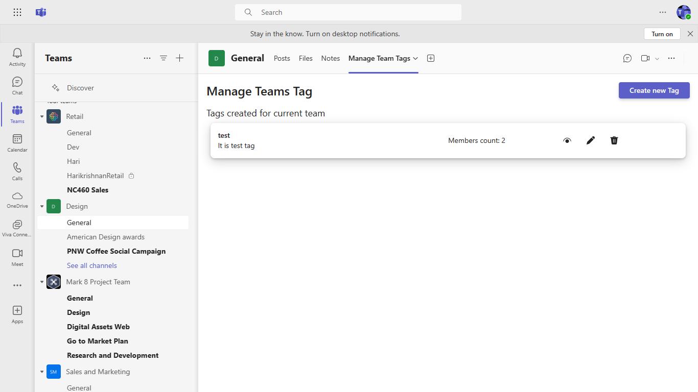
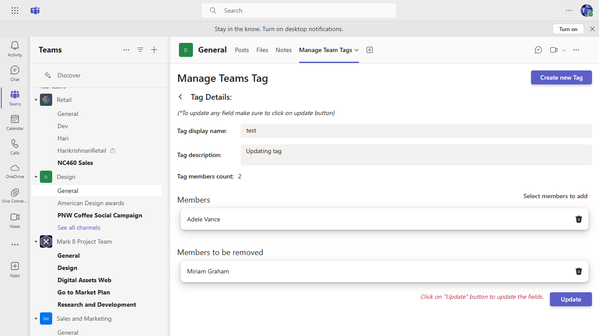

# Graph teams tag

This sample application illustrates how to implement full CRUD operations for team tags using Microsoft Graph API within a Microsoft Teams tab. Users can easily create, edit, view, and delete tags, with comprehensive integration of Teams Single Sign-On (SSO) and the Graph API, ensuring a smooth user experience in managing team collaboration.

## Included Features
* Teams SSO (tabs)
* Graph API
* Teamwork Tags

## Interaction with app

- Create new tags.


- View/Edit existing tags.


## Prerequisites

- Microsoft Teams is installed and you have an account (not a guest account)
-  [NodeJS](https://nodejs.org/en/)
-  [dev tunnel](https://learn.microsoft.com/en-us/azure/developer/dev-tunnels/get-started?tabs=windows) or [ngrok](https://ngrok.com/download) latest version or equivalent tunneling solution
-  [M365 developer account](https://docs.microsoft.com/en-us/microsoftteams/platform/concepts/build-and-test/prepare-your-o365-tenant) or access to a Teams account with the appropriate permissions to install an app.
- [Microsoft 365 Agents Toolkit for VS Code](https://marketplace.visualstudio.com/items?itemName=TeamsDevApp.ms-teams-vscode-extension) or [TeamsFx CLI](https://learn.microsoft.com/microsoftteams/platform/toolkit/teamsfx-cli?pivots=version-one)

## Run the app (Using Microsoft 365 Agents Toolkit for Visual Studio Code)

The simplest way to run this sample in Teams is to use Microsoft 365 Agents Toolkit for Visual Studio Code.

1. Ensure you have downloaded and installed [Visual Studio Code](https://code.visualstudio.com/docs/setup/setup-overview)
1. Install the [Microsoft 365 Agents Toolkit extension](https://marketplace.visualstudio.com/items?itemName=TeamsDevApp.ms-teams-vscode-extension)
1. Select **File > Open Folder** in VS Code and choose this samples directory from the repo
1. Using the extension, sign in with your Microsoft 365 account where you have permissions to upload custom apps
1. Select **Debug > Start Debugging** or **F5** to run the app in a Teams web client.
1. In the browser that launches, select the **Add** button to install the app to Teams.

## Setup
### Register you app with Azure AD.

  1. Register a new application in the [Azure Active Directory – App Registrations](https://go.microsoft.com/fwlink/?linkid=2083908) portal.
  2. Select **New Registration** and on the *register an application page*, set following values:
      * Set **name** to your app name.
      * Choose the **supported account types** (any account type will work)
      * Leave **Redirect URI** empty.
      * Choose **Register**.
  3. On the overview page, copy and save the **Application (client) ID, Directory (tenant) ID**. You’ll need those later when updating your Teams application manifest and in the .env.
  4. Under **Manage**, select **Expose an API**. 
  5. Select the **Set** link to generate the Application ID URI in the form of `api://{base-url}/{AppID}`. Insert your fully qualified domain name (with a forward slash "/" appended to the end) between the double forward slashes and the GUID. The entire ID should have the form of: `api://fully-qualified-domain-name/{AppID}`
      * ex: `api://%ngrokDomain%.ngrok-free.app/00000000-0000-0000-0000-000000000000`.
  6. Select the **Add a scope** button. In the panel that opens, enter `access_as_user` as the **Scope name**.
  7. Set **Who can consent?** to `Admins and users`
  8. Fill in the fields for configuring the admin and user consent prompts with values that are appropriate for the `access_as_user` scope:
      * **Admin consent title:** Teams can access the user’s profile.
      * **Admin consent description**: Allows Teams to call the app’s web APIs as the current user.
      * **User consent title**: Teams can access the user profile and make requests on the user's behalf.
      * **User consent description:** Enable Teams to call this app’s APIs with the same rights as the user.
  9. Ensure that **State** is set to **Enabled**
  10. Select **Add scope**
      * The domain part of the **Scope name** displayed just below the text field should automatically match the **Application ID** URI set in the previous step, with `/access_as_user` appended to the end:
          * `api://[ngrokDomain].ngrok-free.app/00000000-0000-0000-0000-000000000000/access_as_user.
  11. In the **Authorized client applications** section, identify the applications that you want to authorize for your app’s web application. Each of the following IDs needs to be entered:
      * `1fec8e78-bce4-4aaf-ab1b-5451cc387264` (Teams mobile/desktop application)
      * `5e3ce6c0-2b1f-4285-8d4b-75ee78787346` (Teams web application)
  12. Navigate to **API Permissions**, and make sure to add the follow permissions:
  -   Select Add a permission
  -   Select Microsoft Graph -\> Delegated permissions.
      - `TeamworkTag.ReadWrite.All` (enabled by default)
      - `User.Read` (enabled by default)
  -   Click on Add permissions. Please make sure to grant the admin consent for the required permissions.

**NOTE:** When you create app registration, you will create an App ID and App password - make sure you keep these for later.

3. Setup NGROK
 - Run ngrok - point to port 3978

   ```bash
   ngrok http 3978 --host-header="localhost:3978"
   ```  

   Alternatively, you can also use the `dev tunnels`. Please follow [Create and host a dev tunnel](https://learn.microsoft.com/en-us/azure/developer/dev-tunnels/get-started?tabs=windows) and host the tunnel with anonymous user access command as shown below:

   ```bash
   devtunnel host -p 3978 --allow-anonymous
   ```

4. Setup for code

  - Clone the repository

    ```bash
    git clone https://github.com/OfficeDev/Microsoft-Teams-Samples.git
    ```
  - Update the `.env` configuration for the bot to use the `MicrosoftAppId`, `MicrosoftAppPassword` and `MicrosoftAppTenantId`. (Note the MicrosoftAppId is the AppId created in step 1 (Setup for Bot), the MicrosoftAppPassword is referred to as the "client secret" in step 1 (Setup for Bot) and you can always create a new client secret anytime.) MicrosoftAppTenantId  created in step 1 (Setup for Bot), the MicrosoftAppTenantId is referred to as the "Directory (tenant) ID"

  - Navigate to project
    In the folder where repository is cloned navigate to `samples/graph-teams-tag/nodejs`


 - Install node modules and run server 

    Inside node js folder, open your local terminal and run the below command to install node modules. You can do the same in Visual studio code terminal by opening the project in Visual studio code 

   ```bash
   npm install
   ```

   ```bash
   npm start
   ```

   - Install node modules and run client 

    Navigate to **client** folder, Open your local terminal and run the below command to install node modules. You can do the same in Visual studio code terminal by opening the project in Visual studio code 

    ```bash
     cd client
     npm install
     ```

     ```bash
      npm start
     ```
    
5. Setup Manifest for Teams
- __*This step is specific to Teams.*__
    - **Edit** the `manifest.json` contained in the ./appManifest folder to replace your Microsoft App Id (that was created when you registered your app registration earlier) *everywhere* you see the place holder string `{{Microsoft-App-Id}}` (depending on the scenario the Microsoft App Id may occur multiple times in the `manifest.json`)
    - **Edit** the `manifest.json` for `validDomains` and replace `{{domain-name}}` with base Url of your domain. E.g. if you are using ngrok it would be `https://1234.ngrok-free.app` then your domain-name will be `1234.ngrok-free.app` and if you are using dev tunnels then your domain will be like: `12345.devtunnels.ms`.
    - **Zip** up the contents of the `appManifest` folder to create a `manifest.zip` (Make sure that zip file does not contains any subfolder otherwise you will get error while uploading your .zip package)

- Upload the manifest.zip to Teams (in the Apps view click "Upload a custom app")
   - Go to Microsoft Teams. From the lower left corner, select Apps
   - From the lower left corner, choose Upload a custom App
   - Go to your project directory, the ./appManifest folder, select the zip folder, and choose Open.
   - Select Add in the pop-up dialog box. Your app is uploaded to Teams.

## Running the sample

1. User can see list of tags created for the current team.

2. User can view/edit the existing team tags.

3. User can create new team tags.

4. User can delete existing team tags.

## Further reading
- [teamworkTag resource type](https://docs.microsoft.com/en-us/graph/api/resources/teamworktag?view=graph-rest-beta)


