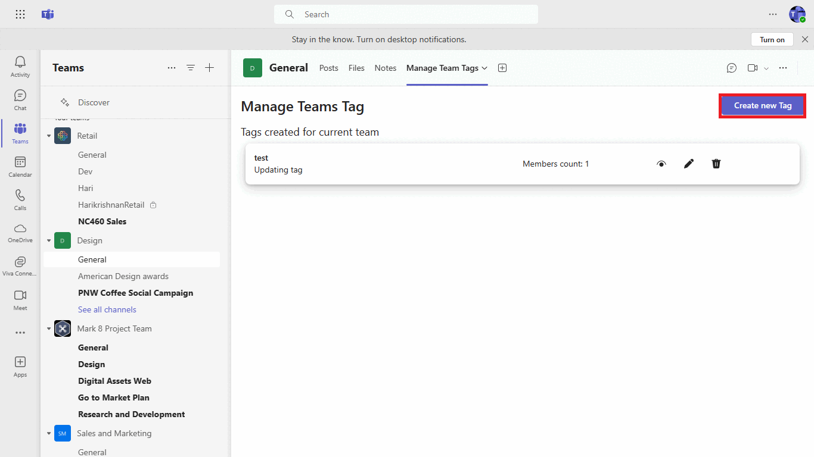

# Graph teams tag

This is a sample application where user can create, update, add or remove members of a tag. All of Graph CRUD operations related to tags can be performed within this sample.

## Included Features
* Teams SSO (tabs)
* Graph API
* Teamwork Tags

## Interaction with app

- Create new tags.



- View/Edit existing tags.


## Prerequisites

- Microsoft Teams is installed and you have an account (not a guest account)
-  [NodeJS](https://nodejs.org/en/)
-  [ngrok](https://ngrok.com/download) or equivalent tunneling solution
-  [M365 developer account](https://docs.microsoft.com/en-us/microsoftteams/platform/concepts/build-and-test/prepare-your-o365-tenant) or access to a Teams account with the appropriate permissions to install an app.

## Setup

### Register your application with Azure AD

1. Register a new application in the [Azure Active Directory – App Registrations](https://go.microsoft.com/fwlink/?linkid=2083908) portal.
  - On the overview page, copy and save the **Application (client) ID, Directory (tenant) ID**. You’ll need those later when updating your Teams application manifest and in the appsettings.json.
  - Navigate to **API Permissions**, and make sure to add the follow permissions:
     - Select Add a permission
     -  Select Microsoft Graph -> Application permissions.
     - `TeamworkTag.ReadWrite.All`

   - Click on Add permissions. Please make sure to grant the admin consent for the required permissions.

   - Navigate to the **Certificates & secrets**. In the Client secrets section, click on "+ New client secret". Add a description (Name of the secret) for the secret and select “Never” for Expires. Click "Add". Once the client secret is created, copy its value, it need to be placed in the .env file.

 2. Setup for Bot
- In Azure portal, create a [Azure Bot resource](https://docs.microsoft.com/en-us/azure/bot-service/bot-builder-authentication?view=azure-bot-service-4.0&tabs=csharp%2Caadv2).
- Ensure that you've [enabled the Teams Channel](https://docs.microsoft.com/en-us/azure/bot-service/channel-connect-teams?view=azure-bot-service-4.0)

**NOTE:** When you create app registration, you will create an App ID and App password - make sure you keep these for later.

3. Setup NGROK
   - Run ngrok - point to port 3978

    ```bash
    ngrok http 3978 --host-header="localhost:3978"
    ```
4. Setup for code

  - Clone the repository

    ```bash
    git clone https://github.com/OfficeDev/Microsoft-Teams-Samples.git
    ```
  - Update the `.env` configuration for the bot to use the `MicrosoftAppId`, `MicrosoftAppPassword` and `MicrosoftAppTenantId`. (Note the MicrosoftAppId is the AppId created in step 1 (Setup for Bot), the MicrosoftAppPassword is referred to as the "client secret" in step 1 (Setup for Bot) and you can always create a new client secret anytime.) MicrosoftAppTenantId  created in step 1 (Setup for Bot), the MicrosoftAppTenantId is referred to as the "Directory (tenant) ID"

  - Navigate to project
    In the folder where repository is cloned navigate to `samples/graph-teams-tag/nodejs`


 - Install node modules and run server 

    Inside node js folder, open your local terminal and run the below command to install node modules. You can do the same in Visual studio code terminal by opening the project in Visual studio code 

   ```bash
   npm install
   ```

   ```bash
   npm start
   ```

   - Install node modules and run client 

    Navigate to **client** folder, Open your local terminal and run the below command to install node modules. You can do the same in Visual studio code terminal by opening the project in Visual studio code 

    ```bash
     cd client
     npm install
     ```

     ```bash
      npm start
     ```
    
5. Setup Manifest for Teams
- __*This step is specific to Teams.*__
    - **Edit** the `manifest.json` contained in the ./teamsAppManifest folder to replace your Microsoft App Id (that was created when you registered your app registration earlier) *everywhere* you see the place holder string `{{Microsoft-App-Id}}` (depending on the scenario the Microsoft App Id may occur multiple times in the `manifest.json`)
    - **Edit** the `manifest.json` for `validDomains` and replace `{{domain-name}}` with base Url of your domain. E.g. if you are using ngrok it would be `https://1234.ngrok-free.app` then your domain-name will be `1234.ngrok-free.app`.
    - **Zip** up the contents of the `teamsAppManifest` folder to create a `manifest.zip` (Make sure that zip file does not contains any subfolder otherwise you will get error while uploading your .zip package)

- Upload the manifest.zip to Teams (in the Apps view click "Upload a custom app")
   - Go to Microsoft Teams. From the lower left corner, select Apps
   - From the lower left corner, choose Upload a custom App
   - Go to your project directory, the ./teamsAppManifest folder, select the zip folder, and choose Open.
   - Select Add in the pop-up dialog box. Your app is uploaded to Teams.

## Running the sample

1. User can see list of tags created for the current team.

2. User can view/edit the existing team tags.

3. User can create new team tags.

4. User can delete existing team tags.

## Further reading
- [teamworkTag resource type](https://docs.microsoft.com/en-us/graph/api/resources/teamworktag?view=graph-rest-beta)


