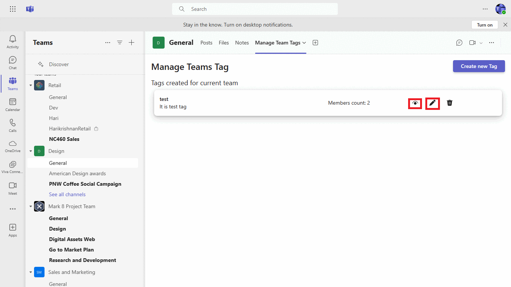
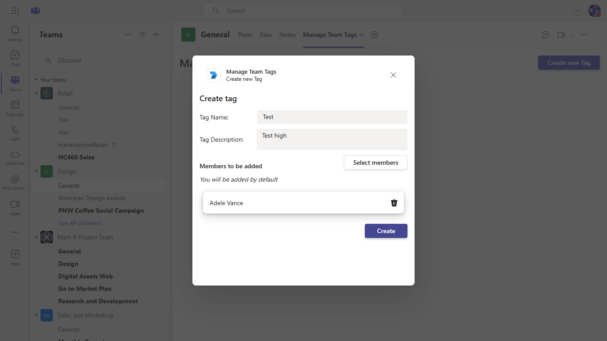

# This is a sample application that shows the usage of Graph CRUD operations related to team tags.

This is a sample application where user can create, update, add or remove members of a tag. All of Graph CRUD operations related to tags can be performed within this sample.

## Key features

1. Create new tags.


2. View/Edit existing tags.




## Prerequisites

- Microsoft Teams is installed and you have an account (not a guest account)
-  [NodeJS](https://nodejs.org/en/)
-  [ngrok](https://ngrok.com/) or equivalent tunneling solution
-  [M365 developer account](https://docs.microsoft.com/en-us/microsoftteams/platform/concepts/build-and-test/prepare-your-o365-tenant) or access to a Teams account with the appropriate permissions to install an app.

## Run app locally

### Register your application with Azure AD

1. Register a new application in the [Azure Active Directory – App Registrations](https://go.microsoft.com/fwlink/?linkid=2083908) portal.
2. On the overview page, copy and save the **Application (client) ID, Directory (tenant) ID**. You’ll need those later when updating your Teams application manifest and in the appsettings.json.
3. Navigate to **API Permissions**, and make sure to add the follow permissions:
-   Select Add a permission
-   Select Microsoft Graph -> Application permissions.
   - `TeamworkTag.ReadWrite.All`

-   Click on Add permissions. Please make sure to grant the admin consent for the required permissions.

4.  Navigate to the **Certificates & secrets**. In the Client secrets section, click on "+ New client secret". Add a description (Name of the secret) for the secret and select “Never” for Expires. Click "Add". Once the client secret is created, copy its value, it need to be placed in the .env file.

## To try this sample

> Note these instructions are for running the sample on your local machine, the tunnelling solution is required because
> the Teams service needs to call into the app.

### 1. Clone the repository
   ```bash
   git clone https://github.com/OfficeDev/Microsoft-Teams-Samples.git
   ```

### 2. Navigate to project
In the folder where repository is cloned navigate to `samples/graph-teams-tag/nodejs`

### 3. Update the `.env`
Update configuration with the ```MicrosoftAppId```,  ```MicrosoftAppPassword``` and ```MicrosoftAppTenantId```.

### 4. Run ngrok - point to port 3978

```bash
ngrok http -host-header=rewrite 3978
```


### 3. Install node modules and run server 

 Inside node js folder, open your local terminal and run the below command to install node modules. You can do the same in Visual studio code terminal by opening the project in Visual studio code 

```bash
npm install
```

```bash
npm start
```

### 3. Install node modules and run client 

 Navigate to **client** folder, Open your local terminal and run the below command to install node modules. You can do the same in Visual studio code terminal by opening the project in Visual studio code 

```bash
cd client
npm install
```

```bash
npm start
```
    
### 4. Manually update the manifest.json
- **Edit** the `manifest.json` contained in the `Manifest` folder to replace your Base url wherever you see the place holder string `<<BASE-URL>>`. Also replace any random guid with the place holder `<<APP-ID>>`.
- **Zip** up the contents of the `Manifest` folder to create a `manifest.zip`
- **Upload** the `manifest.zip` to Teams (in the Apps view click "Upload a custom app")


## Features of this sample

1. User can see list of tags created for the current team.

2. User can view/edit the existing team tags.

3. User can create new team tags.

4. User can delete existing team tags.

## Further reading
- [teamworkTag resource type](https://docs.microsoft.com/en-us/graph/api/resources/teamworktag?view=graph-rest-beta)
