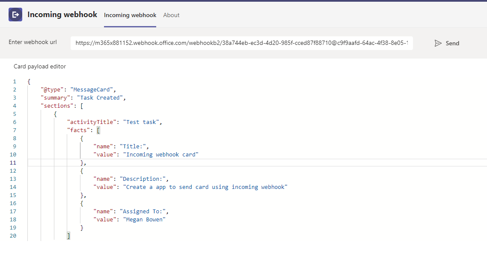
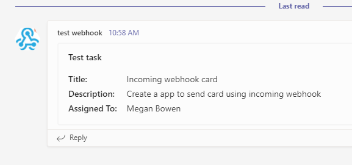
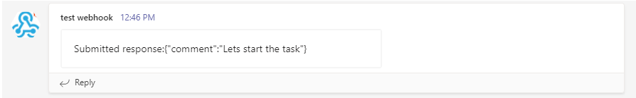

# Incoming webhook

This sample demos UI to type in Incoming Webhook URL and message card payload, which send the card in the team also demonstrates the HttpPOST action in the card. 





- HttpPOST action response
- Note: To see Post action please set target as `https://{{base-url}}/api/save`




## Prerequisites

- [.NET Core SDK](https://dotnet.microsoft.com/download) version 3.1

  ```bash
  # determine dotnet version
  dotnet --version
  ```

- [Ngrok](https://ngrok.com/download) (For local environment testing) Latest (any other tunneling software can also be used)
  ```bash
  # run ngrok locally
  ngrok http -host-header=localhost 3978
  ```

- [Teams](https://teams.microsoft.com) Microsoft Teams is installed and you have an account

## To try this sample

1) Create a incoming webhook. [Create incoming webhooks](https://docs.microsoft.com/en-us/microsoftteams/platform/webhooks-and-connectors/how-to/add-incoming-webhook). Keep this webhook URL handy while running the sample.

2) Clone the repository
   ```bash
   git clone https://github.com/OfficeDev/Microsoft-Teams-Samples.git
   ```

3) In a terminal, navigate to `samples/incoming-webhook/csharp`

    ```bash
    # change into project folder
    cd # IncomingWebhook
    ```
4) Run ngrok - point to port 3978

    ```bash
    # ngrok http -host-header=rewrite 3978
    ```
5) Modify the `manifest.json` in the `/AppPackage` folder and replace the following details
   - `<<App-ID>>` with some unique GUID   
   - `<<BASE-URL>>` with your application's base url, e.g. https://1234.ngrok.io
   - `<<VALID DOMAIN>>` with your app domain e.g. *.ngrok.io

6) Zip the contents of `AppPackage` folder into a `manifest.zip`, and use the `manifest.zip` to deploy in app store or add to Teams.

7) Run the app from a terminal or from Visual Studio, choose option A or B.

  A) From a terminal

  ```bash
  # run the app
  dotnet run
  ```

  B) Or from Visual Studio

  - Launch Visual Studio
  - File -> Open -> Project/Solution
  - Navigate to `IncomingWebhook` folder
  - Select `IncomingWebhook.csproj` file
  - Press `F5` to run the project

8) Upload the manifest.zip to Teams (in the Apps view click "Upload a custom app")
   - Go to Microsoft Teams. From the lower left corner, select Apps
   - From the lower left corner, choose Upload a custom App
   - Go to your project directory, the ./AppPackage folder, select the zip folder, and choose Open.

## Features of the sample

- Open Incoming webhook tab.
- Update webhook URL in `Enter webhook URL` input field and card payload in `Card payload editor`.
- Click on send button. You will get a card from webhook in the team where incoming webhook is added.

## Further reading

- [Build webhooks and connectors ](https://docs.microsoft.com/en-us/microsoftteams/platform/webhooks-and-connectors/what-are-webhooks-and-connectors)
- [Bot Basics](https://docs.microsoft.com/azure/bot-service/bot-builder-basics?view=azure-bot-service-4.0)
- [Activity processing](https://docs.microsoft.com/en-us/azure/bot-service/bot-builder-concept-activity-processing?view=azure-bot-service-4.0)
- [Azure Bot Service Introduction](https://docs.microsoft.com/azure/bot-service/bot-service-overview-introduction?view=azure-bot-service-4.0)
- [Azure Bot Service Documentation](https://docs.microsoft.com/azure/bot-service/?view=azure-bot-service-4.0)
- [.NET Core CLI tools](https://docs.microsoft.com/en-us/dotnet/core/tools/?tabs=netcore2x)
- [Azure CLI](https://docs.microsoft.com/cli/azure/?view=azure-cli-latest)
- [Azure Portal](https://portal.azure.com)
- [Language Understanding using LUIS](https://docs.microsoft.com/en-us/azure/cognitive-services/luis/)
- [Channels and Bot Connector Service](https://docs.microsoft.com/en-us/azure/bot-service/bot-concepts?view=azure-bot-service-4.0)
