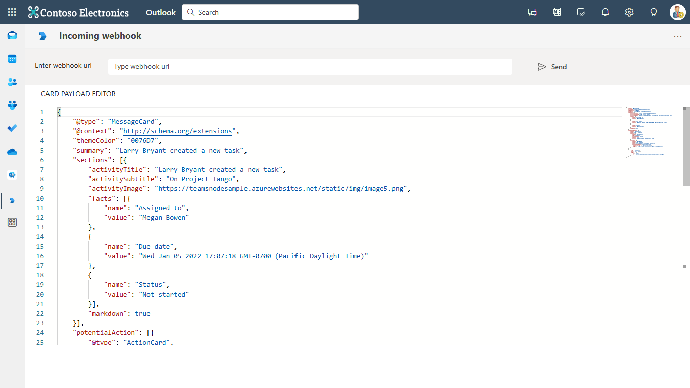
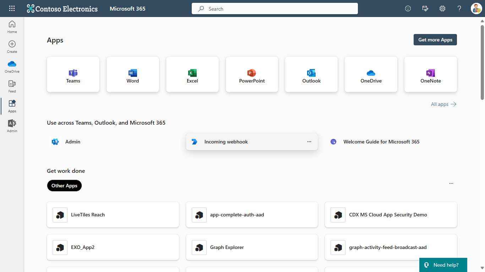
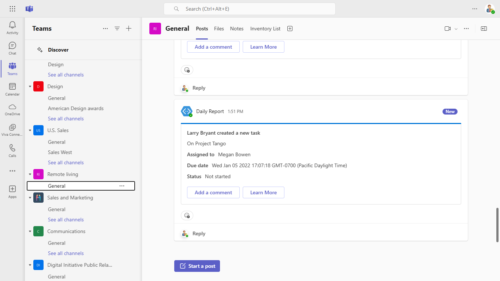

> [!IMPORTANT]
>
> The existing Microsoft 365 (previously called Office 365) connectors across all cloud platforms are nearing deprecation, and the creation of new Microsoft 365 connectors will soon be blocked. For more information on the schedule and how the Workflows app provides a more flexible and secure experience, see [retirement of Microsoft 365 connectors within Microsoft Teams](https://devblogs.microsoft.com/microsoft365dev/retirement-of-office-365-connectors-within-microsoft-teams/).

# Incoming webhook

This sample demonstrates a Teams tab where users can input Incoming Webhook URLs and send message cards to a specified Teams channel, illustrating the HttpPOST action for interactive message cards. It includes setup steps for running the sample, testing in multiple environments such as Outlook and Office, and provides insights into webhooks and connectors for extending Microsoft 365 apps.

## Included Features
* Tabs
* Incoming Webhooks

## Interaction with tab


### Register your app with Azure AD.

  1. Register a new application in the [Microsoft Entra ID – App Registrations](https://go.microsoft.com/fwlink/?linkid=2083908) portal.
  2. Select **New Registration** and on the *register an application page*, set following values:
      * Set **name** to your app name.
      * Choose the **supported account types** (any account type will work)
      * Leave **Redirect URI** empty.
      * Choose **Register**.
  3. On the overview page, copy and save the **Application (client) ID, Directory (tenant) ID**. You'll need those later when updating your Teams application manifest and in the appsettings.json.
  4. Navigate to **API Permissions**, and make sure to add the follow permissions:
   Select Add a permission
      * Select Add a permission
      * Select Microsoft Graph -\> Delegated permissions.
      * `User.Read` (enabled by default)
      * Click on Add permissions. Please make sure to grant the admin consent for the required permissions.


## Prerequisites

- [.NET Core SDK](https://dotnet.microsoft.com/download) version 6.0

  ```bash
  # determine dotnet version
  dotnet --version
  ```
- Publicly addressable https url or tunnel such as [dev tunnel](https://learn.microsoft.com/en-us/azure/developer/dev-tunnels/get-started?tabs=windows) or [ngrok](https://ngrok.com/) latest version or [Tunnel Relay](https://github.com/OfficeDev/microsoft-teams-tunnelrelay) 

- [Teams](https://teams.microsoft.com) Microsoft Teams is installed and you have an account

- [Microsoft 365 Agents Toolkit for Visual Studio](https://learn.microsoft.com/en-us/microsoftteams/platform/toolkit/toolkit-v4/install-teams-toolkit-vs?pivots=visual-studio-v17-7)

## Run the app (Using Microsoft 365 Agents Toolkit for Visual Studio)

The simplest way to run this sample in Teams is to use Microsoft 365 Agents Toolkit for Visual Studio.
1. Install Visual Studio 2022 **Version 17.14 or higher** [Visual Studio](https://visualstudio.microsoft.com/downloads/)
1. Install Microsoft 365 Agents Toolkit for Visual Studio [Microsoft 365 Agents Toolkit extension](https://learn.microsoft.com/en-us/microsoftteams/platform/toolkit/toolkit-v4/install-teams-toolkit-vs?pivots=visual-studio-v17-7)
1. In the debug dropdown menu of Visual Studio, select Dev Tunnels > Create A Tunnel (set authentication type to Public) or select an existing public dev tunnel.
1. In the debug dropdown menu of Visual Studio, select default startup project > **Microsoft Teams (browser)**
1. Right-click the 'M365Agent' project in Solution Explorer and select **Microsoft 365 Agents Toolkit > Select Microsoft 365 Account**
1. Sign in to Microsoft 365 Agents Toolkit with a **Microsoft 365 work or school account**
1. Set `Startup Item` as `Microsoft Teams (browser)`.
1. Press F5, or select Debug > Start Debugging menu in Visual Studio to start your app
    </br>
1. In the opened web browser, select Add button to install the app in Teams
> If you do not have permission to upload custom apps (uploading), Microsoft 365 Agents Toolkit will recommend creating and using a Microsoft 365 Developer Program account - a free program to get your own dev environment sandbox that includes Teams.

## Setup

### 1. Setup for incoming webhook

1) Create a incoming webhook. [Create incoming webhooks](https://docs.microsoft.com/en-us/microsoftteams/platform/webhooks-and-connectors/how-to/add-incoming-webhook). Keep this webhook URL handy while running the sample.

### 2. Setup NGROK
1) Run ngrok - point to port 3978

   ```bash
   ngrok http 3978 --host-header="localhost:3978"
   ```  

   Alternatively, you can also use the `dev tunnels`. Please follow [Create and host a dev tunnel](https://learn.microsoft.com/en-us/azure/developer/dev-tunnels/get-started?tabs=windows) and host the tunnel with anonymous user access command as shown below:

   ```bash
   devtunnel host -p 3978 --allow-anonymous
   ```

### 3. Setup for code

1) Clone the repository
   ```bash
   git clone https://github.com/OfficeDev/Microsoft-Teams-Samples.git
   ```

1) In a terminal, navigate to `samples/incoming-webhook/csharp/ClientApp`

    ```bash
    npm install
    ```

    If you face any dependency error while installing node modules, try using below command

    ```bash
    npm install --legacy-peer-deps
    ```

1) In a terminal, navigate to `samples/incoming-webhook/csharp`

    ```bash
    # change into project folder
    cd # IncomingWebhook
    ```

1) Run the app from a terminal or from Visual Studio, choose option A or B.

  A) From a terminal

  ```bash
  # run the app
  dotnet run
  ```

  B) Or from Visual Studio

  - Launch Visual Studio
  - File -> Open -> Project/Solution
  - Navigate to `IncomingWebhook` folder
  - Select `IncomingWebhook.csproj` file
  - Press `F5` to run the project

### 4. Setup Manifest for Teams
1) __*This step is specific to Teams.*__
    - **Edit** the `manifest.json` contained in the  `appPackage` folder to replace `{{Manifest-id}}` with any `GUID` ID.
    - **Edit** the `manifest.json` for `contentUrl`, `websiteUrl` inside `staticTabs` section. Replace `<<Domain-name>>` with app's base Url domain. E.g. if you are using ngrok it would be `https://1234.ngrok-free.app` then your domain-name will be `1234.ngrok-free.app` and if you are using dev tunnels then your domain will be like: `12345.devtunnels.ms`.
    - **Note:** If you want to test your app across multi hub like: Outlook/Office.com, please update the `manifest.json` in the `incoming-webhook\csharp\IncomingWebhook\Manifest_Hub` folder with the required values.
    - **Zip** up the contents of the `appPackage` folder to create a `Manifest.zip` or `Manifest_Hub` folder to create a `Manifest_Hub.zip`(Make sure that zip file does not contains any subfolder otherwise you will get error while uploading your .zip package)
    - **Upload** the `manifest.zip` to Teams (In Teams Apps/Manage your apps click "Upload an app". Browse to and Open the .zip file. At the next dialog, click the Add button.)
    - Add the app to personal scope.


## Running the sample
- Open Incoming webhook tab.


- Click on send button. You will get a card from webhook in the team where incoming webhook is added.


## Outlook on the web

- To view your app in Outlook on the web.

- Go to [Outlook on the web](https://outlook.office.com/mail/)and sign in using your dev tenant account.

**On the side bar, select More Apps. Your uploaded app title appears among your installed apps**


**Select your app icon to launch and preview your app running in Outlook on the web**




**Note:** Similarly, you can test your application in the Outlook desktop app as well.

## Office on the web

- To preview your app running in Office on the web.

- Log into office.com with test tenant credentials

**Select the Apps icon on the side bar. Your uploaded app title appears among your installed apps**


**Select your app icon to launch your app in Office on the web**

  



**Note:** Similarly, you can test your application in the Office 365 desktop app as well.

## Further reading

- [Build webhooks and connectors ](https://docs.microsoft.com/en-us/microsoftteams/platform/webhooks-and-connectors/what-are-webhooks-and-connectors)
- [Extend Teams apps across Microsoft 365](https://learn.microsoft.com/en-us/microsoftteams/platform/m365-apps/overview)


