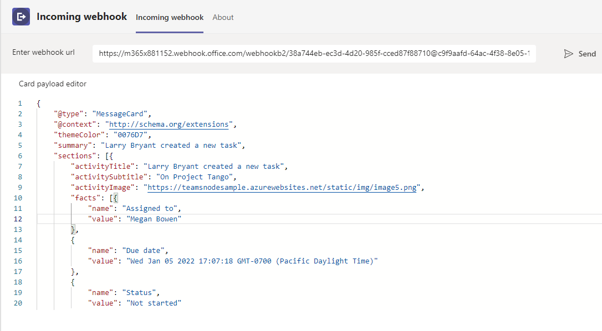
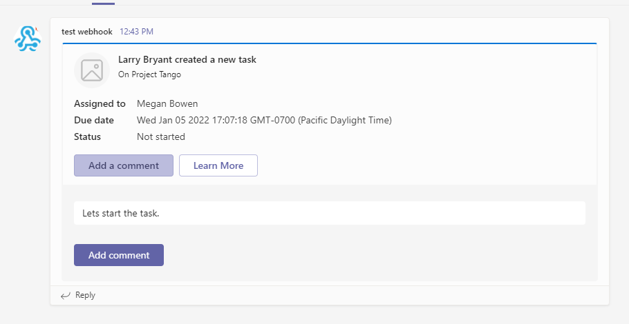
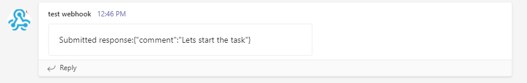

# Incoming webhook

This sample demos UI to type in Incoming Webhook URL and message card payload, which send the card in the team also demonstrates the HttpPOST action in the card. 





- HttpPOST action response
- Note: To see Post action please set target as `https://{{base-url}}/api/save`



## Prerequisites

- [NodeJS](https://nodejs.org/en/)
- [ngrok](https://ngrok.com/) or equivalent tunnelling solution
- [Teams](https://teams.microsoft.com) Microsoft Teams is installed and you have an account


## To try this sample

1) Create a incoming webhook. [Create incoming webhooks](https://docs.microsoft.com/en-us/microsoftteams/platform/webhooks-and-connectors/how-to/add-incoming-webhook). Keep this webhook URL handy while running the sample. 

3) Clone the repository
   ```bash
   git clone https://github.com/OfficeDev/Microsoft-Teams-Samples.git
   ```
4) Install node modules

   Inside node js folder,  navigate to `samples/incoming-webhoook/nodejs/api` open your local terminal and run the below command to install node modules. You can do the same in Visual Studio code terminal by opening the project in Visual Studio code.

   - Repeat the same step in folder `samples/incoming-webhoook/nodejs/ClientApp`

    ```bash
    npm install
    ```
5) We have two different solutions to run so follow below steps:
 
   A) In a terminal, navigate to `samples/incoming-webhoook/nodejs/api`

   B) In a different terminal, navigate to `samples/incoming-webhoook/nodejs/ClientApp`

6) Run ngrok - point to port 3000 (pointing to ClientApp)

    ```bash
    # ngrok http -host-header=rewrite 3000
    ```
7) Modify the `manifest.json` in the `/AppPackage` folder and replace the following details
   - `{{Manifest-id}}` with some unique GUID.
   - `{{Domain Name}}` with your application's base url, e.g. https://1234.ngrok.io

8) Zip the contents of `AppPackage` folder into a `manifest.zip`, and use the `manifest.zip` to deploy in app store or add to Teams.

9) Run both solutions i.e. `samples/incoming-webhoook/nodejs/api` and `samples/incoming-webhoook/nodejs/clientapp`
    ```
    npm start
    ```
10) Upload the manifest.zip to Teams (in the Apps view click "Upload a custom app")
   - Go to Microsoft Teams. From the lower left corner, select Apps
   - From the lower left corner, choose Upload a custom App
   - Go to your project directory, the ./AppPackage folder, select the zip folder, and choose Open.
   - Select Add in the pop-up dialog box. Your app is uploaded to Teams.

## Features of the sample

- Open Incoming webhook tab.
- Update webhook URL in `Enter webhook URL` input field and card payload in `Card payload editor`.
- Click on send button. You will get a card from webhook in the team where incoming webhook is added.

## Testing the bot using Bot Framework Emulator

[Bot Framework Emulator](https://github.com/microsoft/botframework-emulator) is a desktop application that allows bot developers to test and debug their bots on localhost or running remotely through a tunnel.

- Install the Bot Framework Emulator version 4.5.0 or greater from [here](https://github.com/Microsoft/BotFramework-Emulator/releases)

## Further reading

- [Build webhooks and connectors ](https://docs.microsoft.com/en-us/microsoftteams/platform/webhooks-and-connectors/what-are-webhooks-and-connectors)
- [Bot Basics](https://docs.microsoft.com/azure/bot-service/bot-builder-basics?view=azure-bot-service-4.0)
- [Activity processing](https://docs.microsoft.com/en-us/azure/bot-service/bot-builder-concept-activity-processing?view=azure-bot-service-4.0)
- [Azure Bot Service Introduction](https://docs.microsoft.com/azure/bot-service/bot-service-overview-introduction?view=azure-bot-service-4.0)
- [Azure Bot Service Documentation](https://docs.microsoft.com/azure/bot-service/?view=azure-bot-service-4.0)
- [.NET Core CLI tools](https://docs.microsoft.com/en-us/dotnet/core/tools/?tabs=netcore2x)
- [Azure CLI](https://docs.microsoft.com/cli/azure/?view=azure-cli-latest)
- [Azure Portal](https://portal.azure.com)
- [Language Understanding using LUIS](https://docs.microsoft.com/en-us/azure/cognitive-services/luis/)
- [Channels and Bot Connector Service](https://docs.microsoft.com/en-us/azure/bot-service/bot-concepts?view=azure-bot-service-4.0)
