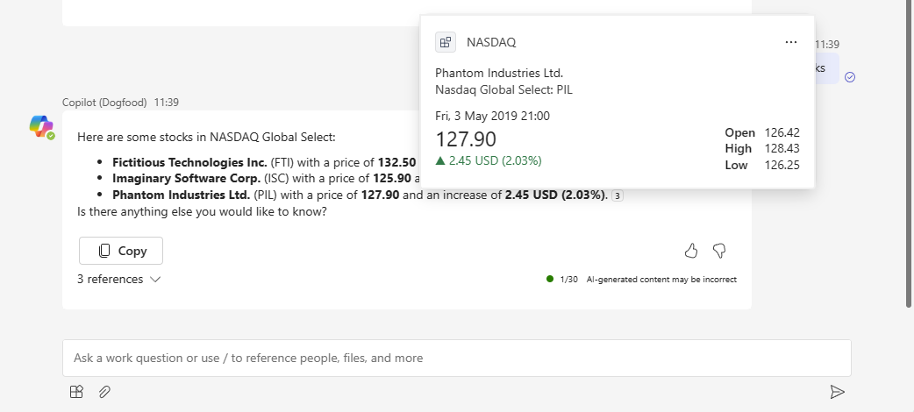

# Using multiple parameters in a plugin for Microsoft Copilot for Microsoft 365 using JavaScript and Teams Toolkit for Visual Studio Code sample

## Prerequisites

- [Node.js 18.x](https://nodejs.org/download/release/v18.18.2/)
- [Visual Studio Code](https://code.visualstudio.com/)
- [Teams Toolkit](https://marketplace.visualstudio.com/items?itemName=TeamsDevApp.ms-teams-vscode-extension)
- You will need a Microsoft work or school account with [permissions to upload custom Teams applications](https://learn.microsoft.com/microsoftteams/platform/concepts/build-and-test/prepare-your-o365-tenant#enable-custom-teams-apps-and-turn-on-custom-app-uploading). The account will also need a Microsoft Copilot for Microsoft 365 license to use the extension in Copilot.

## Minimal path to awesome

- Clone repo
- Open repo in VSCode
- Press <kbd>F5</kbd> and follow the prompts

## Test in Copilot

- Enable the plugin
- Use a basic prompt: `Find stocks in NASDAQ Stocks`
- Use an advanced prompt: `Find top 10 stocks in NASDAQ Stocks with P/B < 2 and P/E < 30`

