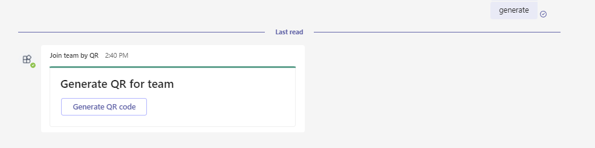

# Join a team using QR code sample

This sample demos a feature where user can join a team using QR code containing the team's id.

User can generate a new QR code (contains team id information) and then scan the QR code to join the team.

`Currently, Microsoft Teams support for QR or barcode scanner capability is only supported for mobile clients`

- Type a message to get a card to generate the QR code.

 

- Select the team from dropdown list for which you want to generate the QR code and then click on      'Generate QR' button.

 

- Scan the generated QR code to join the team.

 

## Prerequisites

- Microsoft Teams is installed and you have an account (not a guest account)
-  [NodeJS](https://nodejs.org/en/)
-  [ngrok](https://ngrok.com/) or equivalent tunneling solution
-  [M365 developer account](https://docs.microsoft.com/en-us/microsoftteams/platform/concepts/build-and-test/prepare-your-o365-tenant) or access to a Teams account with the 
   appropriate permissions to install an app.

## To try this sample

> Note these instructions are for running the sample on your local machine, the tunnelling solution is required because
> the Teams service needs to call into the bot.

### 1. Setup for Bot SSO
a) In Azure portal, create a [Bot Framework registration resource](https://docs.microsoft.com/en-us/azure/bot-service/bot-builder-authentication?view=azure-bot-service-4.0&tabs=csharp%2Caadv2).

**Note:** Once the Azure Bot is created, go to navigation pane and under Settings section select Channels and enable Microsoft Teams Channel.


b) Add the following permission in app registration


### 2. Run your bot sample
1) Clone the repository

    ```bash
    git clone https://github.com/OfficeDev/Microsoft-Teams-Samples.git
    ```

2) In a terminal, navigate to `samples/join-a-team-using-qr-code/nodejs`

3) Install node modules

   Inside node js folder, open your local terminal and run the below command to install node modules. You can do the same in Visual Studio code terminal by opening the project in Visual Studio code.

    ```bash
    npm install
    ```
4) Run ngrok - point to port 3978

    ```bash
    ngrok http -host-header=rewrite 3978
    ```
5) Open the `.env` configuration file in your project folder (or in Visual Studio Code) and update the `MicrosoftAppId` and `MicrosoftAppPassword`, `connectionName` from the Bot Framework registration and `BaseUrl` with application base url. For e.g., your ngrok url. (Note the MicrosoftAppId is the AppId created in step 1 (Setup for Bot SSO), the MicrosoftAppPassword is referred to as the "client secret" in step 1 (Setup for Bot SSO) and you can always create a new client secret anytime.)

6) Run your app

    ```bash
    npm start
    ```
- **Manually update the manifest.json**
    - Edit the `manifest.json` contained in the  `appPackage/` folder to replace with your MicrosoftAppId (that was created in step1.1 and is the same value of MicrosoftAppId in `.env` file) *everywhere* you see the place holder string `{MicrosoftAppId}` (depending on the scenario the Microsoft App Id may occur multiple times in the `manifest.json`)
    - Zip up the contents of the `appPackage/` folder to create a `manifest.zip`
    - Upload the `manifest.zip` to Teams (in the left-bottom *Apps* view, click "Upload a custom app")

     > IMPORTANT: The manifest file in this app adds "token.botframework.com" to the list of `validDomains`. This must be included in any bot that uses the Bot Framework OAuth flow.

## Features of this sample

- Type a message to get a card to generate the QR code.

 

- Select the team from dropdown list for which you want to generate the QR code and then click on 'Generate QR' button.

 

- Scan the generated QR code to join the team.

 
