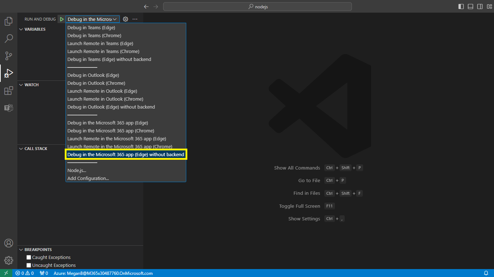

# Actions across Microsoft 365

This sample showcases how to create Teams apps using Actions in the Microsoft 365 app. It enhances task efficiency and user engagement by allowing users to interact directly with content and streamline workflows without switching between different apps.

Developers have the power to enhance users' productivity by building Actions that streamline task completion, minimizing context switching across various applications. 
This feature not only benefits users by enabling them to accomplish tasks more efficiently, but it also enhances the visibility and user engagement of your app by 
seamlessly integrating it into their workflow.

During this preview phase, we are introducing Actions on content in the Microsoft 365 app. This empowers users to take immediate action on content files through your app, expanding the range of interactions users can have with their content.

## Interaction with app


## Prerequisite to use this sample
- [Node.js](https://nodejs.org/), supported versions: 14, 16, 18 (preview)
- A Microsoft 365 account. If you do not have Microsoft 365 account, apply one from [Microsoft 365 developer program](https://developer.microsoft.com/en-us/microsoft-365/dev-program)
- Latest [Microsoft 365 Agents Toolkit Visual Studio Code Extension](https://aka.ms/teams-toolkit) or [TeamsFx CLI](https://aka.ms/teamsfx-cli)
- [VS Code](https://code.visualstudio.com/)
- [Teamsfx-cli](https://www.npmjs.com/package/@microsoft/teamsfx-cli)
- [Microsoft 365 Agents Toolkit](https://marketplace.visualstudio.com/items?itemName=TeamsDevApp.ms-teams-vscode-extension)
- An [Azure subscription](https://azure.microsoft.com/en-us/free/) (Optional)

2) App Registration

### Register your application with Azure AD

1. Register a new application in the [Microsoft Entra ID – App Registrations](https://go.microsoft.com/fwlink/?linkid=2083908) portal.
2. Select **New Registration** and on the *register an application page*, set following values:
    * Set **name** to your app name.
    * Choose the **supported account types** (any account type will work)
    * Leave **Redirect URI** empty.
    * Choose **Register**.
3. On the overview page, copy and save the **Application (client) ID, Directory (tenant) ID**. You'll need those later when updating your Teams application manifest and in the appsettings.json.
4. Navigate to **API Permissions**, and make sure to add the follow permissions:
    * Select Add a permission
    * Select Microsoft Graph -> Delegated permissions.
    * `User.Read` (enabled by default)
    * Click on Add permissions. Please make sure to grant the admin consent for the required permissions.

## Run the app locally with browser's local storage
To debug the app
1. Open the folder in Visual Studio Code with Microsoft 365 Agents Toolkit extension installed.
1. Open Debug View (`Ctrl+Shift+D`) and select "Debug in the Microsoft 365 app (Edge) without backend" in dropdown list.
1. Press "F5" to debug the app in the Microsoft 365 app in a browser window.



## Running the sample

**Select app:**


**Welcome to todo list app!:**


**Accept permissions:**


**No task added:**


**Click more options:**


**Add todo task and Mark complete UI:**


**Add your notes here:**


**Add to do list grid:**


**Add todo task and Mark complete UI:**


**Add your notes here:**


**Add to do list grid:**


**Click related tasks:**


**All tasks list:**


**Select related tasks completed:**


**Add task:**


**Edit task:**


**Edit task value:**


**Save edit task value:**


**Delete task:**


**Delete a particular task:**


**Add task and Enter the task notes:**


**New task added:**


**Uninstall app:**


### (Optional) Deploy the app to Azure

>Here are the instructions to run the sample in **Visual Studio Code**. You can also try to run the app using TeamsFx CLI tool, refer to [Try the Sample with TeamsFx CLI](cli.md)

1. Clone the repo to your local workspace or directly download the source code.
1. Download [Visual Studio Code](https://code.visualstudio.com) and install [Microsoft 365 Agents Toolkit Visual Studio Code Extension](https://aka.ms/teams-toolkit).
1. Open the project in Visual Studio Code.
1. Create an **env/.env.dev.user** file, and set value for `SECRET_SQL_USER_NAME` and `SECRET_SQL_PASSWORD`
1. Open the command palette and select `Teams: Provision in the cloud`. You will be asked to input admin name and password of SQL. The toolkit will help you to provision Azure SQL.
1. Once provision is completed, open the command palette and select `Teams: Deploy to the cloud`.
1. Open **env/.env.dev** file, you could get the database name in `PROVISIONOUTPUT__AZURESQLOUTPUT__DATABASENAME` output. [Set IP address of your computer into server-level IP firewall rule from the database overview page](https://docs.microsoft.com/en-us/azure/azure-sql/database/firewall-configure#from-the-database-overview-page).
1. In Azure portal, find the database by `databaseName` and use [query editor](https://docs.microsoft.com/en-us/azure/azure-sql/database/connect-query-portal) with below query to create a table:
    ```sql
    CREATE TABLE Todo
    (
        id INT IDENTITY PRIMARY KEY,
        description NVARCHAR(128) NOT NULL,
        objectId NVARCHAR(36),
        itemId NVARCHAR(128),
        channelOrChatId NVARCHAR(128),
        isCompleted TinyInt NOT NULL default 0,
    )
    ```

### Preview the app in Teams
1. Once deployment is completed, you can preview the app running in Azure. In Visual Studio Code, open `Run and Debug` and select `Launch Remote in the Microsoft 365 app (Edge)` or `Launch Remote in the Microsoft 365 app (Chrome)` in the dropdown list and Press `F5` or the green arrow button to open a browser.

## Feedback
We really appreciate your feedback! If you encounter any issue or error, please report issues to us following the [Supporting Guide](https://github.com/OfficeDev/TeamsFx-Samples/blob/dev/SUPPORT.md). Meanwhile you can make [recording](https://aka.ms/teamsfx-record) of your journey with our product, they really make the product better. Thank you!

## Contributing

This project welcomes contributions and suggestions.  Most contributions require you to agree to a
Contributor License Agreement (CLA) declaring that you have the right to, and actually do, grant us
the rights to use your contribution. For details, visit https://cla.opensource.microsoft.com.

When you submit a pull request, a CLA bot will automatically determine whether you need to provide
a CLA and decorate the PR appropriately (e.g., status check, comment). Simply follow the instructions
provided by the bot. You will only need to do this once across all repos using our CLA.

This project has adopted the [Microsoft Open Source Code of Conduct](https://opensource.microsoft.com/codeofconduct/).
For more information see the [Code of Conduct FAQ](https://opensource.microsoft.com/codeofconduct/faq/) or
contact [opencode@microsoft.com](mailto:opencode@microsoft.com) with any additional questions or comments.

## Trademarks

This project may contain trademarks or logos for projects, products, or services. Authorized use of Microsoft 
trademarks or logos is subject to and must follow 
[Microsoft's Trademark & Brand Guidelines](https://www.microsoft.com/en-us/legal/intellectualproperty/trademarks/usage/general).
Use of Microsoft trademarks or logos in modified versions of this project must not cause confusion or imply Microsoft sponsorship.
Any use of third-party trademarks or logos are subject to those third-party's policies.


