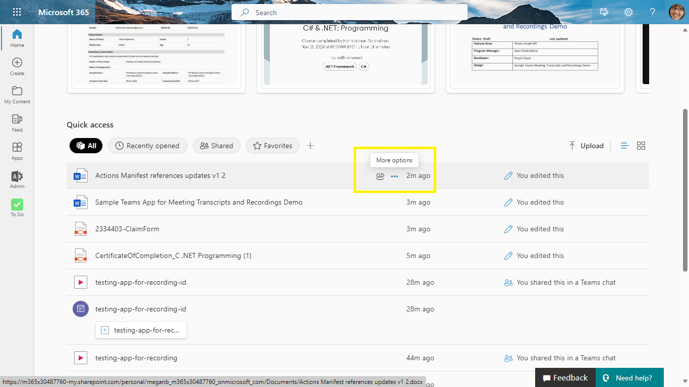

# Actions across Microsoft 365 (private preview)

## Interaction with app

## Prerequisite to use this sample
- [Node.js](https://nodejs.org/), supported versions: 14, 16, 18 (preview)
- A Microsoft 365 account. If you do not have Microsoft 365 account, apply one from [Microsoft 365 developer program](https://developer.microsoft.com/en-us/microsoft-365/dev-program)
- Latest [Teams Toolkit Visual Studio Code Extension](https://aka.ms/teams-toolkit) or [TeamsFx CLI](https://aka.ms/teamsfx-cli)
- [VS Code](https://code.visualstudio.com/)
- [Teamsfx-cli](https://www.npmjs.com/package/@microsoft/teamsfx-cli)
- [Teams Toolkit](https://marketplace.visualstudio.com/items?itemName=TeamsDevApp.ms-teams-vscode-extension)
- An [Azure subscription](https://azure.microsoft.com/en-us/free/) (Optional)

## Run the app locally with browser's local storage
To debug the app
1. Open the folder in Visual Studio Code with Teams Toolkit extension installed.
1. Open Debug View (`Ctrl+Shift+D`) and select "Debug in the Microsoft 365 app (Edge) without backend" in dropdown list.
1. Press "F5" to debug the app in the Microsoft 365 app in a browser window.

## Running the sample

