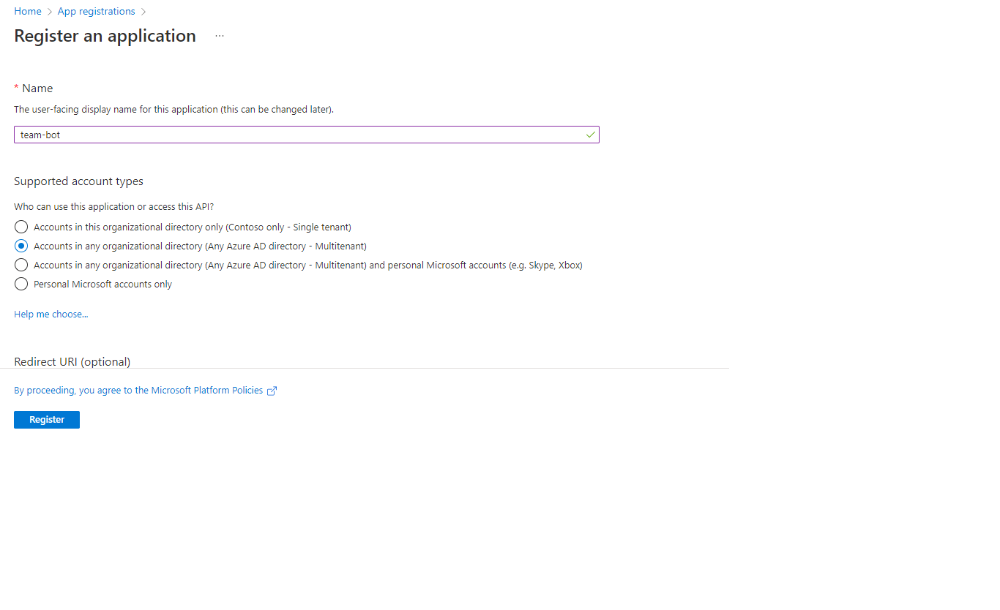
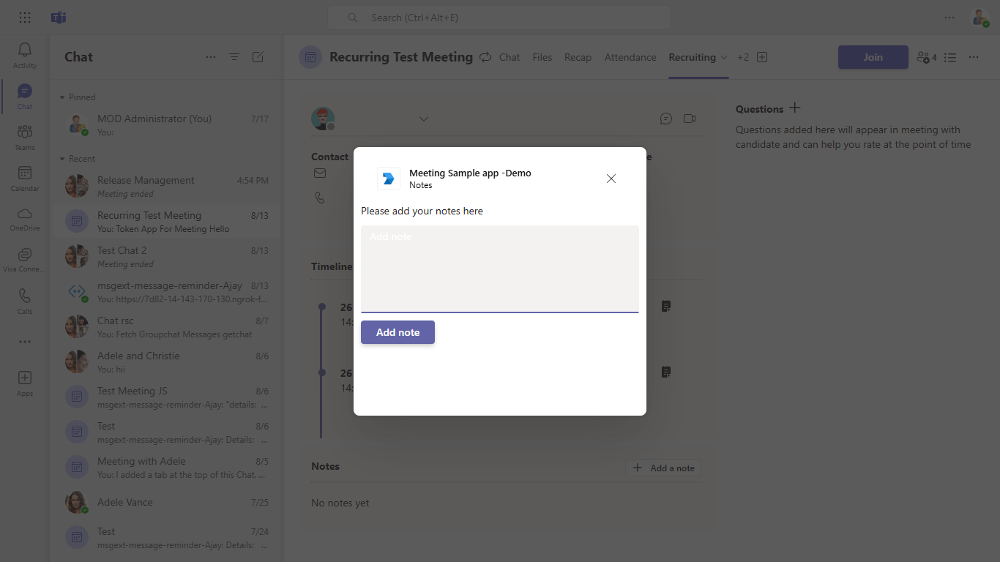

# Recruitment App Sample using Apps in Meetings

This sample illustrates a meeting experience for recruitment.

It has meeting details and in-meeting app that helps in the interview process.

## Included Features
* Bots
* Meeting Chat 
* Meeting Sidepanel 
* Meeting Details

## Interaction with app


## Try it yourself - experience the App in your Microsoft Teams client
Please find below demo manifest which is deployed on Microsoft Azure and you can try it yourself by uploading the app package (.zip file link below) to your teams and/or as a personal app. (Sideloading must be enabled for your tenant, [see steps here](https://docs.microsoft.com/microsoftteams/platform/concepts/build-and-test/prepare-your-o365-tenant#enable-custom-teams-apps-and-turn-on-custom-app-uploading)).

**Recruitment App Sample:** [Manifest](/samples/meeting-recruitment-app/csharp/demo-manifest/Meeting-Recruitment-App.zip)

## Prerequisites

- [.NET Core SDK](https://dotnet.microsoft.com/download) version 6.0

  ```bash
  # determine dotnet version
  dotnet --version
  ```
- [ngrok](https://ngrok.com/download) or equivalent tunnelling solution
- [Teams](https://teams.microsoft.com) Microsoft Teams is installed and you have an account

## Setup

1.Register a new application in the [Azure Active Directory – App Registrations](https://go.microsoft.com/fwlink/?linkid=2083908) portal.
   Fill out name and select third option for supported account type and click "Register".

   

   * Copy and paste the App Id and Tenant ID somewhere safe. You will need it in a future step.

  - Create Client Secret.
   * Navigate to the "Certificates & secrets" blade and add a client secret by clicking "New Client Secret".

    

   * Copy and paste the secret somewhere safe. You will need it in a future step.
   
2. Setup for Bot

    - Also, register a bot with Azure Bot Service, following the instructions [here](https://docs.microsoft.com/azure/bot-service/bot-service-quickstart-registration?view=azure-bot-service-3.0).
  - Ensure that you've [enabled the Teams Channel](https://docs.microsoft.com/azure/bot-service/channel-connect-teams?view=azure-bot-service-4.0)
  - While registering the bot, use `https://<your_ngrok_url>/api/messages` as the messaging endpoint.

      > NOTE: When you create your app registration, you will create an App ID and App password - make sure you keep these for later.
      
3. Create a Azure Storage account(This is needed to store/retrieve data that's used in the app) 
     [Create storage account](https://docs.microsoft.com/azure/storage/common/storage-account-create?tabs=azure-portal)

      This step will create a storage account. You will require storage account name and keys in next steps.
  
      Please follow [View account keys](https://docs.microsoft.com/azure/storage/common/storage-account-keys-manage?tabs=azure-portal#view-account-access-keys)  to see the keys info. 
     

4. Setup NGROK
     - Run ngrok - point to port 3978

    ```bash
     ngrok http 3978 --host-header="localhost:3978"
    ```

5. Setup for code

  - Clone the repository

      ```bash
      git clone https://github.com/OfficeDev/Microsoft-Teams-Samples.git
      ```

- Modify the `/appsettings.json` and fill in the following details:
    - `{{MicrosoftAppId}}` - Generated from Step 1 while doing AAd app registration in Azure portal.
    - `{{ MicrosoftAppPassword}}` - Generated from Step 1, also referred to as Client secret
    - `{{ StorageConnectionString }}` - Generated from Step 3,Create a Azure Storage accoun

 - Run the app from a terminal or from Visual Studio, choose option A or B.

     A) From a terminal

    ```bash
    # run the app
    dotnet run
    ```

    B) Or from Visual Studio

    - Launch Visual Studio
    - File -> Open -> Project/Solution
    - Navigate to `MeetingApp` folder
    - Select `MeetingApp.csproj` file
    - Press `F5` to run the project

6. Setup Manifest for Teams
- __*This step is specific to Teams.*__
    - **Edit** the `manifest.json` contained in the ./AppPackage folder to replace your Microsoft App Id (that was created when you registered your app registration earlier) *everywhere* you see the place holder string `<<APP-ID>>` (depending on the scenario the Microsoft App Id may occur multiple times in the `manifest.json`)
    - **Edit** the `manifest.json` for `<<BASE-URL>>` and replace `<<BASE-URL>>` with base Url of your domain. E.g. if you are using ngrok it would be `https://1234.ngrok-free.app` then your domain-name will be `1234.ngrok-free.app`.
    - **Zip** up the contents of the `AppPackage` folder to create a `manifest.zip` (Make sure that zip file does not contains any subfolder otherwise you will get error while uploading your .zip package)    
    
- Upload the manifest.zip to Teams (in the Apps view click "Upload a custom app")
   - Go to Microsoft Teams. From the lower left corner, select Apps
   - From the lower left corner, choose Upload a custom App
   - Go to your project directory, the ./AppPackage folder, select the zip folder, and choose Open.
   - Select Add in the pop-up dialog box. Your app is uploaded to Teams.

**Note**: If you are facing any issue in your app, please uncomment [this](https://github.com/OfficeDev/Microsoft-Teams-Samples/blob/main/samples/meeting-recruitment-app/csharp/MeetingApp/AdapterWithErrorHandler.cs#L25) line and put your debugger for local debug.

## Running the sample

1) Details page:
   The details page shows basic information of the candidate, timeline, Questions (that can be added for meeting), Notes (provided by peers)

   

2) Action on Questions:
   
   - The interviewer can Add/Edit or Delete question.

   

   - Add Questions Task Module
   
   

   

   - Edit Question Task Module
   
   

3) Add Notes:
   
   The interviewer can add notes that will appear to other peers.

   

   Add Note Task Module
  
   

4) Sidepanel:
    
    The in-meeting side panel shows two sections as follows:
    
    A) Overview: Shows the basic details of the candidate.
    
    B) Questions: The questions set in the details page appear here. The interviewer can use this to provide rating and submit final feedback.

    

    

5) Share assets:

   This is used to share assets to the candidate.
   
   

6) Mobile view: Details tab

   

   

   
   
   - Sidepanel view
   
   

   


## Further reading

- [Meeting apps APIs](https://learn.microsoft.com/microsoftteams/platform/apps-in-teams-meetings/meeting-apps-apis?tabs=dotnet)
- [Install the App in Teams Meeting](https://docs.microsoft.com/microsoftteams/platform/apps-in-teams-meetings/teams-apps-in-meetings?view=msteams-client-js-latest#meeting-lifecycle-scenarios)

