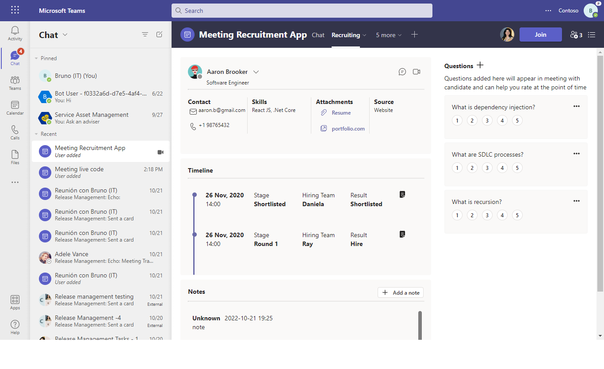
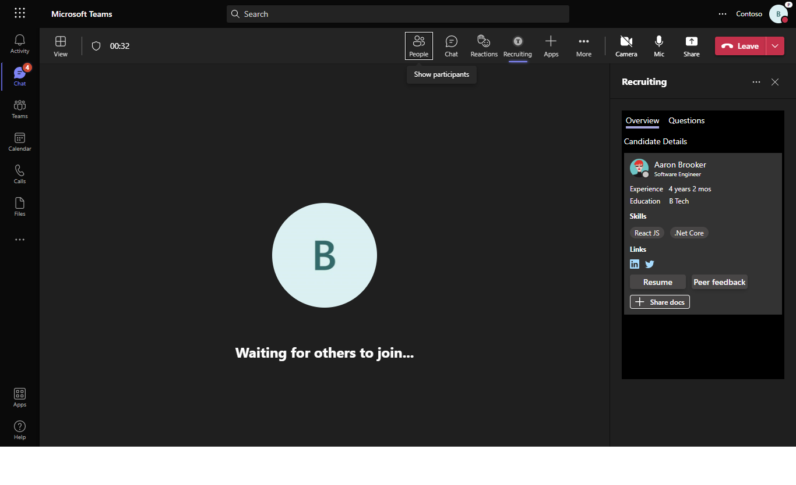
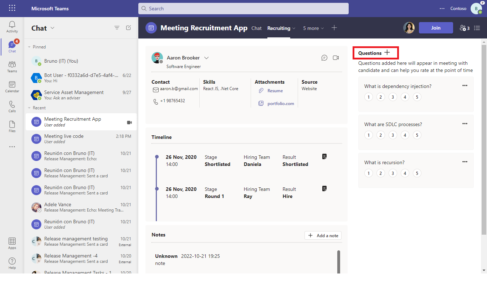
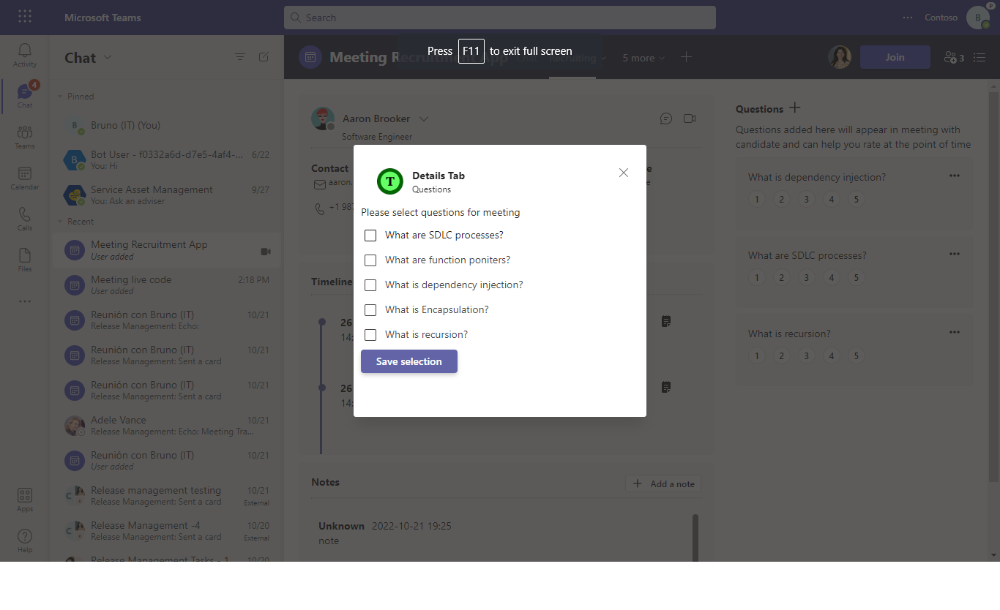
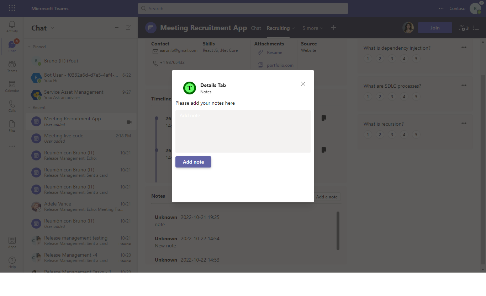
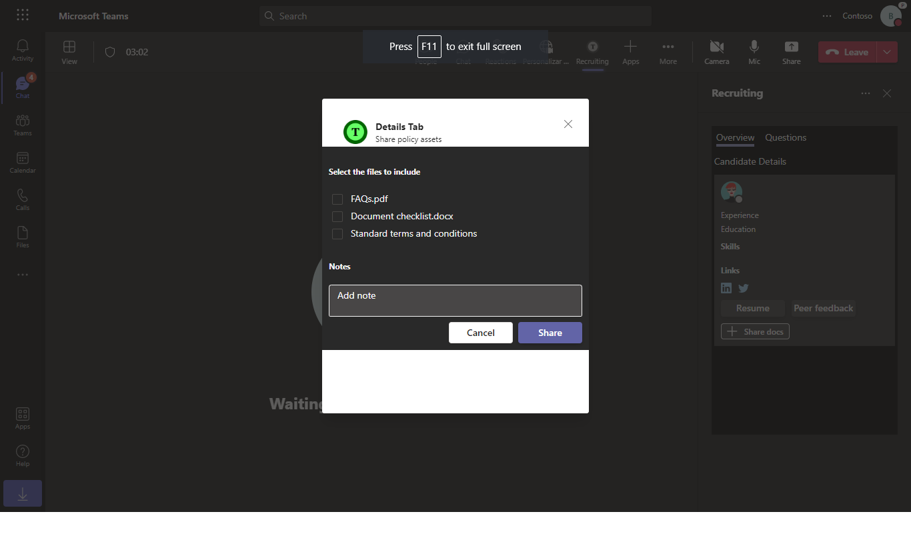

# Recruitment App Sample using Apps in Meetings

This sample illustrates a meeting experience for recruitment.

It has meeting details and in-meeting app that helps in the interview process.






## Prerequisites

- [NodeJS](https://nodejs.org/en/)
- [ngrok](https://ngrok.com/) or equivalent tunnelling solution
- [Teams](https://teams.microsoft.com) Microsoft Teams is installed and you have an account


## To try this sample
1) Create a Bot Registration in Azure portal. [Bot Framework registration](https://docs.microsoft.com/en-us/azure/bot-service/bot-builder-authentication?view=azure-bot-service-4.0&tabs=csharp%2Caadv2#create-the-resource)

- Ensure that you've [enabled the Teams Channel](https://docs.microsoft.com/en-us/azure/bot-service/channel-connect-teams?view=azure-bot-service-4.0)
    
2) Create a Azure Storage account(This is needed to store/retrieve data that's used in the app) 
  [Create storage account](https://docs.microsoft.com/en-us/azure/storage/common/storage-account-create?tabs=azure-portal)

   This step will create a storage account. You will require storage account name and keys in next steps.
  
   Please follow [View account keys](https://docs.microsoft.com/en-us/azure/storage/common/storage-account-keys-manage?tabs=azure-portal#view-account-access-keys) to see the   
   keys info.

3) Clone the repository
   ```bash
   git clone https://github.com/OfficeDev/Microsoft-Teams-Samples.git
   ```
4) We have two different solutions to run so follow below steps:
 
   A) In a terminal, navigate to `samples/meeting-recruitment-app/nodejs/api`

   B) In a different terminal, navigate to `samples/meeting-recruitment-app/nodejs/clientapp`

5) Run ngrok - point to port 3000

    ```bash
    # ngrok http -host-header=rewrite 3000
    ```
6) Modify the `manifest.json` in the `/AppPackage` folder and replace the following details
   - `<<APP-ID>>` with some unique GUID. e.g. your app id generated in Step-1 
   - `<<BASE-URL>>` with your application's base url, e.g. https://1234.ngrok.io
   - `<<VALID DOMAIN>>` with your app domain e.g. *.ngrok.io

7) Zip the contents of `AppPackage` folder into a `manifest.zip`, and use the `manifest.zip` to deploy in app store or add to Teams.

8) Modify the `.env` file in the location `samples/meeting-app/nodejs/api` and fill in the `{{ MicrosoftAppId }}`, `{{ MicrosoftAppPassword }}` generated from step 1 
   i.e. (Create a bot registration step).

9) Modify the `keys.js` file in the location `samples/meeting-app/nodejs/api/server` and fill in the `[STORAGE ACCOUNT NAME]` and `[ACCESS KEY]` for azure table storage.

10) Run both solutions i.e. `samples/meeting-app/nodejs/api` and `samples/meeting-app/nodejs/clientapp`
    ```
    npm start
    ```
11) Upload the manifest.zip to Teams (in the Apps view click "Upload a custom app")
   - Go to Microsoft Teams. From the lower left corner, select Apps
   - From the lower left corner, choose Upload a custom App
   - Go to your project directory, the ./AppPackage folder, select the zip folder, and choose Open.
   - Select Add to meeting in the pop-up dialog box. Your app is uploaded to Teams.

## Features of this sample

1) Details page:
   The details page shows basic information of the candidate, timeline, Questions (that can be added for meeting), Notes (provided by peers)

   

2) Action on Questions:
   
   - The interviewer can Add/Edit or Delete question.

   

   - Add Questions Task Module
   
   

   

   - Edit Question Task Module
   
   

3) Add Notes:
   
   The interviewer can add notes that will appear to other peers.

   

   Add Note Task Module
  
   

4) Sidepanel:
    
    The in-meeting side panel shows two sections as follows:
    
    A) Overview: Shows the basic details of the candidate.
    
    B) Questions: The questions set in the details page appear here. The interviewer can use this to provide rating and submit final feedback.

    

    

5) Share assets:

   This is used to share assets to the candidate.
   
   

6) Mobile view: Details tab

   
   
   - Action on Questions:
   
   
   
   - Sidepanel view
   
   

## Testing the bot using Bot Framework Emulator

[Bot Framework Emulator](https://github.com/microsoft/botframework-emulator) is a desktop application that allows bot developers to test and debug their bots on localhost or running remotely through a tunnel.

- Install the Bot Framework Emulator version 4.5.0 or greater from [here](https://github.com/Microsoft/BotFramework-Emulator/releases)

## Further reading

- [Bot Framework Documentation](https://docs.botframework.com)
- [Bot Basics](https://docs.microsoft.com/azure/bot-service/bot-builder-basics?view=azure-bot-service-4.0)
- [Activity processing](https://docs.microsoft.com/en-us/azure/bot-service/bot-builder-concept-activity-processing?view=azure-bot-service-4.0)
- [Azure Bot Service Introduction](https://docs.microsoft.com/azure/bot-service/bot-service-overview-introduction?view=azure-bot-service-4.0)
- [Azure Bot Service Documentation](https://docs.microsoft.com/azure/bot-service/?view=azure-bot-service-4.0)
- [.NET Core CLI tools](https://docs.microsoft.com/en-us/dotnet/core/tools/?tabs=netcore2x)
- [Azure CLI](https://docs.microsoft.com/cli/azure/?view=azure-cli-latest)
- [Azure Portal](https://portal.azure.com)
- [Language Understanding using LUIS](https://docs.microsoft.com/en-us/azure/cognitive-services/luis/)
- [Channels and Bot Connector Service](https://docs.microsoft.com/en-us/azure/bot-service/bot-concepts?view=azure-bot-service-4.0)
