## Meeting Tabs Sample

This sample shows app stage view, Mute/Unmute Teams meeting audio call in meeting Side panel tab.

## Included Features
* Meeting Stage
* Meeting SidePanel
* RSC Permissions

**Interaction with bot**


## Try it yourself - experience the App in your Microsoft Teams client
Please find below demo manifest which is deployed on Microsoft Azure and you can try it yourself by uploading the app package (.zip file link below) to your teams and/or as a personal app. (Sideloading must be enabled for your tenant, [see steps here](https://docs.microsoft.com/microsoftteams/platform/concepts/build-and-test/prepare-your-o365-tenant#enable-custom-teams-apps-and-turn-on-custom-app-uploading)).

**Meeting-Tabs:** [Manifest](/samples/meeting-tabs/csharp/demo-manifest/meeting-tabs.zip)

## Prerequisites

- [.NET Core SDK](https://dotnet.microsoft.com/download) version 6.0

  determine dotnet version
  ```bash
  dotnet --version
  ```
- [ngrok](https://ngrok.com/) or equivalent tunnelling solution
- [Teams](https://teams.microsoft.com) Microsoft Teams is installed and you have an account

## Setup

> Note these instructions are for running the sample on your local machine.

1. Run ngrok - point to port 3978

   ```bash
     ngrok http 3978 --host-header="localhost:3978"
   ```  

2. Setup

   **Register your application with Azure AD:**

    - Register a new application in the [Azure Active Directory – App Registrations](https://go.microsoft.com/fwlink/?linkid=2083908) portal.

    - Select **New Registration** and on the *register an application page*, set following values:
           * Set **name** to your app name.
           * Choose the **supported account types** (any account type will work)
           * Leave **Redirect URI** empty.
           * Choose **Register**.

    - On the overview page, copy and save the **Application (client) ID, Directory (tenant) ID**. You’ll need those later when updating your Teams application manifest and in the appsettings.json.

    - Ensure that you've [enabled the Teams Channel](https://docs.microsoft.com/en-us/azure/bot-service/channel-connect-teams?view=azure-bot-service-4.0)

3. Clone the repository

    ```bash
    git clone https://github.com/OfficeDev/Microsoft-Teams-Samples.git
    ```
    
4. Run the app from a terminal or from Visual Studio, choose option A or B.

    A) From a terminal, navigate to `samples/meeting-tabs/csharp`

    ```bash
    # run the app
    dotnet run
    ```
    B) Or from Visual Studio

    - Launch Visual Studio
    - File -> Open -> Project/Solution
    - Navigate to `samples/meeting-tabs/csharp` folder
    - Select `AppInMeeting.sln` file
    - Press `F5` to run the project

5. In a terminal, navigate to `samples/meeting-tabs/csharp/ClientApp`

    - Inside ClientApp folder execute the below command.

        ```bash
        # npm install
        ```
 6. __*This step is specific to Teams.*__

- **Edit** the `manifest.json` contained in the  `teamsAppManifest` folder to replace your Microsoft App Id (that was created when you registered your bot earlier) *everywhere* you see the place holder string `<<YOUR-MICROSOFT-APP-ID>>` (depending on the scenario the Microsoft App Id may occur multiple times in the `manifest.json`)

- **Edit** the `manifest.json` for `<<DOMAIN-NAME>>` with base Url domain. E.g. if you are using ngrok it would be `https://1234.ngrok-free.app` then your domain-name will be `1234.ngrok-free.app`.

- **Zip** up the contents of the `teamsAppManifest` folder to create a `manifest.zip` (Make sure that zip file does not contains any subfolder otherwise you will get error while uploading your .zip package)

- **Upload** the `manifest.zip` to Teams (In Teams Apps/Manage your apps click "Upload an app". Browse to and Open the .zip file. At the next dialog, click the Add button.)

- Add the app to team/groupChat scope (Supported scopes). 

## Running the sample

You can interact with Teams Tab meeting sidepanel.

1. **Install app**
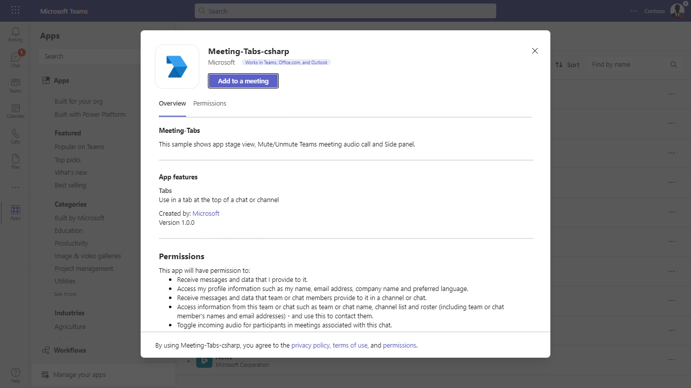

2. **Type a meeting name**
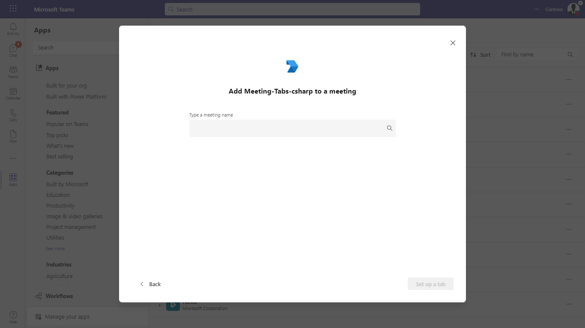

3. **Select meeting name**
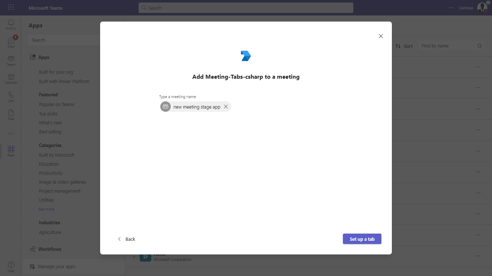

4. **Add meeting tab**
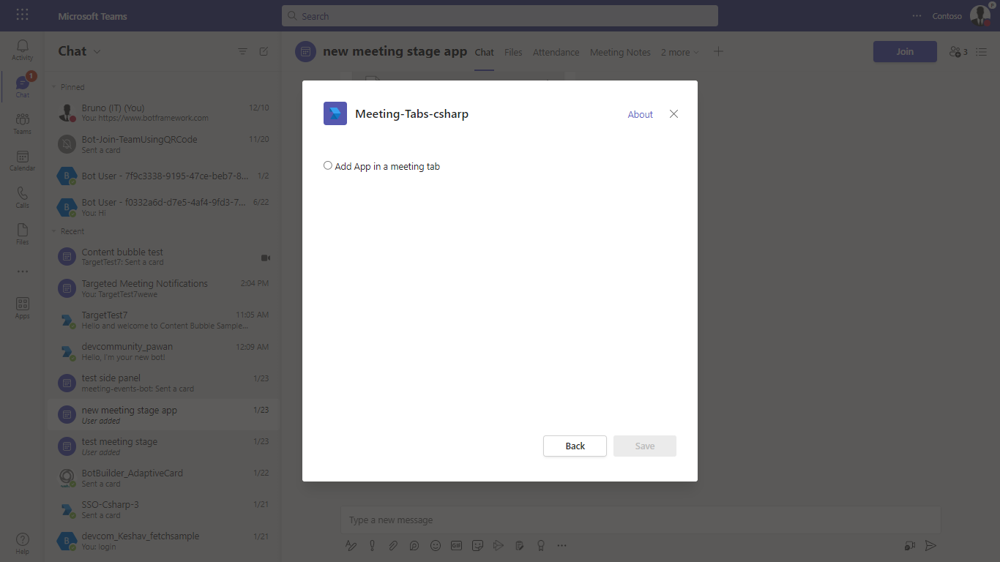

5. **Join meeting**
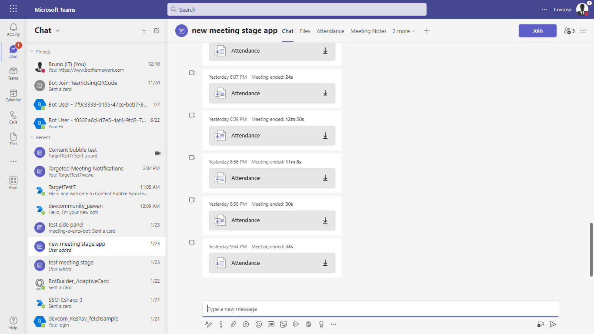

6. **Select your app**
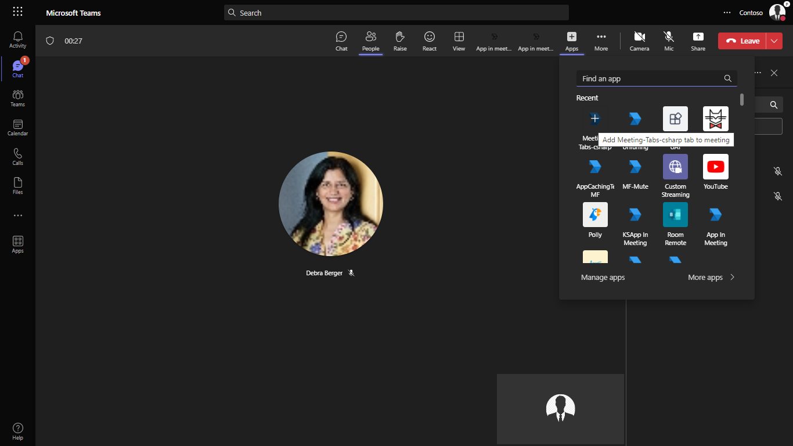

7. **Add meeting tab**
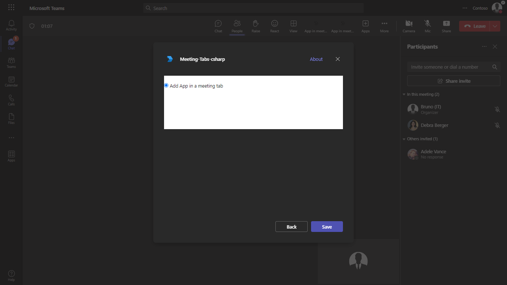

8. **Home page**
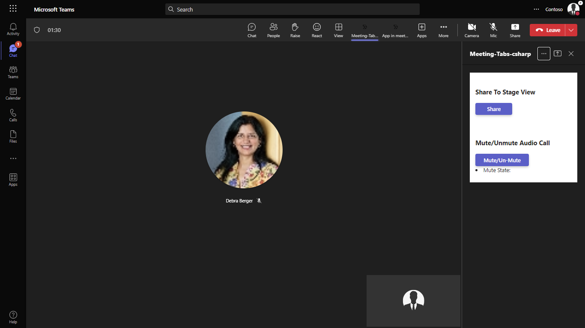

9. **Click share To stage view**
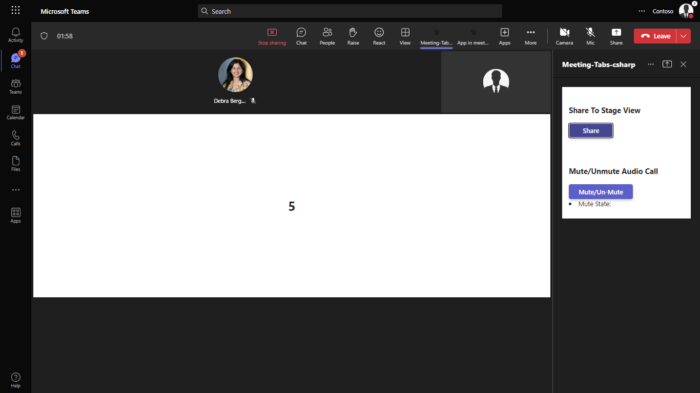

10. **Share To stage view**
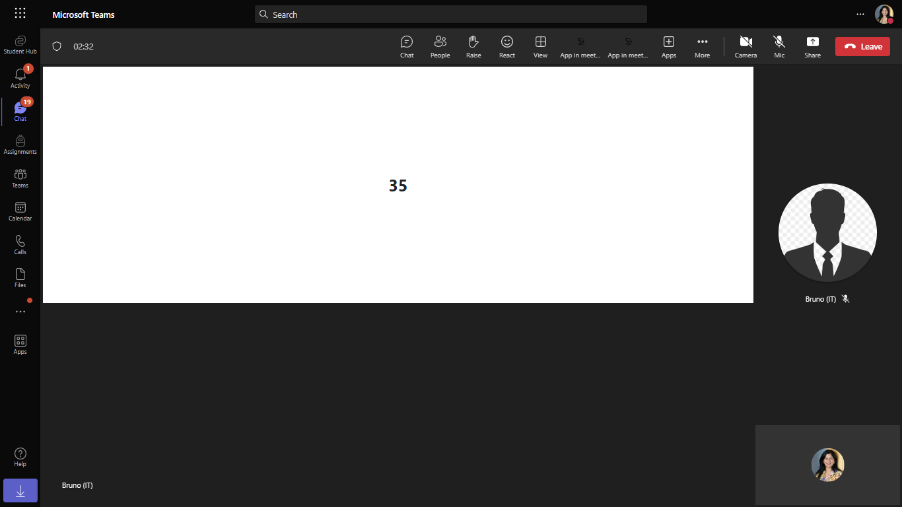

11. **Toggle To Mute**
Toggle button to mute state its looks like below.
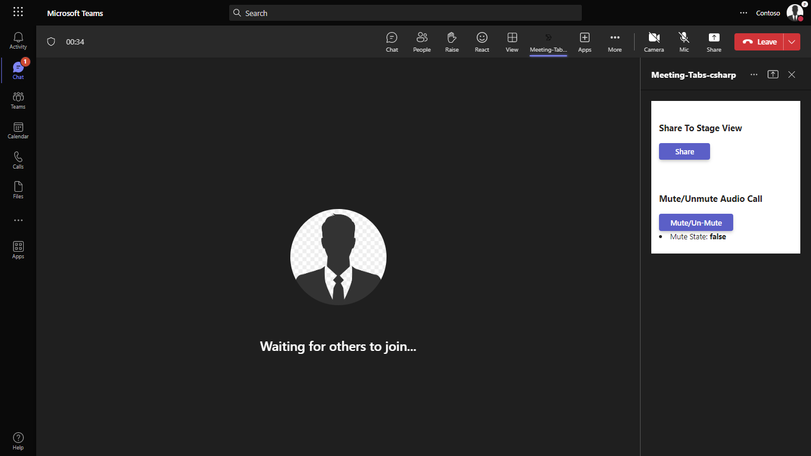

12. **Toggle To Unmute**
Toggle button to Unmute state it will unmute client audio.


## Further reading

- [Toggle incoming audio](https://docs.microsoft.com/en-us/microsoftteams/platform/apps-in-teams-meetings/api-references?tabs=dotnet#toggle-incoming-audio)
- [Get incoming audio speaker](https://docs.microsoft.com/en-us/microsoftteams/platform/apps-in-teams-meetings/api-references?tabs=dotnet#get-incoming-audio-speaker)
- [Generate meeting side panel](https://learn.microsoft.com/en-us/microsoftteams/platform/sbs-meetings-sidepanel?tabs=vs)


