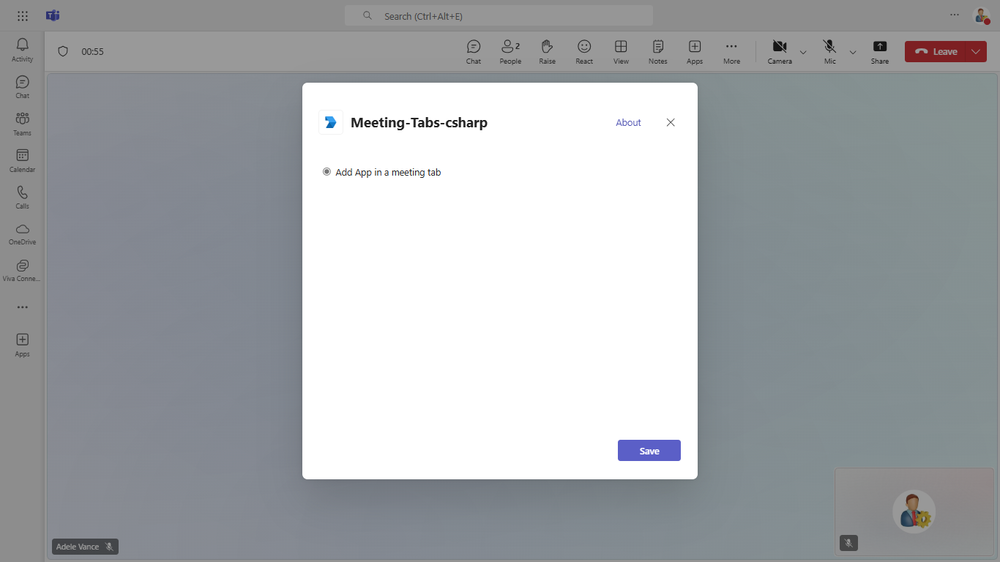

## Meeting Tabs Sample

This sample showcases muting/unmuting Teams meeting audio directly from the side panel tab with stage view integration. It also features Teams theme handling and RSC permissions support, making it ideal for enhancing your meeting experience.

## Included Features
* Meeting Stage
* Meeting SidePanel
* RSC Permissions
* Teams Theme Handler

**Interaction with bot**


**Interaction with Teams Themes**


## Try it yourself - experience the App in your Microsoft Teams client
Please find below demo manifest which is deployed on Microsoft Azure and you can try it yourself by uploading the app manifest (.zip file link below) to your teams and/or as a personal app. (Uploading must be enabled for your tenant, [see steps here](https://docs.microsoft.com/microsoftteams/platform/concepts/build-and-test/prepare-your-o365-tenant#enable-custom-teams-apps-and-turn-on-custom-app-uploading)).

**Meeting-Tabs:** [Manifest](/samples/meeting-tabs/csharp/demo-manifest/meeting-tabs.zip)

## Prerequisites

- [.NET Core SDK](https://dotnet.microsoft.com/download) version 6.0

  determine dotnet version
  ```bash
  dotnet --version
  ```
- [dev tunnel](https://learn.microsoft.com/en-us/azure/developer/dev-tunnels/get-started?tabs=windows) or [ngrok](https://ngrok.com/) latest version or equivalent tunnelling solution
- [Teams](https://teams.microsoft.com) Microsoft Teams is installed and you have an account
- [Microsoft 365 Agents Toolkit for Visual Studio](https://learn.microsoft.com/en-us/microsoftteams/platform/toolkit/toolkit-v4/install-teams-toolkit-vs?pivots=visual-studio-v17-7)

## Run the app (Using Microsoft 365 Agents Toolkit for Visual Studio)

The simplest way to run this sample in Teams is to use Microsoft 365 Agents Toolkit for Visual Studio.
1. Install Visual Studio 2022 **Version 17.14 or higher** [Visual Studio](https://visualstudio.microsoft.com/downloads/)
1. Install Microsoft 365 Agents Toolkit for Visual Studio [Microsoft 365 Agents Toolkit extension](https://learn.microsoft.com/en-us/microsoftteams/platform/toolkit/toolkit-v4/install-teams-toolkit-vs?pivots=visual-studio-v17-7)
1. In the debug dropdown menu of Visual Studio, select default startup project > **Microsoft Teams (browser)**
1. Right-click the 'M365Agent' project in Solution Explorer and select **Microsoft 365 Agents Toolkit > Select Microsoft 365 Account**
1. Sign in to Microsoft 365 Agents Toolkit with a **Microsoft 365 work or school account**
1. Set `Startup Item` as `Microsoft Teams (browser)`.
1. Press F5, or select Debug > Start Debugging menu in Visual Studio to start your app
    </br>
1. In the opened web browser, select Add button to install the app in Teams
> If you do not have permission to upload custom apps (uploading), Microsoft 365 Agents Toolkit will recommend creating and using a Microsoft 365 Developer Program account - a free program to get your own dev environment sandbox that includes Teams.

## Setup

> Note these instructions are for running the sample on your local machine.

1. Run ngrok - point to port 3978

   ```bash
   ngrok http 3978 --host-header="localhost:3978"
   ```  

   Alternatively, you can also use the `dev tunnels`. Please follow [Create and host a dev tunnel](https://learn.microsoft.com/en-us/azure/developer/dev-tunnels/get-started?tabs=windows) and host the tunnel with anonymous user access command as shown below:

   ```bash
   devtunnel host -p 3978 --allow-anonymous
   ```

2. Setup

   **Register your application with Azure AD:**

    - Register a new application in the [Microsoft Entra ID – App Registrations](https://go.microsoft.com/fwlink/?linkid=2083908) portal.

    - Select **New Registration** and on the *register an application page*, set following values:
           * Set **name** to your app name.
           * Choose the **supported account types** (any account type will work)
           * Leave **Redirect URI** empty.
           * Choose **Register**.

    - On the overview page, copy and save the **Application (client) ID, Directory (tenant) ID**. You’ll need those later when updating your Teams application manifest and in the appsettings.json.

    - Navigate to **API Permissions**, and make sure to add the follow permissions:
    * Select Add a permission
    * Select Microsoft Graph -> Delegated permissions.
    * `User.Read` (enabled by default)
    * Click on Add permissions. Please make sure to grant the admin consent for the required permissions.

    - Ensure that you've [enabled the Teams Channel](https://docs.microsoft.com/en-us/azure/bot-service/channel-connect-teams?view=azure-bot-service-4.0)

3. Clone the repository

    ```bash
    git clone https://github.com/OfficeDev/Microsoft-Teams-Samples.git
    ```
    
4. Run the app from a terminal or from Visual Studio, choose option A or B.

    A) From a terminal, navigate to `samples/meeting-tabs/csharp`

    ```bash
    # run the app
    dotnet run
    ```
    B) Or from Visual Studio

    - Launch Visual Studio
    - File -> Open -> Project/Solution
    - Navigate to `samples/meeting-tabs/csharp` folder
    - Select `AppInMeeting.sln` file
    - Press `F5` to run the project

5. In a terminal, navigate to `samples/meeting-tabs/csharp/ClientApp`

    - Inside ClientApp folder execute the below command.

        ```bash
        # npm install
        ```
 6. __*This step is specific to Teams.*__

- **Edit** the `manifest.json` contained in the  `appPackage` folder to replace your Microsoft App Id (that was created when you registered your bot earlier) *everywhere* you see the place holder string `<<YOUR-MICROSOFT-APP-ID>>` (depending on the scenario the Microsoft App Id may occur multiple times in the `manifest.json`)

- **Edit** the `manifest.json` for `<<DOMAIN-NAME>>` with base Url domain. E.g. if you are using ngrok it would be `https://1234.ngrok-free.app` then your domain-name will be `1234.ngrok-free.app` and if you are using dev tunnels then your domain will be like: `12345.devtunnels.ms`.

- **Zip** up the contents of the `appPackage` folder to create a `manifest.zip` (Make sure that zip file does not contains any subfolder otherwise you will get error while uploading your .zip package)

- **Upload** the `manifest.zip` to Teams (In Teams Apps/Manage your apps click "Upload an app". Browse to and Open the .zip file. At the next dialog, click the Add button.)

- Add the app to team/groupChat scope (Supported scopes). 

## Running the sample

You can interact with Teams Tab meeting sidepanel.

1. **Install app**


2. **Type a meeting name**


3. **Select meeting name**


4. **Add meeting tab**


5. **App In Meeting**


6. **Select your app**


7. **Add meeting tab**


8. **Click share To stage view**


9. **Click share To stage view**


10. **Toggle To Mute**


11. **Toggle To UnMute**
Toggle button to mute state its looks like below.


12. **App theme when Dark**
Toggle button to Unmute state it will unmute client audio.


13. **App theme when Light**


14. **App theme when Contrast**


## Further reading

- [Toggle incoming audio](https://docs.microsoft.com/en-us/microsoftteams/platform/apps-in-teams-meetings/api-references?tabs=dotnet#toggle-incoming-audio)
- [Get incoming audio speaker](https://docs.microsoft.com/en-us/microsoftteams/platform/apps-in-teams-meetings/api-references?tabs=dotnet#get-incoming-audio-speaker)
- [Generate meeting side panel](https://learn.microsoft.com/en-us/microsoftteams/platform/sbs-meetings-sidepanel?tabs=vs)
- [Handle theme change](https://learn.microsoft.com/en-us/microsoftteams/platform/tabs/how-to/access-teams-context?tabs=Json-v2%2Cteamsjs-v2%2Cdefault#handle-theme-change)


