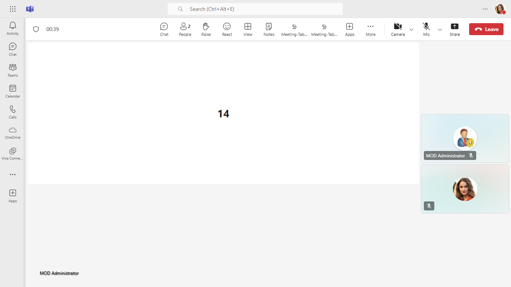

## Meeting Tabs Sample (Python Flask)

This sample provides an interactive demonstration of a Teams meeting side panel that allows users to easily Mute and Unmute audio during calls. It includes app stage view functionality, RSC permissions, and adapts to various Teams themes, ensuring a seamless experience across different environments. Built with Python Flask for backend services.

## Included Features
* Meeting Stage
* Meeting SidePanel
* RSC Permissions

**Interaction with bot**


**Interaction with Teams Themes**


## Try it yourself - experience the App in your Microsoft Teams client
Please find below demo manifest which is deployed on Microsoft Azure and you can try it yourself by uploading the app package (.zip file link below) to your teams and/or as a personal app. (Sideloading must be enabled for your tenant, [see steps here](https://docs.microsoft.com/microsoftteams/platform/concepts/build-and-test/prepare-your-o365-tenant#enable-custom-teams-apps-and-turn-on-custom-app-uploading)).

**Meeting-Tabs:** [Manifest](/samples/meeting-tabs/python/demo-manifest/meeting-tabs.zip)

## Prerequisites

- [Python 3.7+](https://www.python.org/downloads/)
- [pip](https://pip.pypa.io/en/stable/installation/)
- [dev tunnel](https://learn.microsoft.com/en-us/azure/developer/dev-tunnels/get-started?tabs=windows) or [ngrok](https://ngrok.com/) latest version or equivalent tunnelling solution
- [Microsoft 365 Agents Toolkit for VS Code](https://marketplace.visualstudio.com/items?itemName=TeamsDevApp.ms-teams-vscode-extension) or [TeamsFx CLI](https://learn.microsoft.com/microsoftteams/platform/toolkit/teamsfx-cli?pivots=version-one)

## Run the app (Using Microsoft 365 Agents Toolkit for Visual Studio Code)

The simplest way to run this sample in Teams is to use Microsoft 365 Agents Toolkit for Visual Studio Code.

1. Ensure you have downloaded and installed [Visual Studio Code](https://code.visualstudio.com/docs/setup/setup-overview)
1. Install the [Microsoft 365 Agents Toolkit extension](https://marketplace.visualstudio.com/items?itemName=TeamsDevApp.ms-teams-vscode-extension)
1. Select **File > Open Folder** in VS Code and choose this samples directory from the repo
1. Using the extension, sign in with your Microsoft 365 account where you have permissions to upload custom apps
1. Select **Debug > Start Debugging** or **F5** to run the app in a Teams web client.
1. In the browser that launches, select the **Add** button to install the app to Teams.
> If you do not have permission to upload custom apps (sideloading), Microsoft 365 Agents Toolkit will recommend creating and using a Microsoft 365 Developer Program account - a free program to get your own dev environment sandbox that includes Teams.

## Setup

> Note these instructions are for running the sample on your local machine.

1. Run ngrok - point to port 3978

   ```bash
   ngrok http 3978 --host-header="localhost:3978"
   ```  

   Alternatively, you can also use the `dev tunnels`. Please follow [Create and host a dev tunnel](https://learn.microsoft.com/en-us/azure/developer/dev-tunnels/get-started?tabs=windows) and host the tunnel with anonymous user access command as shown below:

   ```bash
   devtunnel host -p 3978 --allow-anonymous
   ```


2) App Registration

### Register your application with Azure AD

1. Register a new application in the [Microsoft Entra ID – App Registrations](https://go.microsoft.com/fwlink/?linkid=2083908) portal.
2. Select **New Registration** and on the *register an application page*, set following values:
     * Set **name** to your app name.
     * Choose the **supported account types** (any account type will work)
     * Leave **Redirect URI** empty.
     * Choose **Register**.
3. On the overview page, copy and save the **Application (client) ID, Directory (tenant) ID**. You'll need those later when updating your Teams application manifest and in the appsettings.json.
4. Navigate to **API Permissions**, and make sure to add the follow permissions:
     * Select Add a permission
     * Select Microsoft Graph -> Delegated permissions.
     * `User.Read` (enabled by default)
     * Click on Add permissions. Please make sure to grant the admin consent for the required permissions.

5. Ensure that you've [enabled the Teams Channel](https://docs.microsoft.com/en-us/azure/bot-service/channel-connect-teams?view=azure-bot-service-4.0)

3. Clone the repository

     ```bash
      git clone https://github.com/OfficeDev/Microsoft-Teams-Samples.git
     ```

4. In the folder where repository is cloned navigate to `samples/meeting-tabs/python`

5. Create and activate a virtual environment (recommended)

     ```bash
     python -m venv venv
  
     ```

6. Install Python dependencies

     ```bash
     pip install -r requirements.txt
     ```

7. Update the `.env` file with your configuration:
     - Set `MicrosoftAppId` to your Azure App Registration ID
     - Set `MicrosoftAppPassword` to your Azure App Registration secret
     - Set `TeamsAppId` to your Teams App ID
     - Port is set to 3978 by default

8. Run your Flask app

    ```bash
    python app.py
    ```

    The app will start on `https://localhost:3978` with SSL support.

9. __*This step is specific to Teams.*__

- **Edit** the `manifest.json` contained in the  `appManifest` folder to replace your Microsoft App Id (that was created when you registered your app earlier) *everywhere* you see the place holder string `${{TEAMS_APP_ID}}` 

- **Edit** the `manifest.json` for `${{TAB_DOMAIN}}` with base Url domain. E.g. if you are using ngrok it would be `https://1234.ngrok-free.app` then your domain-name will be `1234.ngrok-free.app` and if you are using dev tunnels then your domain will be like: `12345.devtunnels.ms`.

- **Zip** up the contents of the `appManifest` folder to create a `manifest.zip` (Make sure that zip file does not contains any subfolder otherwise you will get error while uploading your .zip package)

- **Upload** the `manifest.zip` to Teams (In Teams Apps/Manage your apps click "Upload an app". Browse to and Open the .zip file. At the next dialog, click the Add button.)

- Add the app to team/groupChat scope (Supported scopes). 


## Running the sample

You can interact with Teams Tab meeting sidepanel.

1. **Install app**


2. **Type a meeting name**


3. **Select meeting name**


4. **Add meeting tab**


5. **Select your app**


6. **Add meeting tab**


7. **Home page**


8. **Click share To stage view**


9. **Share To stage view**


10. **Toggle To Mute**
Toggle button to mute state its looks like below.


11. **Toggle To Unmute**
Toggle button to Unmute state it will unmute client audio.


12. **App theme when dark**


13. **App theme when light**


14. **App theme when contrast**


## Further reading

- [Toggle incoming audio](https://docs.microsoft.com/en-us/microsoftteams/platform/apps-in-teams-meetings/api-references?tabs=dotnet#toggle-incoming-audio)
- [Get incoming audio speaker](https://docs.microsoft.com/en-us/microsoftteams/platform/apps-in-teams-meetings/api-references?tabs=dotnet#get-incoming-audio-speaker)
- [Generate meeting side panel](https://learn.microsoft.com/en-us/microsoftteams/platform/sbs-meetings-sidepanel?tabs=vs)
- [Handle theme change](https://learn.microsoft.com/en-us/microsoftteams/platform/tabs/how-to/access-teams-context?tabs=Json-v2%2Cteamsjs-v2%2Cdefault#handle-theme-change)


