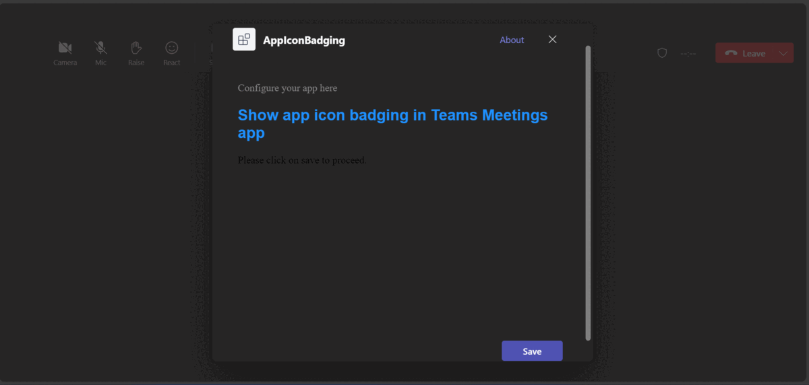
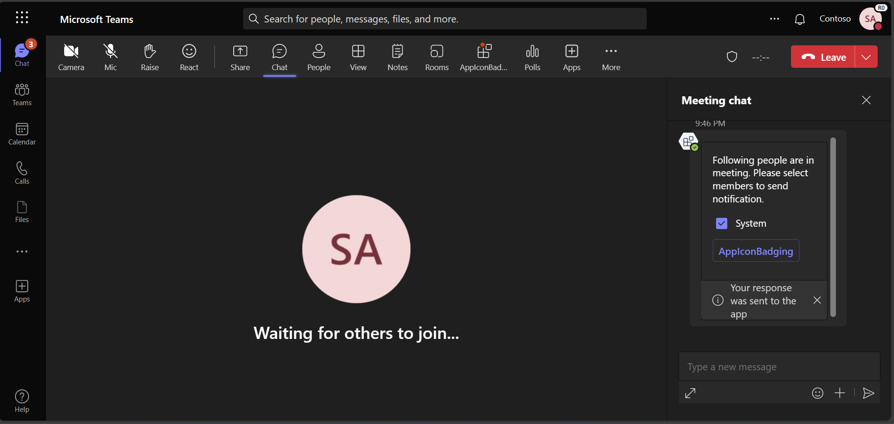

## App Icon Badging In Teams Meeting Notification

This sample illustrates how to send app icon badging notification on tab icon in Teams meetings.

## Included Features
* Bots
* In-Meeting Notifications
* RSC Permissions
* App Icon Badging

## Interaction with app



## Prerequisites

- Microsoft Teams is installed and you have an account
- [.NET Core SDK](https://dotnet.microsoft.com/download) version 6.0
- [ngrok](https://ngrok.com/) or equivalent tunnelling solution

## Setup

1. Register a new application in the [Azure Active Directory – App Registrations](https://go.microsoft.com/fwlink/?linkid=2083908) portal.

2. Setup for Bot	
	- Also, register a bot with Azure Bot Service, following the instructions [here](https://docs.microsoft.com/azure/bot-service/bot-service-quickstart-registration?view=azure-bot-service-3.0).
	- Ensure that you've [enabled the Teams Channel](https://docs.microsoft.com/azure/bot-service/channel-connect-teams?view=azure-bot-service-4.0)
	- While registering the bot, use `https://<your_ngrok_url>/api/messages` as the messaging endpoint.

    > NOTE: When you create your app registration, you will create an App ID and App password - make sure you keep these for later.

3. Setup NGROK
      - Run ngrok - point to port 3978

	```bash
	# ngrok http 3978 --host-header="localhost:3978"
	```
4. Setup for code
- Clone the repository

    ```bash
    git clone https://github.com/OfficeDev/Microsoft-Teams-Samples.git
    ```

- If you are using Visual Studio
  - Launch Visual Studio
  - File -> Open -> Project/Solution
  - Navigate to `samples/meetings-app-icon-badging/csharp` folder
  - Select `AppIconBadgingInMeetings.sln` file


- Modify the `/appsettings.json` and fill in the following details:
  - `{{MICROSOFT_APP_ID}}` - Generated from Step 1 while doing AAd app registration in Azure portal.
  - `{{ MICROSOFT_APP_PASSWORD}}` - Generated from Step 1, also referred to as Client secret
  - `{{ BaseURL }}` - Your application's base url. E.g. https://12345.ngrok-free.app if you are using ngrok.


5. Setup Manifest for Teams
- __*This step is specific to Teams.*__
    - **Edit** the `manifest.json` contained in the ./Manifest folder to replace your Microsoft App Id (that was created when you registered your app registration earlier) *everywhere* you see the place holder string `{{Microsoft-App-Id}}` (depending on the scenario the Microsoft App Id may occur multiple times in the `manifest.json`)
    - **Edit** the `manifest.json` for `validDomains` and replace `{{domain-name}}` with base Url of your domain. E.g. if you are using ngrok it would be `https://1234.ngrok-free.app` then your domain-name will be `1234.ngrok-free.app`.
    - **Zip** up the contents of the `Manifest` folder to create a `manifest.zip` (Make sure that zip file does not contains any subfolder otherwise you will get error while uploading your .zip package)

- Upload the manifest.zip to Teams (in the Apps view click "Upload a custom app")
   - Go to Microsoft Teams. From the lower left corner, select Apps
   - From the lower left corner, choose Upload a custom App
   - Go to your project directory, the ./Manifest folder, select the zip folder, and choose Open.
   - Select Add in the pop-up dialog box. Your app is uploaded to Teams.

**Note**: If you are facing any issue in your app, please uncomment [this](https://github.com/OfficeDev/Microsoft-Teams-Samples/blob/main/samples/meetings-notification/csharp/AppIconBadgingInMeetings/AdapterWithErrorHandler.cs#L26) line and put your debugger for local debug.

## Interacting with the app in Teams Meeting

Message the Bot by @ mentioning to interact with meetings notifications.
1. You will see an Adaptive Card.
1. Select option and click on `App Icon badging` button
1. You can send notification with red color icon on your configurable tab.


## Running the sample

**Setup Configurable Tab:**


**Interacting with the app in Teams Meeting**

Type `SendNotification` in bot chat to send In-Meeting notifications.

**Notification On Tab Icon as 'Icon Badging':**




## Further reading

- [Enable app icon badging for your Teams app](https://learn.microsoft.com/en-us/microsoftteams/platform/apps-in-teams-meetings/app-icon-badging-for-your-app?branch=pr-en-us-8495)

- [Grant RSC permissions to your app](https://learn.microsoft.com/en-us/microsoftteams/platform/graph-api/rsc/grant-resource-specific-consent#install-your-app-in-a-team-or-chat)


