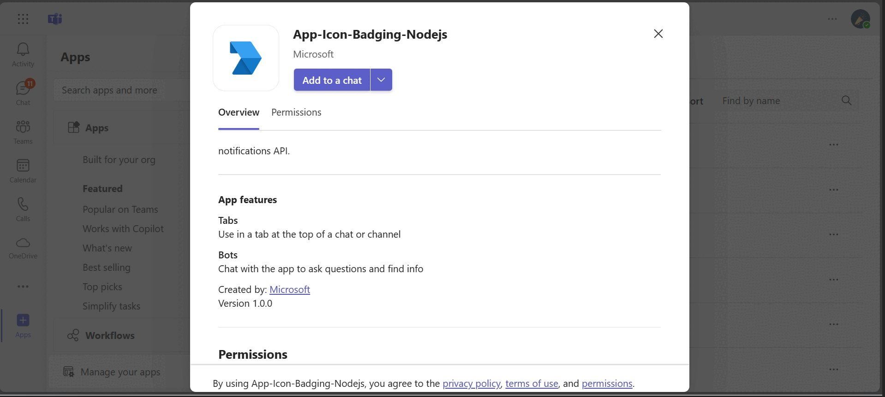
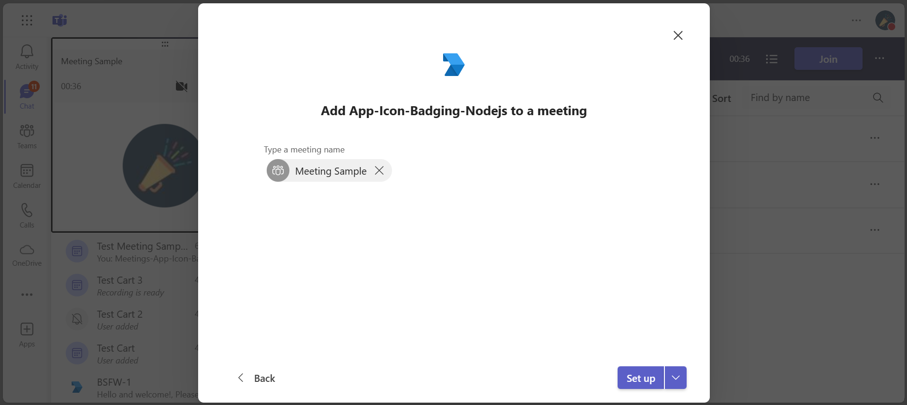
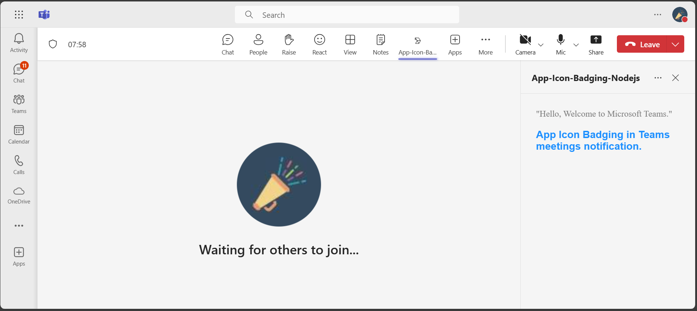
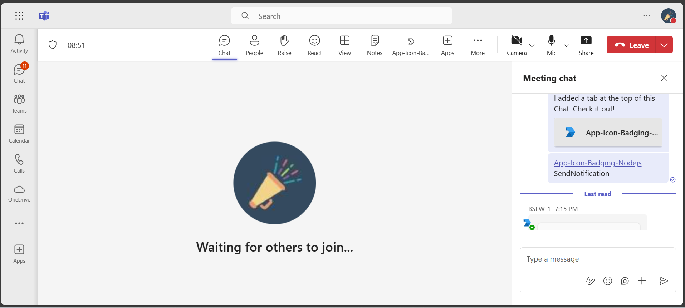
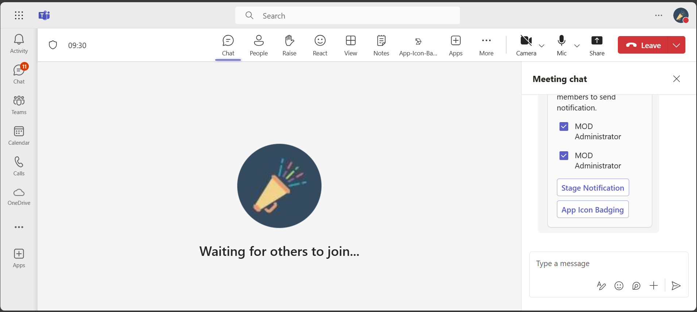
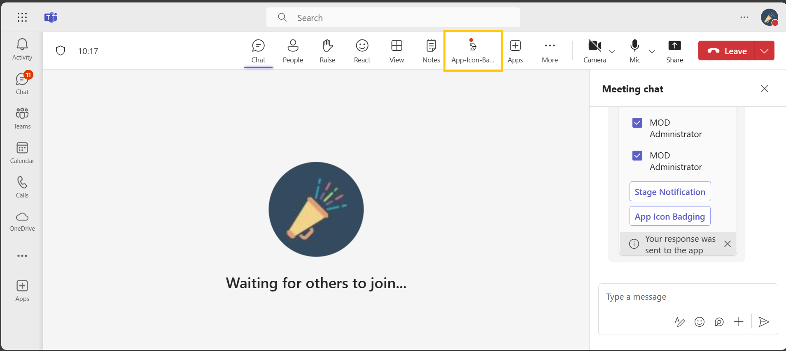

## App Icon Badging In Teams Meeting Notification

This sample application illustrates how to implement app icon badging notifications in Teams meetings using the targeted notifications API. It supports features like bots, in-meeting notifications, and RSC permissions, enabling developers to enhance user interaction within their Teams applications.

## Included Features
* Bots
* In-Meeting Notifications
* RSC Permissions
* App Icon Badging

## Interaction with app



## Try it yourself - experience the App in your Microsoft Teams client
Please find below demo manifest which is deployed on Microsoft Azure and you can try it yourself by uploading the app package (.zip file link below) to your teams and/or as a personal app. (Sideloading must be enabled for your tenant, [see steps here](https://docs.microsoft.com/microsoftteams/platform/concepts/build-and-test/prepare-your-o365-tenant#enable-custom-teams-apps-and-turn-on-custom-app-uploading)).

**App Icon Badging:** [Manifest](/samples/meetings-app-icon-badging/csharp/demo-manifest/meetings-app-icon-badging.zip)

## Prerequisites

- To test locally, [NodeJS](https://nodejs.org/en/download/) must be installed on your development machine (version 16.14.2  or higher).

    ```bash
    # determine node version
    node --version
    ```
- Office 365 tenant. You can get a free tenant for development use by signing up for the [Office 365 Developer Program](https://developer.microsoft.com/microsoft-365/dev-program).

- [dev tunnel](https://learn.microsoft.com/en-us/azure/developer/dev-tunnels/get-started?tabs=windows) or [ngrok](https://ngrok.com/) latest version or equivalent tunnelling solution

- If you are using Ngrok to test locally, you'll need [Ngrok](https://ngrok.com/) installed on your development machine.
Make sure you've downloaded and installed Ngrok on your local machine. Ngrok will tunnel requests from the Internet to your local computer and terminate the SSL connection from Teams.

- [Teams Toolkit for VS Code](https://marketplace.visualstudio.com/items?itemName=TeamsDevApp.ms-teams-vscode-extension) or [TeamsFx CLI](https://learn.microsoft.com/microsoftteams/platform/toolkit/teamsfx-cli?pivots=version-one)

## Run the app (Using Teams Toolkit for Visual Studio Code)

The simplest way to run this sample in Teams is to use Teams Toolkit for Visual Studio Code.

1. Ensure you have downloaded and installed [Visual Studio Code](https://code.visualstudio.com/docs/setup/setup-overview)
1. Install the [Teams Toolkit extension](https://marketplace.visualstudio.com/items?itemName=TeamsDevApp.ms-teams-vscode-extension)
1. Select **File > Open Folder** in VS Code and choose this samples directory from the repo
1. Using the extension, sign in with your Microsoft 365 account where you have permissions to upload custom apps
1. Select **Debug > Start Debugging** or **F5** to run the app in a Teams web client.
1. In the browser that launches, select the **Add** button to install the app to Teams.
> If you do not have permission to upload custom apps (uploading), Teams Toolkit will recommend creating and using a Microsoft 365 Developer Program account - a free program to get your own dev environment sandbox that includes Teams.

## Setup

> NOTE: The free ngrok plan will generate a new URL every time you run it, which requires you to update your Azure AD registration, the Teams app manifest, and the project configuration. A paid account with a permanent ngrok URL is recommended.

1) Setup for Bot
- Register Azure AD application resource in Azure portal
- In Azure portal, create a [Azure Bot resource](https://docs.microsoft.com/azure/bot-service/bot-builder-authentication?view=azure-bot-service-4.0&tabs=csharp%2Caadv2).

- Ensure that you've [enabled the Teams Channel](https://docs.microsoft.com/azure/bot-service/channel-connect-teams?view=azure-bot-service-4.0)

- While registering the bot, use `https://<your_tunnel_domain>/api/messages` as the messaging endpoint.
    
    > NOTE: When you create your app registration in Azure portal, you will create an App ID and App password - make sure you keep these for later.

2) Setup NGROK  
 - Run ngrok - point to port 3978

   ```bash
   ngrok http 3978 --host-header="localhost:3978"
   ```  

   Alternatively, you can also use the `dev tunnels`. Please follow [Create and host a dev tunnel](https://learn.microsoft.com/en-us/azure/developer/dev-tunnels/get-started?tabs=windows) and host the tunnel with anonymous user access command as shown below:

   ```bash
   devtunnel host -p 3978 --allow-anonymous
   ```

3) App Registration

### Register your application with Azure AD

1. Register a new application in the [Microsoft Entra ID – App Registrations](https://go.microsoft.com/fwlink/?linkid=2083908) portal.
2. Select **New Registration** and on the *register an application page*, set following values:
    * Set **name** to your app name.
    * Choose the **supported account types** (any account type will work)
    * Leave **Redirect URI** empty.
    * Choose **Register**.
3. On the overview page, copy and save the **Application (client) ID, Directory (tenant) ID**. You'll need those later when updating your Teams application manifest and in the appsettings.json.
4. Navigate to **API Permissions**, and make sure to add the follow permissions:
    * Select Add a permission
    * Select Microsoft Graph -> Delegated permissions.
    * `User.Read` (enabled by default)
    * Click on Add permissions. Please make sure to grant the admin consent for the required permissions.

4) Setup for code   
- Clone the repository

    ```bash
    git clone https://github.com/OfficeDev/Microsoft-Teams-Samples.git
    ```

- In a terminal, navigate to `samples\meetings-app-icon-badging\nodejs`

    ```bash
    cd samples/meetings-app-icon-badging/nodejs
    ```

- Install modules

    ```bash
    npm install
    ```

- Go to .env file in your project folder and update `MicrosoftAppId`, `MicrosoftAppPassword` with the values received from your Microsoft Entra ID app registration.
  - Update `BaseUrl` as per your domain like ngrok url: https://1234.ngrok-free.app 

- Start the bot

    ```bash
    npm start
    ```
 
5) Setup Manifest for Teams

- Modify the `manifest.json` file placed in `/appManifest` folder and replace the <<YOUR-MICROSOFT-APP-ID>> with your Microsoft App Id received via doing Microsoft Entra ID app registration in your Azure Portal.
    - **Edit** the `manifest.json` for `validDomains` and replace <<Valid-Domain>> with base Url domain. E.g. if you are using ngrok it would be `https://1234.ngrok-free.app` then your domain-name will be `1234.ngrok-free.app` and if you are using dev tunnels then your domain will be like: `12345.devtunnels.ms`.
    - **Zip** up the contents of the `appManifest` folder to create a `manifest.zip`
    - - **Upload** the `manifest.zip` to Teams
         - Select **Apps** from the left panel.
         - Then select **Upload a custom app** from the lower right corner.
         - Then select the `manifest.zip` file from `appManifest`.
         - [Install the App in Teams Meeting](https://docs.microsoft.com/microsoftteams/platform/apps-in-teams-meetings/teams-apps-in-meetings?view=msteams-client-js-latest#meeting-lifecycle-scenarios)

**Note**: If you are facing any issue in your app, please uncomment [this](https://github.com/OfficeDev/Microsoft-Teams-Samples/blob/main/samples/meetings-app-icon-badging/nodejs/index.js#L45) line and put your debugger for local debug.

## Running the sample

**Setup Configurable Tab:**


**Interacting with the app in Teams Meeting**





Type `SendNotification` in bot chat to send In-Meeting notifications.



**Notification On Tab Icon as 'Icon Badging':**





## Further reading

- [Enable app icon badging for your Teams app](https://review.learn.microsoft.com/en-us/microsoftteams/platform/apps-in-teams-meetings/app-icon-badging-for-your-app?branch=pr-en-us-8495)

- [Grant RSC permissions to your app](https://learn.microsoft.com/en-us/microsoftteams/platform/graph-api/rsc/grant-resource-specific-consent#install-your-app-in-a-team-or-chat)


