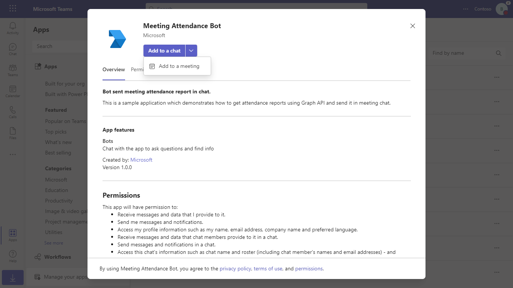
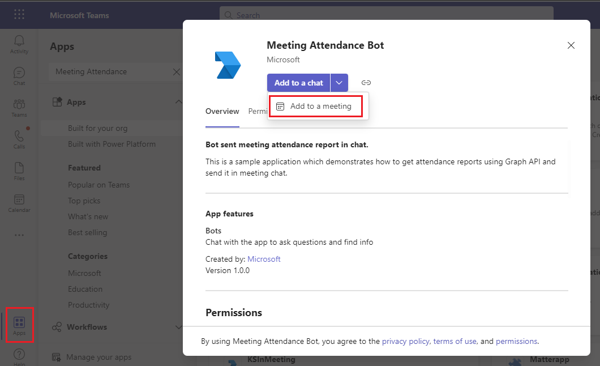
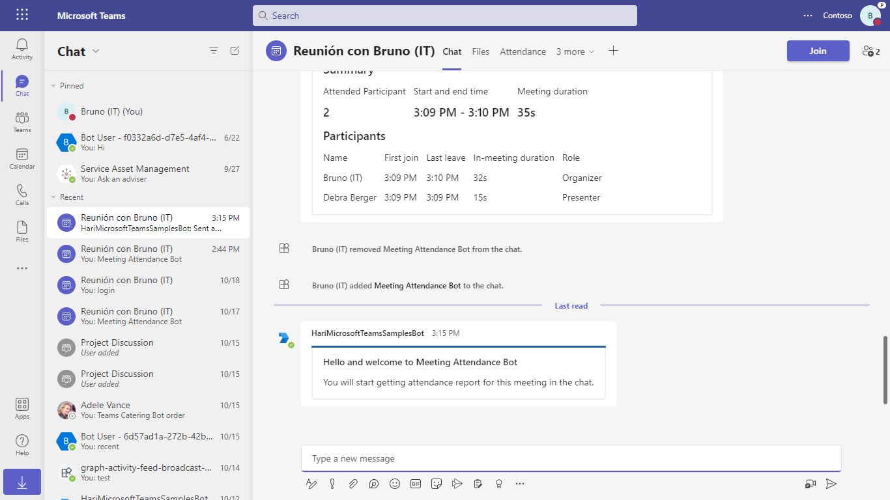
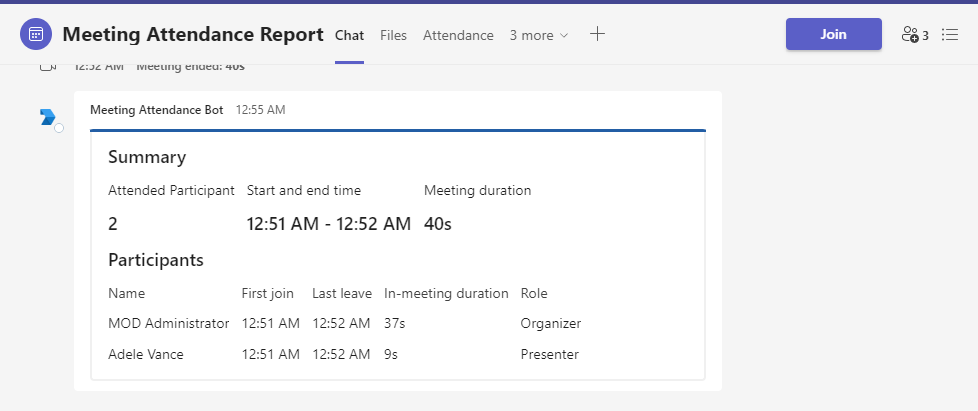

# Meeting attendance report

This is a sample application which demonstrates how to get meeting attendance report using Graph API and send it in meeting chat using bot.

## Included Features
* Bots
* Graph API

## Interaction with app

When meeting ends, attendance report card is sent by the bot.


## Prerequisites

-  Microsoft Teams is installed and you have an account (not a guest account)
-  To test locally, [NodeJS](https://nodejs.org/en/download/) must be installed on your development machine (version 16.14.2  or higher).
-  [ngrok](https://ngrok.com/) or equivalent tunneling solution
-  [M365 developer account](https://docs.microsoft.com/en-us/microsoftteams/platform/concepts/build-and-test/prepare-your-o365-tenant) or access to a Teams account with the appropriate permissions to install an app.

## Setup

> Note these instructions are for running the sample on your local machine, the tunnelling solution is required because
> the Teams service needs to call into the bot.

1. Register a new application in the [Azure Active Directory – App Registrations](https://go.microsoft.com/fwlink/?linkid=2083908) portal.
    -  Click on "New registration", and create an Azure AD application.

   -  **Name:**  The name of your Teams app - if you are following the template for a default deployment, we recommend "App catalog lifecycle".

   -  **Supported account types:**  Select "Accounts in any organizational directory"

   -  Leave the "Redirect URL" field blank.   

   - Click on the "Register" button.

    - When the app is registered, you'll be taken to the app's "Overview" page. Copy the  **Application (client) ID**; we will need it later. Verify that the "Supported account types" is set to  **Multiple organizations**.

   -  On the side rail in the Manage section, navigate to the "Certificates & secrets" section. In the Client secrets section, click on "+ New client secret". Add a description for the secret and select Expires as "Never". Click "Add".

   -  Once the client secret is created, copy its  **Value**, please take a note of the secret as it will be required later.

   - At this point you have 3 unique values:
       -   Application (client) ID which will be later used during Azure bot creation
       -   Client secret for the bot which will be later used during Azure bot creation
       -   Directory (tenant) ID
   We recommend that you copy these values into a text file, using an application like Notepad. We will need these values later.

   -  Under left menu, navigate to  **API Permissions**, and make sure to add the following permissions of Microsoft Graph API > Application permissions:
       -  OnlineMeetingArtifact.Read.All

   Click on Add Permissions to commit your changes.

   - If you are logged in as the Global Administrator, click on the Grant admin consent for %tenant-name% button to grant admin consent else, inform your admin to do the same through the portal or follow the steps provided here to create a link and send it to your admin for consent.

     - Global Administrator can grant consent using following link:  [https://login.microsoftonline.com/common/adminconsent?client_id=](https://login.microsoftonline.com/common/adminconsent?client_id=)<%appId%> 
  
2. Setup for Bot
- In Azure portal, create a [Azure Bot resource](https://docs.microsoft.com/en-us/azure/bot-service/bot-builder-authentication?view=azure-bot-service-4.0&tabs=csharp%2Caadv2).

- Ensure that you've [enabled the Teams Channel](https://docs.microsoft.com/en-us/azure/bot-service/channel-connect-teams?view=azure-bot-service-4.0)

- To test locally, you'll need [Ngrok](https://ngrok.com/) installed on your development machine.
Make sure you've downloaded and installed Ngrok on your local machine. ngrok will tunnel requests from the Internet to your local computer and terminate the SSL connection from Teams.
3. Allow applications to access online meetings on behalf of a user

  - Follow this link- [Configure application access policy](https://docs.microsoft.com/en-us/graph/cloud-communication-online-meeting-application-access-policy)

  - **Note**: Copy the User Id you used to granting the policy. You need while configuring the .env file.

4. Setup NGROK  
  - Run ngrok - point to port 3978

    ```bash
    ngrok http 3978 --host-header="localhost:3978"
    ```
   - Once started you should see URL  `https://41ed-abcd-e125.ngrok-free.app`. Copy it, this is your baseUrl that will used as endpoint for Azure bot and webhook.

5. Setup for code  
   - Clone the repository

    ```bash
    git clone https://github.com/OfficeDev/Microsoft-Teams-Samples.git
    ```
   -Update the `.env` configuration for the bot to use the `MicrosoftAppId` and `MicrosoftAppPassword` and `MicrosoftAppTenantId` and `AppBaseUrl` and `UserId` (Note that the MicrosoftAppId is the AppId created in step 1 , the MicrosoftAppPassword is referred to as the "client secret" in step 1 and you can always create a new client secret anytime., MicrosoftAppTenantId is reffered to as Directory tenant Id in step 1, AppBaseUrl is the URL that you get in step 3 after running ngrok, UserId of the user used while granting the policy in step 1).

  - In the folder where repository is cloned navigate to `samples/meetings-attendance-report/nodejs`

  - Install node modules

   Inside node js folder, open your local terminal and run the below command to install node modules. You can do the same in Visual studio code terminal by opening the project in Visual studio code 

    ```bash
    npm install
    ```

   - Run your app

    ```bash
    npm start
    ```


6. Setup Manifest for Teams
 - __*This step is specific to Teams.*__
     - **Edit** the `manifest.json` contained in the ./AppPackage folder to replace your Microsoft App Id (that was created when you registered your app registration earlier) *everywhere* you see the place holder string `{{Microsoft-App-Id}}` (depending on the scenario the Microsoft App Id may occur multiple times in the `manifest.json`)
     - **Edit** the `manifest.json` for `validDomains` and replace `{{domain-name}}` with base Url of your domain. E.g. if you are using ngrok it would be `https://1234.ngrok-free.app` then your domain-name will be `1234.ngrok-free.app`.
     - **Zip** up the contents of the `AppPackage` folder to create a `manifest.zip` (Make sure that zip file does not contains any subfolder otherwise you will get error while uploading your .zip package)

 - Upload the manifest.zip to Teams (in the Apps view click "Upload a custom app")
    - Go to Microsoft Teams. From the lower left corner, select Apps
    - From the lower left corner, choose Upload a custom App
    - Go to your project directory, the ./AppPackage folder, select the zip folder, and choose Open.
    - Select Add in the pop-up dialog box. Your app is uploaded to Teams.

**Note**: If you are facing any issue in your app, please uncomment [this](https://github.com/OfficeDev/Microsoft-Teams-Samples/blob/main/samples/meetings-attendance-report/nodejs/index.js#L52) line and put your debugger for local debug.

## Running the sample

**Schedule the meeting and add Meeting Attendance Bot from Apps section in that particular scheduled meeting:**



**Add Meeting UI:**



**On installation you will get a welcome card:**



**Once the bot is installed in the meeting, whenever meeting ends bot will send attendance report:**



## Further reading
- [List Meeting Attendance Reports](https://docs.microsoft.com/en-us/graph/api/meetingattendancereport-list?view=graph-rest-1.0&tabs=http)
- [List Attendance Records](https://docs.microsoft.com/en-us/graph/api/attendancerecord-list?view=graph-rest-1.0&tabs=http)
- [Configure application access policy](https://docs.microsoft.com/en-us/graph/cloud-communication-online-meeting-application-access-policy)
- [Bot Framework Documentation](https://docs.botframework.com)
- [Bot Basics](https://docs.microsoft.com/azure/bot-service/bot-builder-basics?view=azure-bot-service-4.0)
- [Azure Portal](https://portal.azure.com)
- [Add Authentication to Your Bot Via Azure Bot Service](https://docs.microsoft.com/en-us/azure/bot-service/bot-builder-authentication?view=azure-bot-service-4.0&tabs=csharp)
- [Activity processing](https://docs.microsoft.com/en-us/azure/bot-service/bot-builder-concept-activity-processing?view=azure-bot-service-4.0)
- [Azure Bot Service Introduction](https://docs.microsoft.com/azure/bot-service/bot-service-overview-introduction?view=azure-bot-service-4.0)
- [Azure Bot Service Documentation](https://docs.microsoft.com/azure/bot-service/?view=azure-bot-service-4.0)
- [.NET Core CLI tools](https://docs.microsoft.com/en-us/dotnet/core/tools/?tabs=netcore2x)
- [Azure CLI](https://docs.microsoft.com/cli/azure/?view=azure-cli-latest)
- [Azure Portal](https://portal.azure.com)
- [Language Understanding using LUIS](https://docs.microsoft.com/en-us/azure/cognitive-services/luis/)
- [Channels and Bot Connector Service](https://docs.microsoft.com/en-us/azure/bot-service/bot-concepts?view=azure-bot-service-4.0)
- [Microsoft Teams Developer Platform](https://docs.microsoft.com/en-us/microsoftteams/platform/)


