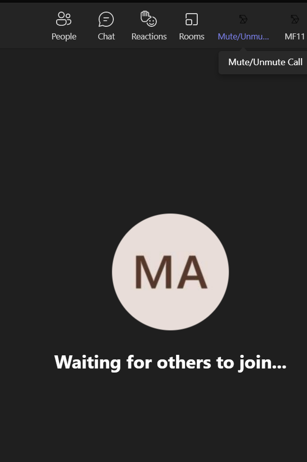
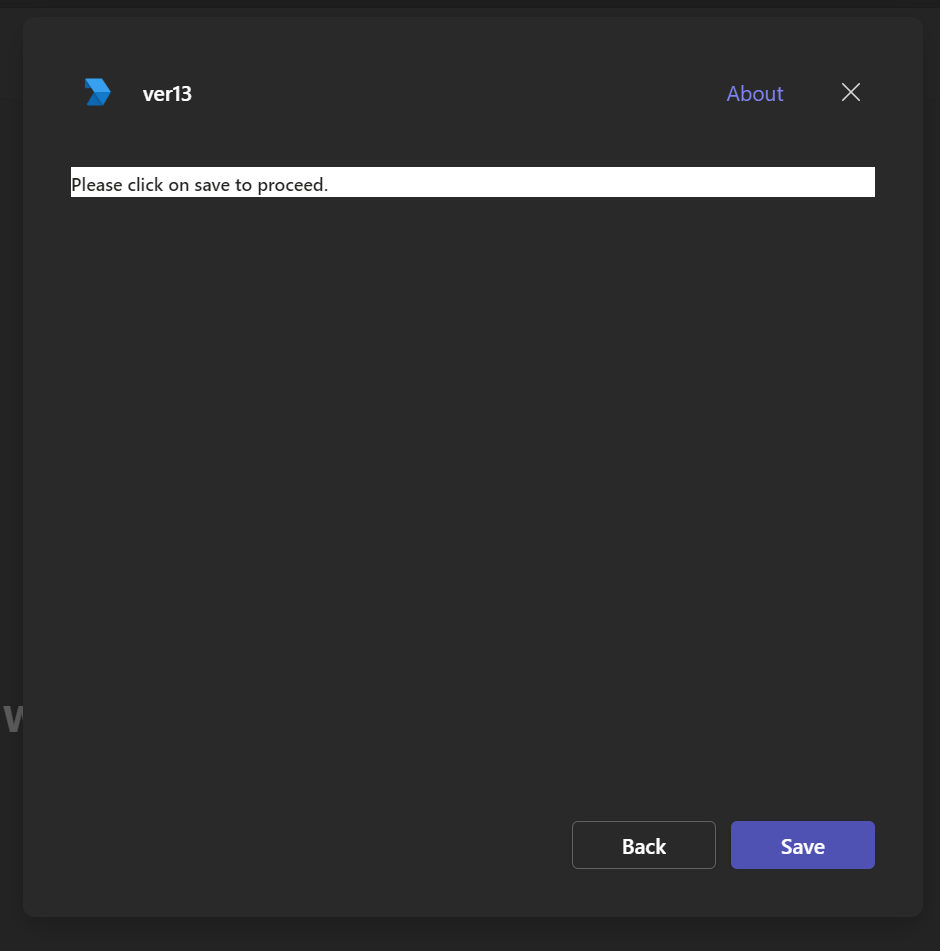
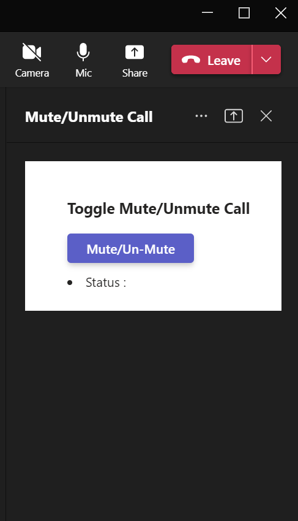

##Mute/Unmute Api Sample
  
  
  


## Prerequisites

- [ReactJs](https://reactjs.org/en/)
- [ngrok](https://ngrok.com/) or equivalent tunnelling solution

### 1. App Registration 
In Azure portal, [Register an app ](https://portal.azure.com/#view/Microsoft_AAD_RegisteredApps/ApplicationsListBlade)

1) Clone the repository
    ```bash
    git clone https://github.com/OfficeDev/Microsoft-Teams-Samples.git
    ```

2) In the folder where repository is cloned navigate to `samples/meetings-audio-state/nodejs`

3) Install node modules

   Inside node js folder, open your local terminal and run the below command to install node modules. You can do the same in Visual Studio code terminal by opening the project in Visual Studio code.

    ```bash
    npm install
    ```
4) Run ngrok - point to port 3978

    ```bash
    ngrok http -host-header=rewrite 3978
    ```
5) Update the `.env`

6) Run your app

    ```bash
    npm start
    ```
7) Manually update the manifest.json
    - Edit the `manifest.json` contained in the  `appPackage/` folder to replace with your MicrosoftAppId (that was created in step1.1) *everywhere* you see the place holder string `{MicrosoftAppId}` (depending on the scenario the Microsoft App Id may occur multiple times in the `manifest.json`)
    - Zip up the contents of the `appPackage/` folder to create a `manifest.zip`
    - Upload the `manifest.zip` to Teams (in the left-bottom *Apps* view, click "Upload a custom app")

## Further reading

- [Toggle incoming audio](https://docs.microsoft.com/en-us/microsoftteams/platform/apps-in-teams-meetings/api-references?tabs=dotnet#toggle-incoming-audio)
- [Get incoming audio speaker](https://docs.microsoft.com/en-us/microsoftteams/platform/apps-in-teams-meetings/api-references?tabs=dotnet#get-incoming-audio-speaker)
- 
