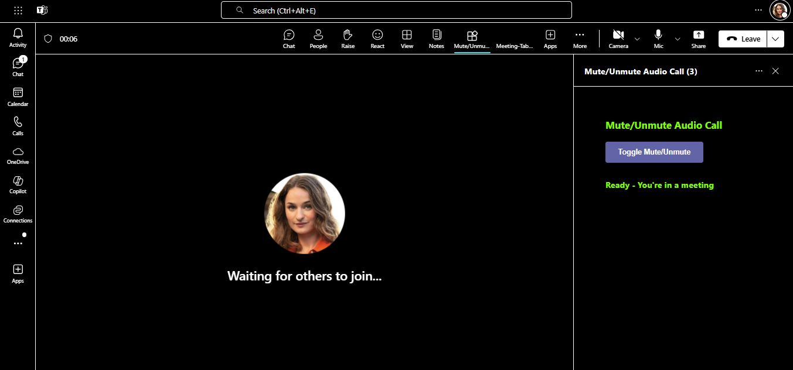

# Meeting Audio State Sample (Python)

This sample tab application showcases how to manage audio states in Microsoft Teams meetings by muting and unmuting using the Incoming Client Audio API. Built with Flask and Python, it features meeting side panel integration, support for Teams themes, and RSC permissions, providing a streamlined experience for controlling audio directly from the app.

## Included Features
* Meeting SidePanel
* RSC Permissions
* Teams Themes handler 

## Interaction with Tab


## Prerequisites
- [Python 3.8+](https://www.python.org/downloads/)
- [pip](https://pip.pypa.io/en/stable/installation/) (Python package installer)
- [dev tunnel](https://learn.microsoft.com/en-us/azure/developer/dev-tunnels/get-started?tabs=windows) or [ngrok](https://ngrok.com/) latest version or equivalent tunnelling solution
- [Microsoft 365 Agents Toolkit for VS Code](https://marketplace.visualstudio.com/items?itemName=TeamsDevApp.ms-teams-vscode-extension) or [TeamsFx CLI](https://learn.microsoft.com/microsoftteams/platform/toolkit/teamsfx-cli?pivots=version-one)

## Run the app (Using Microsoft 365 Agents Toolkit for Visual Studio Code)

The simplest way to run this sample in Teams is to use Microsoft 365 Agents Toolkit for Visual Studio Code.

1. Ensure you have downloaded and installed [Visual Studio Code](https://code.visualstudio.com/docs/setup/setup-overview)
1. Install the [Microsoft 365 Agents Toolkit extension](https://marketplace.visualstudio.com/items?itemName=TeamsDevApp.ms-teams-vscode-extension)
1. Select **File > Open Folder** in VS Code and choose this samples directory from the repo
1. Using the extension, sign in with your Microsoft 365 account where you have permissions to upload custom apps
1. Select **Debug > Start Debugging** or **F5** to run the app in a Teams web client.
1. In the browser that launches, select the **Add** button to install the app to Teams.
> If you do not have permission to upload custom apps (sideloading), Microsoft 365 Agents Toolkit will recommend creating and using a Microsoft 365 Developer Program account - a free program to get your own dev environment sandbox that includes Teams.

## Setup

> Note these instructions are for running the sample on your local machine.

1. Run ngrok - point to port 3978

   ```bash
   ngrok http 3978 --host-header="localhost:3978"
   ```  

   Alternatively, you can also use the `dev tunnels`. Please follow [Create and host a dev tunnel](https://learn.microsoft.com/en-us/azure/developer/dev-tunnels/get-started?tabs=windows) and host the tunnel with anonymous user access command as shown below:

   ```bash
   devtunnel host -p 3978 --allow-anonymous
   ```

2) App Registration

### Register your application with Azure AD

1. Register a new application in the [Microsoft Entra ID – App Registrations](https://go.microsoft.com/fwlink/?linkid=2083908) portal.
2. Select **New Registration** and on the *register an application page*, set following values:
    * Set **name** to your app name.
    * Choose the **supported account types** (any account type will work)
    * Leave **Redirect URI** empty.
    * Choose **Register**.
3. On the overview page, copy and save the **Application (client) ID, Directory (tenant) ID**. You'll need those later when updating your Teams application manifest and in the appsettings.json.
4. Navigate to **API Permissions**, and make sure to add the follow permissions:
    * Select Add a permission
    * Select Microsoft Graph -> Delegated permissions.
    * `User.Read` (enabled by default)
    * Click on Add permissions. Please make sure to grant the admin consent for the required permissions.
5. Navigate to the **Certificates & secrets**. In the Client secrets section, click on "+ New client secret". Add a description (Name of the secret) for the secret and select "Never" for Expires. Click "Add". Once the client secret is created, copy its value, it need to be placed in the .env file.

6. In Azure portal, create a [Azure Bot resource](https://docs.microsoft.com/en-us/azure/bot-service/bot-builder-authentication?view=azure-bot-service-4.0&tabs=csharp%2Caadv2).

7. Ensure that you've [enabled the Teams Channel](https://docs.microsoft.com/en-us/azure/bot-service/channel-connect-teams?view=azure-bot-service-4.0)

3. Clone the repository
    ```bash
    git clone https://github.com/OfficeDev/Microsoft-Teams-Samples.git
    ```

4. In the folder where repository is cloned navigate to `samples/meetings-audio-state/python`

5. Create a virtual environment and install dependencies

   Inside the python folder, open your terminal and run the below commands:

    ```bash
    # Create virtual environment
    python -m venv venv
    
    # Activate virtual environment (Windows)
    venv\Scripts\activate
    
    # Or on macOS/Linux
    source venv/bin/activate
    
    # Install dependencies
    pip install -r requirements.txt
    ```

6. Update the `.env.local` file with appropriate values:
   - `TAB_DOMAIN`: Your tunnel domain (e.g., `12345.devtunnels.ms`)
   - `TAB_ENDPOINT`: Your tunnel URL (e.g., `https://12345.devtunnels.ms`)
   - `BOT_DOMAIN`: Same as TAB_DOMAIN
   - `BOT_ENDPOINT`: Same as TAB_ENDPOINT

7. Run your Flask app

    ```bash
    python app.py
    ```

    The app will run on `http://localhost:3978`

8. __*This step is specific to Teams.*__

- **Edit** the `manifest.json` contained in the  `appManifest` folder to replace your Microsoft App Id (that was created when you registered your bot earlier) *everywhere* you see the place holder string `<<YOUR-MICROSOFT-APP-ID>>` (depending on the scenario the Microsoft App Id may occur multiple times in the `manifest.json`)

- **Edit** the `manifest.json` for `<<DOMAIN-NAME>>` with base Url domain. E.g. if you are using ngrok it would be `https://1234.ngrok-free.app` then your domain-name will be `1234.ngrok-free.app` and if you are using dev tunnels then your domain will be like: `12345.devtunnels.ms`.

- **Zip** up the contents of the `appManifest` folder to create a `manifest.zip` (Make sure that zip file does not contains any subfolder otherwise you will get error while uploading your .zip package)

- **Upload** the `manifest.zip` to Teams (In Teams Apps/Manage your apps click "Upload an app". Browse to and Open the .zip file. At the next dialog, click the Add button.)

- Add the app to personal/team/groupChat scope (Supported scopes). 

**Note:** RSC has been enabled post 1.11 hence this feature will not work below 1.12 (Manifest Version). 

## Running the sample

You can interact with Teams Tab meeting sidepanel.

1. **Select your app**


Add your application to the `meetings` as its display as below.


2. **Toggle To Mute**
Toggle button to mute state its looks like below.


3. **Toggle To Unmute**
Toggle button to Unmute state it will unmute client audio.


4. **Dark Theme**
App theme changes to dark when Teams theme switch to dark .


5. **Light Theme**
App theme changes to light when Teams theme switch to light .


6. **Contrast Theme**
App theme changes to contrast when Teams theme switch to contrast .



## Further reading

- [Toggle incoming audio](https://docs.microsoft.com/en-us/microsoftteams/platform/apps-in-teams-meetings/api-references?tabs=dotnet#toggle-incoming-audio)
- [Get incoming audio speaker](https://docs.microsoft.com/en-us/microsoftteams/platform/apps-in-teams-meetings/api-references?tabs=dotnet#get-incoming-audio-speaker)
- [Handle theme change](https://learn.microsoft.com/en-us/microsoftteams/platform/tabs/how-to/access-teams-context?tabs=Json-v2%2Cteamsjs-v2%2Cdefault#handle-theme-change)
- [Flask Documentation](https://flask.palletsprojects.com/)
- [Microsoft Teams JavaScript SDK](https://docs.microsoft.com/en-us/microsoftteams/platform/tabs/how-to/using-teams-client-sdk)


