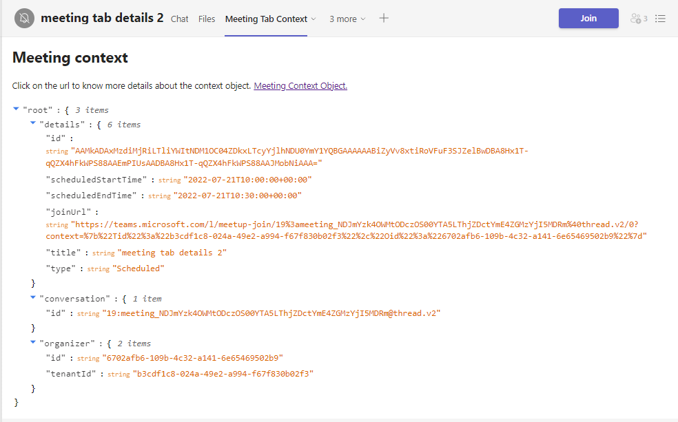
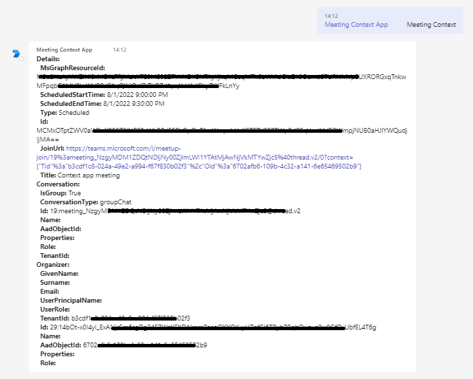
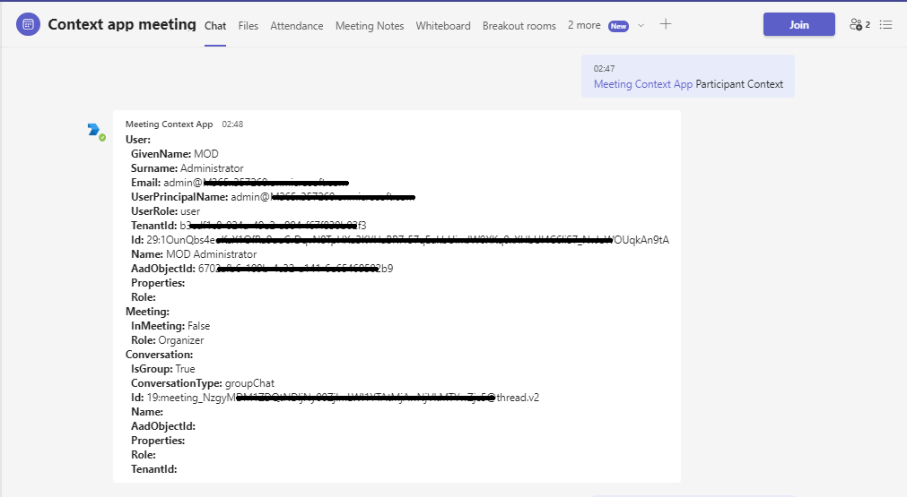

# Meeting context

This sample shows the contents of meeting tab context object in a meeting tab and shows the output of Meeting's API `TeamsInfo.GetMeetingParticipantAsync` and `TeamsInfo.GetMeetingInfoAsync` using bot commands.





## Prerequisites

- Microsoft Teams is installed and you have an account (not a guest account)
-  .[NET 6.0](https://dotnet.microsoft.com/en-us/download) SDK.
    ```bash
        # determine dotnet version
        dotnet --version
    ```
-  [ngrok](https://ngrok.com/) or equivalent tunneling solution
-  [M365 developer account](https://docs.microsoft.com/en-us/microsoftteams/platform/concepts/build-and-test/prepare-your-o365-tenant) or access to a Teams account with the appropriate permissions to install an app.


## To try this sample

1) Register your application with Azure AD

- Register a new application in the [Azure Active Directory – App Registrations](https://go.microsoft.com/fwlink/?linkid=2083908) portal.
- On the overview page, copy and save the **Application (client) ID, Directory (tenant) ID**. You’ll need those later when updating your Teams application manifest and in the appsettings.json.
-  Navigate to the **Certificates & secrets**. In the Client secrets section, click on "+ New client secret". Add a description (Name of the secret) for the secret and select “Never” for Expires. Click "Add". Once the client secret is created, copy its value, it need to be placed in the appsettings.json file.

2) Setup for Bot In Azure portal, create a [Azure Bot resource.](https://docs.microsoft.com/en-us/azure/bot-service/bot-builder-authentication?view=azure-bot-service-4.0&tabs=csharp%2Caadv2)

Ensure that you've [enabled the Teams Channel](https://docs.microsoft.com/en-us/azure/bot-service/channel-connect-teams?view=azure-bot-service-4.0)

3) Clone the repository
   ```bash
   git clone https://github.com/OfficeDev/Microsoft-Teams-Samples.git
   ```
4)  Launch Visual Studio
   - File -> Open -> Project/Solution
   - Navigate to folder where repository is cloned then `samples/meetings-context-app/csharp/MeetingContextApp.sln`
    
5) Start ngrok on localhost:3978
- Open ngrok and run command `ngrok http -host-header=rewrite 3978` 
- Once started you should see link  `https://41ed-abcd-e125.ngrok.io`. Copy it, this is your baseUrl that will used as endpoint for Azure bot.

6) Modify the `manifest.json` in the `/AppManifest` folder and replace the following details
   - `{{Manifest-id}}` with some unique GUID.
   - `{{Microsoft-App-Id}}`Registerd for app in step 1.
   - `{{Domain Name}}` with your application's base url, e.g. https://1234.ngrok.io

7) Zip the contents of `AppManifest` folder into a `manifest.zip`, and use the `manifest.zip` to deploy in app store or add to Teams.
    
8) Upload the manifest.zip to Teams (in the Apps view click "Upload a custom app")
   - Go to Microsoft Teams. From the lower left corner, select Apps
   - From the lower left corner, choose Apps -> Manage your apps -> Upload an app.
   - Go to your project directory, the ./AppPackage folder, select the zip folder, and choose Open.
   - Select Add in the pop-up dialog box. Your app is uploaded to Teams.
   
8) Add the app in meeting.

 **NOTE:** Only accounts with admin access can create private/shared channels in team.

## Features of the sample

- Add the app in meeting.
- The details of the meeting context object will be shown on tab based.
- You can expand/reduce the JSON for the context object and can also copy a particular object slice.

- You can send one of these two commands: **Meeting Context** or **Participant Context**
- It will send you the output of `TeamsInfo.GetMeetingInfoAsync` and `TeamsInfo.GetMeetingParticipantAsync`

## Further reading

- [Tab Basics](https://docs.microsoft.com/en-us/microsoftteams/platform/tabs/how-to/create-channel-group-tab?pivots=node-java-script)
- [Azure Portal](https://portal.azure.com)
- [Get-context-for-tabs](https://docs.microsoft.com/en-us/microsoftteams/platform/tabs/how-to/access-teams-context#retrieve-context-in-private-channels)
- [Meeting API reference](https://docs.microsoft.com/en-us/microsoftteams/platform/apps-in-teams-meetings/api-references?tabs=dotnet)
