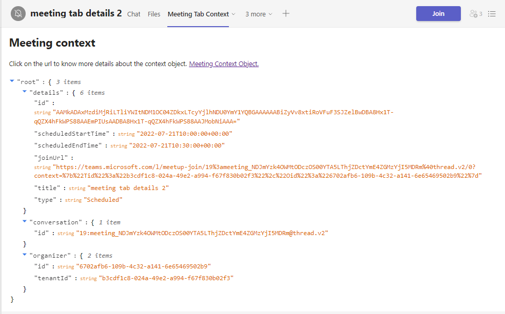

# Tab context in channel

This sample shows the contents of meeeting tab context object in a meeting tab.



## Prerequisites

- [NodeJS](https://nodejs.org/en/)
- [ngrok](https://ngrok.com/) or equivalent tunnelling solution
- [Teams](https://teams.microsoft.com) Microsoft Teams is installed and you have an account


## To try this sample

1) Register your app with Microsoft identity platform via the Azure AD portal
    - Your app must be registered in the Azure AD portal to integrate with the Microsoft identity platform and call Microsoft Graph APIs. See [Register an application with the Microsoft identity platform](https://docs.microsoft.com/en-us/graph/auth-register-app-v2). 

2) Clone the repository
   ```bash
   git clone https://github.com/OfficeDev/Microsoft-Teams-Samples.git
   ```
3) Install node modules

   Inside node js folder,  navigate to `samples/tab-meeting-context/nodejs/ClientApp` open your local terminal and run the below command to install node modules. You can do the same in Visual Studio code terminal by opening the project in Visual Studio code.

    ```bash
    npm install

4) Run the solution from the same path terminal using below command.

    ```
    npm start
    ```
5) Modify the `manifest.json` in the `/AppPackage` folder and replace the following details
   - `{{Manifest-id}}` with some unique GUID.
   - `{{App-id}}`Registerd for app in step 1.
   - `{{Domain Name}}` with your application's base url, e.g. https://1234.ngrok.io

6) Zip the contents of `AppPackage` folder into a `manifest.zip`, and use the `manifest.zip` to deploy in app store or add to Teams.
    
7) Upload the manifest.zip to Teams (in the Apps view click "Upload a custom app")
   - Go to Microsoft Teams. From the lower left corner, select Apps
   - From the lower left corner, choose Apps -> Manage your apps -> Upload an app.
   - Go to your project directory, the ./AppPackage folder, select the zip folder, and choose Open.
   - Select Add in the pop-up dialog box. Your app is uploaded to Teams.
   
8) Add the tab in meeting.

 **NOTE:** Only accounts with admin access can create private/shared channels in team.

## Features of the sample

- Add the tab in meeting.
- The details of the meeting context object will be shown on tab based.
- You can expand/reduce the JSON for the context object and can also copy a particular object slice.

## Further reading

- [Tab Basics](https://docs.microsoft.com/en-us/microsoftteams/platform/tabs/how-to/create-channel-group-tab?pivots=node-java-script)
- [Azure Portal](https://portal.azure.com)
- [Get-context-for-tabs](https://docs.microsoft.com/en-us/microsoftteams/platform/tabs/how-to/access-teams-context#retrieve-context-in-private-channels)
