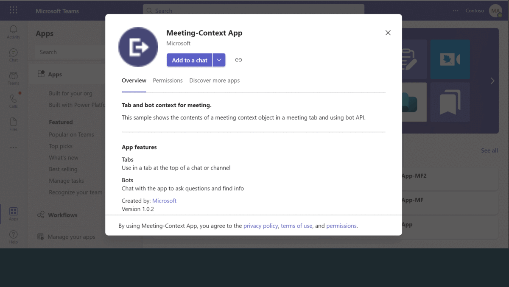
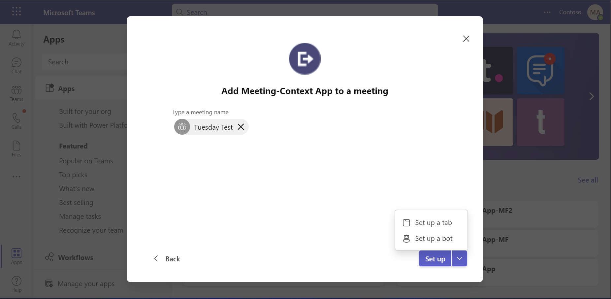
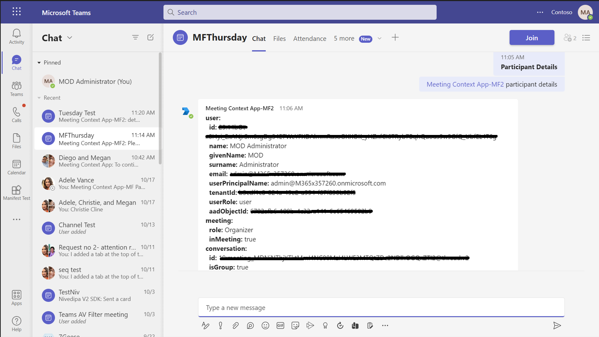
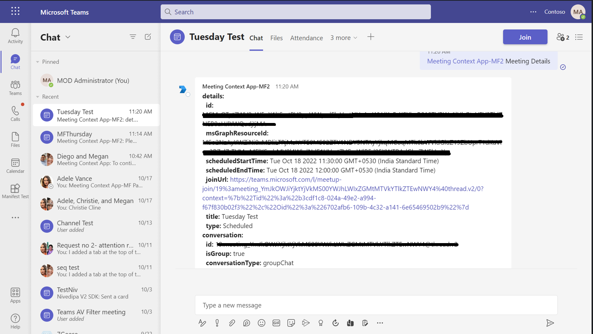

# Teams Meeting Context Sample Node.js

This sample application illustrates how to display the meeting context object in a Microsoft Teams meeting tab, utilizing the bot's Meeting API to fetch participant and meeting details. Users can interact with the bot to obtain comprehensive information about participants and meeting specifics, such as start times, end times, and joining URLs, thereby enriching the collaborative experience within Teams.

## Included Features
* Bots
* Meeting Chat 
* Meeting Details
* RSC Permissions

## Interaction with bot


## Try it yourself - experience the App in your Microsoft Teams client
Please find below demo manifest which is deployed on Microsoft Azure and you can try it yourself by uploading the app package (.zip file link below) to your teams and/or as a personal app. (Uploading must be enabled for your tenant, [see steps here](https://docs.microsoft.com/microsoftteams/platform/concepts/build-and-test/prepare-your-o365-tenant#enable-custom-teams-apps-and-turn-on-custom-app-uploading)).

**Teams Meeting Context Sample:** [Manifest](/samples/meetings-context-app/csharp/demo-manifest/meetings-context-app.zip)

## Prerequisites

- [NodeJS](https://nodejs.org/en/)
- [dev tunnel](https://learn.microsoft.com/en-us/azure/developer/dev-tunnels/get-started?tabs=windows) or [ngrok](https://ngrok.com/) latest version or equivalent tunnelling solution
- [Microsoft 365 Agents Toolkit for VS Code](https://marketplace.visualstudio.com/items?itemName=TeamsDevApp.ms-teams-vscode-extension) or [TeamsFx CLI](https://learn.microsoft.com/microsoftteams/platform/toolkit/teamsfx-cli?pivots=version-one)

## Run the app (Using Microsoft 365 Agents Toolkit for Visual Studio Code)

The simplest way to run this sample in Teams is to use Microsoft 365 Agents Toolkit for Visual Studio Code.

1. Ensure you have downloaded and installed [Visual Studio Code](https://code.visualstudio.com/docs/setup/setup-overview)
1. Install the [Microsoft 365 Agents Toolkit extension](https://marketplace.visualstudio.com/items?itemName=TeamsDevApp.ms-teams-vscode-extension)
1. Select **File > Open Folder** in VS Code and choose this samples directory from the repo
1. Using the extension, sign in with your Microsoft 365 account where you have permissions to upload custom apps
1. Select **Debug > Start Debugging** or **F5** to run the app in a Teams web client.
1. In the browser that launches, select the **Add** button to install the app to Teams.

### Setup 
> Note these instructions are for running the sample on your local machine.

1) Run ngrok - point to port 3978

   ```bash
   ngrok http 3978 --host-header="localhost:3978"
   ```  

   Alternatively, you can also use the `dev tunnels`. Please follow [Create and host a dev tunnel](https://learn.microsoft.com/en-us/azure/developer/dev-tunnels/get-started?tabs=windows) and host the tunnel with anonymous user access command as shown below:

   ```bash
   devtunnel host -p 3978 --allow-anonymous
   ```

2) Setup for Bot

Register your application with Azure AD

- Register a new application in the [Microsoft Entra ID – App Registrations](https://go.microsoft.com/fwlink/?linkid=2083908) portal.
- On the overview page, copy and save the **Application (client) ID, Directory (tenant) ID**. You’ll need those later when updating your Teams application manifest and in the appsettings.json.
- Navigate to the **Certificates & secrets**. In the Client secrets section, click on "+ New client secret". Add a description (Name of the secret) for the secret and select “Never” for Expires. Click "Add". Once the client secret is created, copy its value, it need to be placed in the .env file.

- I need to update the README.md file in this repository with Azure AD registration instructions.
Here is the exact content that must be added if it’s missing or incomplete:

2) App Registration

### Register your application with Azure AD

1. Register a new application in the [Microsoft Entra ID – App Registrations](https://go.microsoft.com/fwlink/?linkid=2083908) portal.
2. Select **New Registration** and on the *register an application page*, set following values:
    * Set **name** to your app name.
    * Choose the **supported account types** (any account type will work)
    * Leave **Redirect URI** empty.
    * Choose **Register**.
3. On the overview page, copy and save the **Application (client) ID, Directory (tenant) ID**. You'll need those later when updating your Teams application manifest and in the appsettings.json.
4. Navigate to **API Permissions**, and make sure to add the follow permissions:
    * Select Add a permission
    * Select Microsoft Graph -> Delegated permissions.
    * `User.Read` (enabled by default)
    * Click on Add permissions. Please make sure to grant the admin consent for the required permissions.

- In Azure portal, create a [Azure Bot resource](https://docs.microsoft.com/azure/bot-service/bot-builder-authentication?view=azure-bot-service-4.0&tabs=csharp%2Caadv2).

- Ensure that you've [enabled the Teams Channel](https://docs.microsoft.com/azure/bot-service/channel-connect-teams?view=azure-bot-service-4.0)

3) Clone the repository

    ```bash
    git clone https://github.com/OfficeDev/Microsoft-Teams-Samples.git
    ```

   A) If you are using Visual Studio Code

    - Launch Visual Studio code
    - File -> Open Folder
    - Navigate to `samples/meeting-context-app` folder
    - Select `nodejs` folder

   B) Install node modules For Server

   Inside node js folder, open your local terminal and run the below command to install node modules. You can do the same in Visual Studio code terminal by opening the project in Visual Studio code.

    ```bash
    npm install
    ```

   C) Install node modules For Client

   Navigate to folder `client` folder, open your local terminal and run the below command to install node modules. You can do the same in Visual Studio code terminal by opening the project in Visual Studio code.

    ```bash
    npm install
    ```


4) Update the `.env` configuration file.

   Update configuration with the ```MicrosoftAppId```,  ```MicrosoftAppPassword``` and ```MicrosoftAppTenantId```.

6) Run your app for server and client

    ```bash
    npm start
    ```

    - Your server will start running on 3000 PORT
    - Your client will start running on 3978 PORT.

7) __*This step is specific to Teams.*__
    - **Edit** the `manifest.json` contained in the  `appManifest` folder to replace your Microsoft App Id (that was created when you registered your bot earlier) *everywhere* you see the place holder string `<<YOUR-MICROSOFT-APP-ID>>` (depending on the scenario the Microsoft App Id may occur multiple times in the `manifest.json`)
    - **Edit** the `manifest.json` for `validDomains` with base Url domain. E.g. if you are using ngrok it would be `https://1234.ngrok-free.app` then your domain-name will be `1234.ngrok-free.app` and if you are using dev tunnels then your domain will be like: `12345.devtunnels.ms`.
    - **Zip** up the contents of the `appManifest` folder to create a `manifest.zip` (Make sure that zip file does not contains any subfolder otherwise you will get error while uploading your .zip package)
    - **Upload** the `manifest.zip` to Teams (In Teams Apps/Manage your apps click "Upload an app". Browse to and Open the .zip file. At the next dialog, click the Add button.)
    - Add the app to personal/team/groupChat scope (Supported scopes)
     

## Running the sample

- Add the app in meeting/group channel.
- The details of the meeting context object will be shown on tab based.


- You can expand/reduce the JSON for the context object and can also copy a particular object slice.
- You can send one of these two commands: **Meeting Context** or **Participant Context**
- It will send you the output of `TeamsInfo.getMeetingInfo` and `TeamsInfo.getMeetingParticipant`

1. **Particpant Details :** User can see the details of current participant by the name id and other feilds respectively.


2. **Meeting Details :** In this user can track the detials of meeting start time, end time, joining url and other details respectively.
 

**Note**: If you are facing any issue in your app, please uncomment [this](https://github.com/OfficeDev/Microsoft-Teams-Samples/blob/main/samples/meetings-context-app/nodejs/server/index.js#L44) line and put your debugger for local debug.

## Further reading

- [Tab Basics](https://docs.microsoft.com/microsoftteams/platform/tabs/how-to/create-channel-group-tab?pivots=node-java-script)
- [Azure Portal](https://portal.azure.com)
- [Get-context-for-tabs](https://docs.microsoft.com/microsoftteams/platform/tabs/how-to/access-teams-context#retrieve-context-in-private-channels)
- [Meeting API reference](https://docs.microsoft.com/microsoftteams/platform/apps-in-teams-meetings/api-references?tabs=dotnet)

