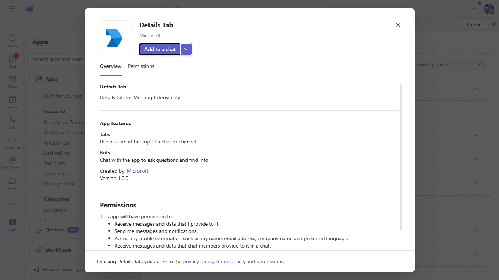
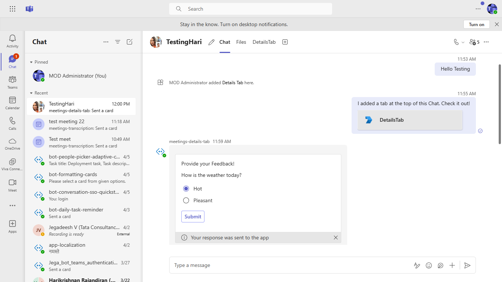

# Meeting Details Tab Sample Node.js 

This sample app illustrates the implementation of Details Tab in Meeting. User can create a poll and post poll in meeting chat and participants can submit their feedback in Meeting.

## Included Features
* Tabs
* Bots
* Adaptive Cards

## Interaction with app



## Try it yourself - experience the App in your Microsoft Teams client
Please find below demo manifest which is deployed on Microsoft Azure and you can try it yourself by uploading the app package (.zip file link below) to your teams and/or as a personal app. (Sideloading must be enabled for your tenant, [see steps here](https://docs.microsoft.com/microsoftteams/platform/concepts/build-and-test/prepare-your-o365-tenant#enable-custom-teams-apps-and-turn-on-custom-app-uploading)).

**Meetings Details Tab Sample:** [Manifest](/samples/meetings-details-tab/csharp/demo-manifest/meetings-details-tab.zip)

## Prerequisites

- [Node.js](https://nodejs.org) version 10.14 or higher

    ```bash
    # determine node version
    node --version
    ```
      
- [dev tunnel](https://learn.microsoft.com/en-us/azure/developer/dev-tunnels/get-started?tabs=windows) or [Ngrok](https://ngrok.com/download) (Only for devbox testing) Latest (any other tunneling      software       can also be used)
  
- [Teams](https://teams.microsoft.com) Microsoft Teams is installed and you have an account
- [Teams Toolkit for VS Code](https://marketplace.visualstudio.com/items?itemName=TeamsDevApp.ms-teams-vscode-extension) or [TeamsFx CLI](https://learn.microsoft.com/microsoftteams/platform/toolkit/teamsfx-cli?pivots=version-one)

## Run the app (Using Teams Toolkit for Visual Studio Code)

The simplest way to run this sample in Teams is to use Teams Toolkit for Visual Studio Code.

1. Ensure you have downloaded and installed [Visual Studio Code](https://code.visualstudio.com/docs/setup/setup-overview)
1. Install the [Teams Toolkit extension](https://marketplace.visualstudio.com/items?itemName=TeamsDevApp.ms-teams-vscode-extension)
1. Select **File > Open Folder** in VS Code and choose this samples directory from the repo
1. Using the extension, sign in with your Microsoft 365 account where you have permissions to upload custom apps
1. Select **Debug > Start Debugging** or **F5** to run the app in a Teams web client.
1. In the browser that launches, select the **Add** button to install the app to Teams.

## Setup
1. Register a new application in the [Microsoft Entra ID – App Registrations](https://go.microsoft.com/fwlink/?linkid=2083908) portal.

2. Setup for Bot
	- Register a Microsoft Entra ID aap registration in Azure portal.
	- Also, register a bot with Azure Bot Service, following the instructions [here](https://docs.microsoft.com/azure/bot-service/bot-service-quickstart-registration?view=azure-bot-service-3.0).
	- Ensure that you've [enabled the Teams Channel](https://docs.microsoft.com/azure/bot-service/channel-connect-teams?view=azure-bot-service-4.0)
	- While registering the bot, use `https://<your_tunnel_domain>/api/messages` as the messaging endpoint.

    > NOTE: When you create your app registration, you will create an App ID and App password - make sure you keep these for later.

3. Setup NGROK
 - Run ngrok - point to port 3978

   ```bash
   ngrok http 3978 --host-header="localhost:3978"
   ```  

   Alternatively, you can also use the `dev tunnels`. Please follow [Create and host a dev tunnel](https://learn.microsoft.com/en-us/azure/developer/dev-tunnels/get-started?tabs=windows) and host the tunnel with anonymous user access command as shown below:

   ```bash
   devtunnel host -p 3978 --allow-anonymous
   ```

4. Clone the repository

    ```bash
    git clone https://github.com/OfficeDev/Microsoft-Teams-Samples.git
    ```

    -Modfiy the Go to .env file  and add ```BotId``` ,  ```BotPassword``` and ```BaseUrl as tunnel URL``` information.

    - In a terminal, navigate to `samples/meetings-details-tab/nodejs`

        ```bash
        cd samples/meetings-details-tab/nodejs
        ```

    - Install modules and Start the bot
    - Server will run on PORT:  `4001`

        ```bash
        npm run server
        ```

        > **This command is equivalent to:**
        _npm install > npm run build-client > npm start_

    - Start client application
    - Client will run on PORT:  `3978`

        ```bash
        npm run client
        ```
        
        > **This command is equivalent to:**
         _cd client > npm install > npm start_

5. Setup Manifest for Teams
- __*This step is specific to Teams.*__
    - **Edit** the `manifest.json` contained in the ./appManifest folder to replace your Microsoft App Id (that was created when you registered your app registration earlier) *everywhere* you see the place holder string `{{Microsoft-App-Id}}` (depending on the scenario the Microsoft App Id may occur multiple times in the `manifest.json`)
    - **Edit** the `manifest.json` for `validDomains` and replace `{{domain-name}}` with base Url of your domain. E.g. if you are using ngrok it would be `https://1234.ngrok-free.app` then your domain-name will be `1234.ngrok-free.app` and if you are using dev tunnels then your domain will be like: `12345.devtunnels.ms`.
    - **Zip** up the contents of the `appManifest` folder to create a `manifest.zip` (Make sure that zip file does not contains any subfolder otherwise you will get error while uploading your .zip package)

- Upload the manifest.zip to Teams (in the Apps view click "Upload a custom app")
   - Go to Microsoft Teams. From the lower left corner, select Apps
   - From the lower left corner, choose Upload a custom App
   - Go to your project directory, the ./appManifest folder, select the zip folder, and choose Open.
   - Select Add in the pop-up dialog box. Your app is uploaded to Teams.

**Note**: If you are facing any issue in your app, please uncomment [this](https://github.com/OfficeDev/Microsoft-Teams-Samples/blob/main/samples/meetings-details-tab/nodejs/server/api/botController.js#L24) line and put your debugger for local debug.

## Running the sample

Interact with Details Tab in Meeting.

**Add Chat:**


**Select Group:**


**Newly added agenda will be added to Tab:**


**Click on Add Agenda:**


**Add a Poll:**


**Participants in meeting can submit their response in adaptive card:**


**Response will be recorded and Bot will send an new adaptive card with response:**


**Participants in meeting can view the results from meeting chat or Tab itself:**


## Further reading

- [Build tabs for meeting](https://learn.microsoft.com/microsoftteams/platform/apps-in-teams-meetings/build-tabs-for-meeting?tabs=desktop)
- [Meeting apps APIs](https://learn.microsoft.com/microsoftteams/platform/apps-in-teams-meetings/meeting-apps-apis?tabs=dotnet)
- [Meeting Side Panel](https://learn.microsoft.com/microsoftteams/platform/sbs-meetings-sidepanel?tabs=vs)
- [Install the App in Teams Meeting](https://docs.microsoft.com/microsoftteams/platform/apps-in-teams-meetings/teams-apps-in-meetings?view=msteams-client-js-latest#meeting-lifecycle-scenarios)

