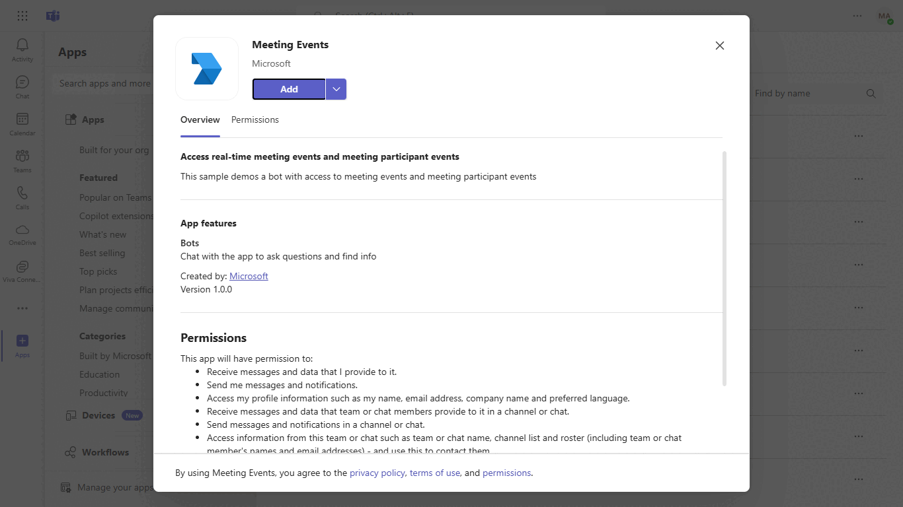
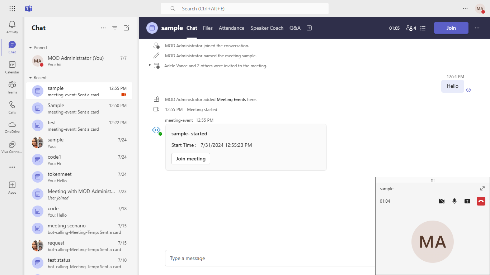
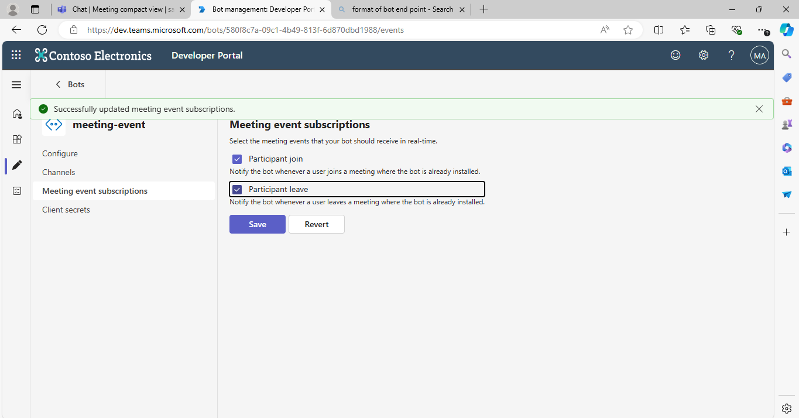
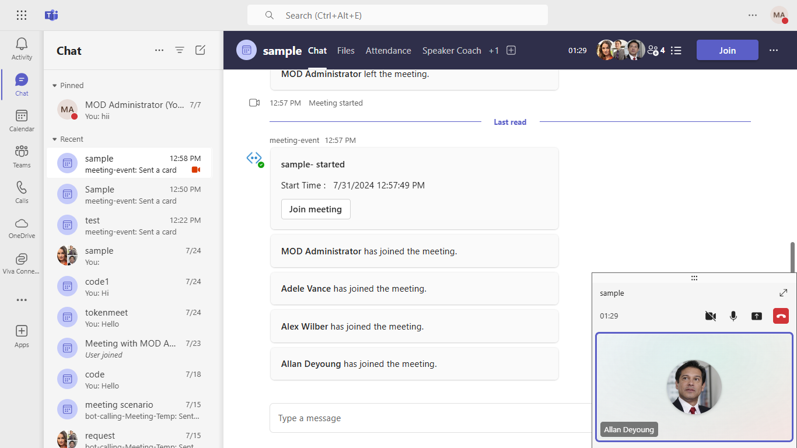
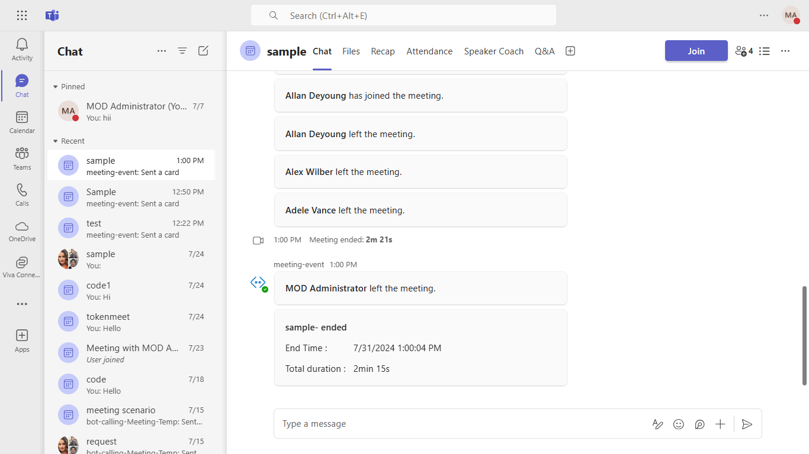

# Realtime meeting events

Using this C# sample, a bot can receive real-time meeting events and meeting participant events.
For reference please check [Real-time Teams meeting events](https://docs.microsoft.com/microsoftteams/platform/apps-in-teams-meetings/api-references?tabs=dotnet)
and [Real-time Teams meeting participant events](https://learn.microsoft.com/microsoftteams/platform/apps-in-teams-meetings/meeting-apps-apis?branch=pr-8455&tabs=dotnet%2Cparticipant-join-event#get-participant-events)

The feature shown in this sample is currently available in public developer preview only.

## Included Features
* Bots
* Adaptive Cards
* RSC Permissions

## Interaction with app



## Try it yourself - experience the App in your Microsoft Teams client
Please find below demo manifest which is deployed on Microsoft Azure and you can try it yourself by uploading the app manifest (.zip file link below) to your teams and/or as a personal app. (Sideloading must be enabled for your tenant, [see steps here](https://docs.microsoft.com/microsoftteams/platform/concepts/build-and-test/prepare-your-o365-tenant#enable-custom-teams-apps-and-turn-on-custom-app-uploading)).

**Realtime meeting and participant events:** [Manifest](/samples/meetings-events/csharp/demo-manifest/Meetings-Events.zip)

## Prerequisites

- [.NET Core SDK](https://dotnet.microsoft.com/download) version 6.0

  ```bash
  # determine dotnet version
  dotnet --version
  ```
- Publicly addressable https url or tunnel such as [dev tunnel](https://learn.microsoft.com/en-us/azure/developer/dev-tunnels/get-started?tabs=windows) or [ngrok](https://ngrok.com/) latest version or [Tunnel Relay](https://github.com/OfficeDev/microsoft-teams-tunnelrelay) 
- [Teams Toolkit for Visual Studio](https://learn.microsoft.com/en-us/microsoftteams/platform/toolkit/toolkit-v4/install-teams-toolkit-vs?pivots=visual-studio-v17-7)

## Run the app (Using Teams Toolkit for Visual Studio)

The simplest way to run this sample in Teams is to use Teams Toolkit for Visual Studio.
1. Install Visual Studio 2022 **Version 17.10 Preview 4 or higher** [Visual Studio](https://visualstudio.microsoft.com/downloads/)
1. Install Teams Toolkit for Visual Studio [Teams Toolkit extension](https://learn.microsoft.com/en-us/microsoftteams/platform/toolkit/toolkit-v4/install-teams-toolkit-vs?pivots=visual-studio-v17-7)
1. In the debug dropdown menu of Visual Studio, select Dev Tunnels > Create A Tunnel (set authentication type to Public) or select an existing public dev tunnel.
1. In the debug dropdown menu of Visual Studio, select default startup project > **Microsoft Teams (browser)**
1. In Visual Studio, right-click your **TeamsApp** project and **Select Teams Toolkit > Prepare Teams App Dependencies**
1. Using the extension, sign in with your Microsoft 365 account where you have permissions to upload custom apps.
1. Select **Debug > Start Debugging** or **F5** to run the menu in Visual Studio.
1. In the browser that launches, select the **Add** button to install the app to Teams.
> If you do not have permission to upload custom apps (sideloading), Teams Toolkit will recommend creating and using a Microsoft 365 Developer Program account - a free program to get your own dev environment sandbox that includes Teams.

## Setup
> NOTE: The free ngrok plan will generate a new URL every time you run it, which requires you to update your Azure AD registration, the Teams app manifest, and the project configuration. A paid account with a permanent ngrok URL is recommended.

1) Setup for Bot
   - Register Azure AD application resource in Azure portal
   - In Azure portal, create a [Azure Bot resource](https://docs.microsoft.com/azure/bot-service/bot-builder-authentication?view=azure-bot-service-4.0&tabs=csharp%2Caadv2).

   - Ensure that you've [enabled the Teams Channel](https://docs.microsoft.com/azure/bot-service/channel-connect-teams?view=azure-bot-service-4.0)
   - While registering the bot, use `https://<your_tunnel_domain>/api/messages` as the messaging endpoint.

  **NOTE:** When you create your bot you will create an App ID and App password - make sure you keep these for later.

2) Setup NGROK  
   Run ngrok - point to port 3978

   ```bash
   ngrok http 3978 --host-header="localhost:3978"
   ```  

   Alternatively, you can also use the `dev tunnels`. Please follow [Create and host a dev tunnel](https://learn.microsoft.com/en-us/azure/developer/dev-tunnels/get-started?tabs=windows) and host the tunnel with anonymous user access command as shown below:

   ```bash
   devtunnel host -p 3978 --allow-anonymous
   ```

3) Setup for code   
- Clone the repository

    ```bash
    git clone https://github.com/OfficeDev/Microsoft-Teams-Samples.git

- Navigate to `samples/meetings-events/csharp` 
    - Modify the `/appsettings.json` and fill in the `{{ MicrosoftAppId }}`,`{{ MicrosoftAppPassword }}` with the values received while doing Microsoft Entra ID app registration in step 1.

- Run the app from a terminal or from Visual Studio, choose option A or B.

  A) From a terminal

  ```bash
  # run the app
  dotnet run
  ```

  B) Or from Visual Studio

  - Launch Visual Studio
  - File -> Open -> Project/Solution
  - Navigate to `MeetingEvents` folder
  - Select `MeetingEvents.csproj` file
  - Press `F5` to run the project

4) Setup Manifest for Teams

Modify the `manifest.json` in the `/appPackage` folder and replace the following details

   - `<<App-ID>>` with your Microsoft Entra ID app registration id   
   - `<<VALID DOMAIN>>` with base Url domain. E.g. if you are using ngrok it would be `https://1234.ngrok-free.app` then your domain-name will be `1234.ngrok-free.app` and if you are using dev tunnels then your domain will be like: `12345.devtunnels.ms`.
   - Zip the contents of `appPackage` folder into a `manifest.zip`, and use the `manifest.zip` to deploy in app store
   - - **Upload** the `manifest.zip` to Teams
         - Select **Apps** from the left panel.
         - Then select **Upload a custom app** from the lower right corner.
         - Then select the `manifest.zip` file from `appPackage`.
         - [Install the App in Teams Meeting](https://docs.microsoft.com/microsoftteams/platform/apps-in-teams-meetings/teams-apps-in-meetings?view=msteams-client-js-latest#meeting-lifecycle-scenarios)

**Note**: If you are facing any issue in your app, please uncomment [this](https://github.com/OfficeDev/Microsoft-Teams-Samples/blob/main/samples/meetings-events/csharp/MeetingEvents/AdapterWithErrorHandler.cs#L25) line and put your debugger for local debug.

## Running the sample
Once the meeting where the bot is added starts or ends, real-time updates are posted in the chat.

**MeetingEvents command interaction:**   



**End meeting events details:**   


**MeetingParticipantEvents command interaction:**   

To utilize this feature, please enable Meeting event subscriptions for `Participant Join` and `Participant Leave` in your bot, following the guidance outlined in the [meeting participant events](https://learn.microsoft.com/microsoftteams/platform/apps-in-teams-meetings/meeting-apps-apis?branch=pr-en-us-8455&tabs=channel-meeting%2Cguest-user%2Cone-on-one-call%2Cdotnet%2Cparticipant-join-event#receive-meeting-participant-events) documentation





**End meeting events details:**   



## Deploy the bot to Azure

To learn more about deploying a bot to Azure, see [Deploy your bot to Azure](https://aka.ms/azuredeployment) for a complete list of deployment instructions.

## Further reading

- [Real-time Teams meeting events](https://docs.microsoft.com/microsoftteams/platform/apps-in-teams-meetings/api-references?tabs=dotnet)
- [Meeting apps APIs](https://learn.microsoft.com/microsoftteams/platform/apps-in-teams-meetings/meeting-apps-apis?tabs=dotnet)
- [Real-time Teams meeting participant events](https://learn.microsoft.com/microsoftteams/platform/apps-in-teams-meetings/meeting-apps-apis?branch=pr-en-us-8455&tabs=channel-meeting%2Cguest-user%2Cone-on-one-call%2Cdotnet%2Cparticipant-join-event#receive-meeting-participant-events)

