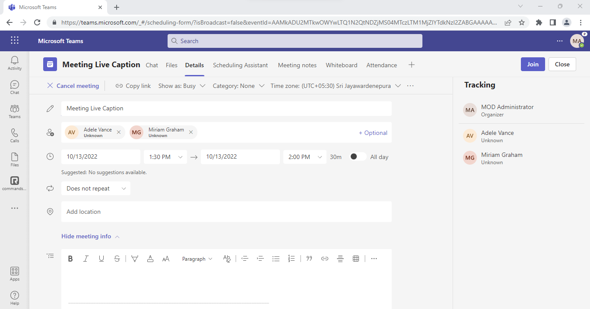
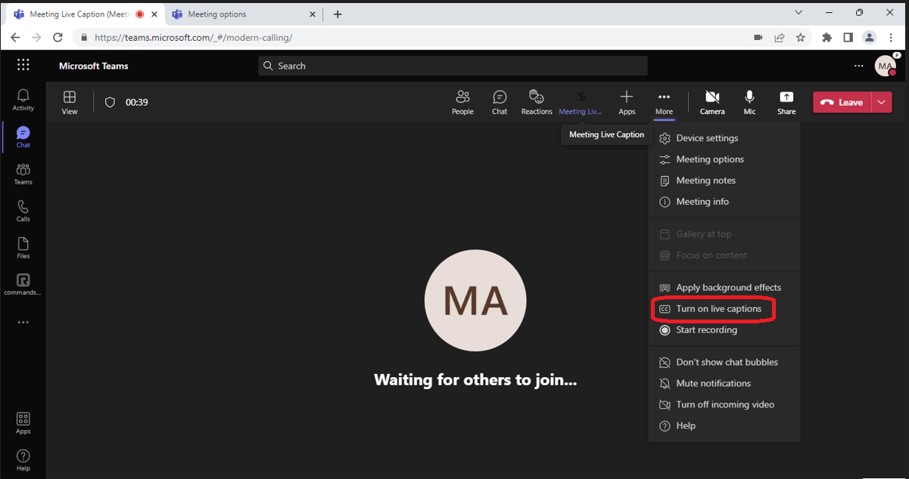
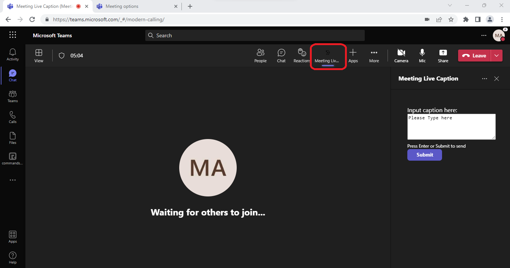
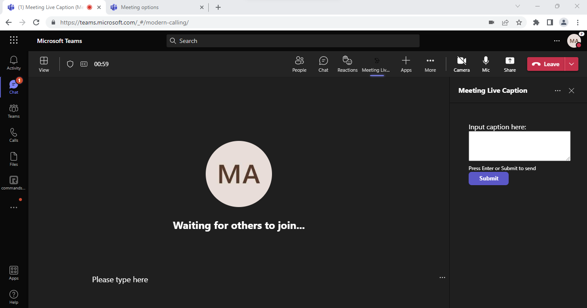

# Meeting side panel application uses CART link to send caption in live meeting.

This is a sample meeting side panel application which demonstrates how to enable live caption in the meeting and using the CART link how to send caption in live meeting. Meeting side panel application uses CART link to send caption in live meeting.

Once the meeting is scheduled, follow this doc to enable [Provide Cart Catptions](https://support.microsoft.com/office/use-cart-captions-in-a-microsoft-teams-meeting-human-generated-captions-2dd889e8-32a8-4582-98b8-6c96cf14eb47).
Copy the CART link it will used while configuring tab for meeting.

## Included Features
* Meeting Chat 
* Meeting Details
* Meeting SidePanel
* Cart API

## Interaction with app


## Prerequisites

- Microsoft Teams is installed and you have an account (not a guest account)
-  .[NET 6.0](https://dotnet.microsoft.com/en-us/download) SDK.
    ```bash
        # determine dotnet version
        dotnet --version
    ```
-  [ngrok](https://ngrok.com/) or equivalent tunneling solution
-  [M365 developer account](https://docs.microsoft.com/en-us/microsoftteams/platform/concepts/build-and-test/prepare-your-o365-tenant) or access to a Teams account with the appropriate permissions to install an app.

## Setup.

> Note these instructions are for running the sample on your local machine, the tunnelling solution is required because
> the Teams service needs to call into the bot.

1) Run ngrok - point to port 3978

    ```bash
    ngrok http 3978 --host-header="localhost:3978"
    ```

1) Clone the repository

    ```bash
    git clone https://github.com/OfficeDev/Microsoft-Teams-Samples.git
    ```

1) Open the code in Visual Studio
   - File -> Open -> Project/Solution
   - Navigate to folder where repository is cloned then `samples/meetings-live-caption/csharp/MeetingLiveCaption.sln`

1) Run the bot from Visual Studio:
   - Press `F5` to run the project

1) Modify the `manifest.json` in the `/AppManifest` folder and replace the following details:
   - `<<AppId>>` with any GUID id value.
   - `<<App-Domain>>` with base Url domain. E.g. if you are using ngrok it would be `https://1234.ngrok-free.app` then your domain-name will be `1234.ngrok-free.app`.

1) Zip the contents of `AppManifest` folder into a `manifest.zip`, and use the `manifest.zip` to deploy in app store or add to Teams using step 6.

1) Upload the manifest.zip to Teams (in the Apps view click "Upload a custom app")
   - Go to Microsoft Teams and then go to side panel, select Apps
   - Choose Manage your apps -> Upload an app -> Upload a custom App
   - Go to your project directory, the ./AppPackage folder, select the zip folder, and choose Open.
   - Select Add in the pop-up dialog box. Your app is uploaded to Teams.

**NOTE: If you are not able to send caption, try configuring tab again.**

## Running the sample

1. Schedule the meeting and add Meeting Caption Tab in that particular scheduled meeting.


2. Once meeting started, turn on live caption.


3. Once the live caption has started, you can use the app to send live caption.


4. After clicking on `Submit` button, you will see the caption in the meeting.


## Further reading

- [Live Meeting Caption](https://support.microsoft.com/en-us/office/use-live-captions-in-a-teams-meeting-4be2d304-f675-4b57-8347-cbd000a21260)


