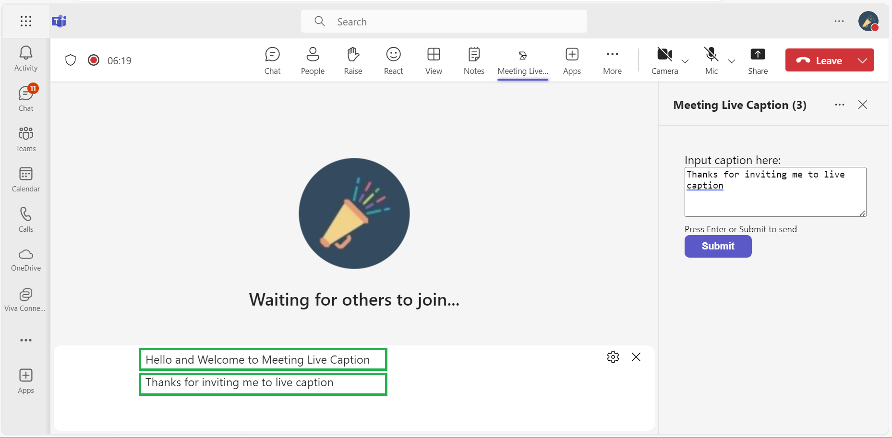

# Meeting side panel application uses CART link to send caption in live meeting.

This sample application illustrates how to implement live captioning in Microsoft Teams meetings using CART links. With functionalities including a meeting side panel, chat integration, and the ability to configure captions during meetings, this app significantly improves accessibility for participants.


## Enable CART Captions
Once the meeting is scheduled. Follow this doc to enable [CART Captions](https://support.microsoft.com/office/use-cart-captions-in-a-microsoft-teams-meeting-human-generated-captions-2dd889e8-32a8-4582-98b8-6c96cf14eb47).
Copy the CART link it will used while configuring tab for meeting.


## Included Features
* Meeting Chat 
* Meeting Details
* Meeting SidePanel
* Cart API

## Key features


## Try it yourself - experience the App in your Microsoft Teams client
Please find below demo manifest which is deployed on Microsoft Azure and you can try it yourself by uploading the app package (.zip file link below) to your teams and/or as a personal app. (Sideloading must be enabled for your tenant, [see steps here](https://docs.microsoft.com/microsoftteams/platform/concepts/build-and-test/prepare-your-o365-tenant#enable-custom-teams-apps-and-turn-on-custom-app-uploading)).

**Meetings Live Caption:** [Manifest](/samples/meetings-live-caption/csharp/demo-manifest/meetings-live-caption.zip)

## Prerequisites

- Microsoft Teams is installed and you have an account (not a guest account)
-  [NodeJS](https://nodejs.org/en/)
-  [dev tunnel](https://learn.microsoft.com/en-us/azure/developer/dev-tunnels/get-started?tabs=windows) or [ngrok](https://ngrok.com/download) latest version or equivalent tunneling solution
-  [M365 developer account](https://docs.microsoft.com/en-us/microsoftteams/platform/concepts/build-and-test/prepare-your-o365-tenant) or access to a Teams account with the appropriate permissions to install an app.
- [Microsoft 365 Agents Toolkit for VS Code](https://marketplace.visualstudio.com/items?itemName=TeamsDevApp.ms-teams-vscode-extension) or [TeamsFx CLI](https://learn.microsoft.com/microsoftteams/platform/toolkit/teamsfx-cli?pivots=version-one)

## Run the app (Using Microsoft 365 Agents Toolkit for Visual Studio Code)

The simplest way to run this sample in Teams is to use Microsoft 365 Agents Toolkit for Visual Studio Code.

1. Ensure you have downloaded and installed [Visual Studio Code](https://code.visualstudio.com/docs/setup/setup-overview)
1. Install the [Microsoft 365 Agents Toolkit extension](https://marketplace.visualstudio.com/items?itemName=TeamsDevApp.ms-teams-vscode-extension)
1. Select **File > Open Folder** in VS Code and choose this samples directory from the repo
1. Using the extension, sign in with your Microsoft 365 account where you have permissions to upload custom apps
1. Select **Debug > Start Debugging** or **F5** to run the app in a Teams web client.
1. In the browser that launches, select the **Add** button to install the app to Teams.

## To try this sample

> Note these instructions are for running the sample on your local machine, the tunnelling solution is required because
> the Teams service needs to call the tab.

### 1. Clone and start your sample sample
1) Clone the repository

    ```bash
    git clone https://github.com/OfficeDev/Microsoft-Teams-Samples.git
    ```

2) In a terminal, navigate to `samples/meetings-live-caption/nodejs`

3) Install modules

    ```bash
    npm install
    ```
4) Run ngrok - point to port 3978

   ```bash
   ngrok http 3978 --host-header="localhost:3978"
   ```  

   Alternatively, you can also use the `dev tunnels`. Please follow [Create and host a dev tunnel](https://learn.microsoft.com/en-us/azure/developer/dev-tunnels/get-started?tabs=windows) and host the tunnel with anonymous user access command as shown below:

   ```bash
   devtunnel host -p 3978 --allow-anonymous
   ```

5) Run your app

    ```bash
    npm start
    ```

### 2) App Registration

### Register your application with Azure AD

1. Register a new application in the [Microsoft Entra ID – App Registrations](https://go.microsoft.com/fwlink/?linkid=2083908) portal.
2. Select **New Registration** and on the *register an application page*, set following values:
    * Set **name** to your app name.
    * Choose the **supported account types** (any account type will work)
    * Leave **Redirect URI** empty.
    * Choose **Register**.
3. On the overview page, copy and save the **Application (client) ID, Directory (tenant) ID**. You'll need those later when updating your Teams application manifest and in the appsettings.json.
4. Navigate to **API Permissions**, and make sure to add the follow permissions:
    * Select Add a permission
    * Select Microsoft Graph -> Delegated permissions.
    * `User.Read` (enabled by default)
    * Click on Add permissions. Please make sure to grant the admin consent for the required permissions.

### 3. Manually update the manifest.json
1. Manually update the manifest.json
    - Edit the `manifest.json` contained in the  `appManifest/` folder to replace the `<<AppId>>` with any guid value and `<<APP-DOMAIN>>` with with base Url domain. E.g. if you are using ngrok it would be `1234.ngrok.com` and if you are using dev tunnels then your domain will be `12345.devtunnels.ms`.
    - Zip up the contents of the `appManifest/` folder to create a `manifest.zip`
    - Upload the `manifest.zip` to Teams (in the left-bottom *Apps* view, click "Manage your apps -> Upload an app -> Upload a custom app")

**NOTE: If you are unable to send caption, try configuring tab again.**

### Features of the sample.


1. Schedule the meeting and add Meeting Caption Tab in that particular scheduled meeting.

2. Once meeting started, turn on live caption.

3. Once the live caption has started, you can use the app to send live caption.

4. After clicking on `Submit` button, you will see the caption in the meeting.


## Further reading

- [Live Meeting Caption](https://support.microsoft.com/en-us/office/use-live-captions-in-a-teams-meeting-4be2d304-f675-4b57-8347-cbd000a21260)

