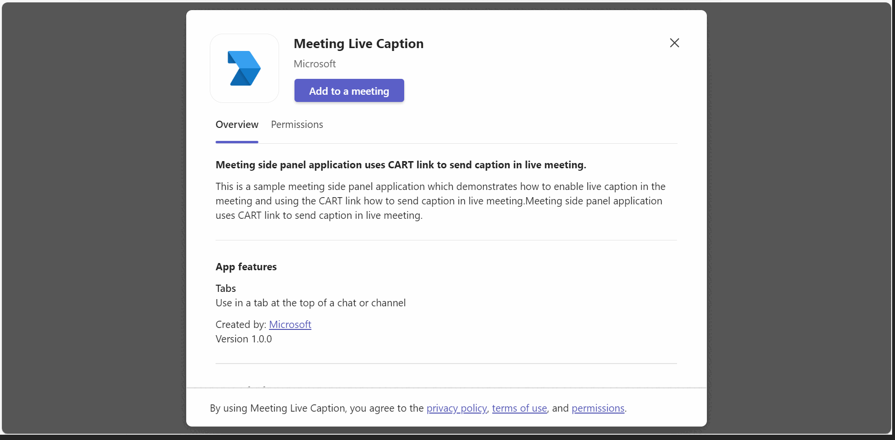

# Meeting side panel application uses CART link to send caption in live meeting.

This is a sample meeting side panel application which demonstrates how to enable live caption in the meeting and using the CART link how to send caption in live meeting. Meeting side panel application uses CART link to send caption in live meeting.

## Enable CART Captions
Once the meeting is scheduled. Follow this doc to enable [CART Captions](https://support.microsoft.com/office/use-cart-captions-in-a-microsoft-teams-meeting-human-generated-captions-2dd889e8-32a8-4582-98b8-6c96cf14eb47).
Copy the CART link it will used while configuring tab for meeting.

## Included Features
* Meeting Chat 
* Meeting Details
* Meeting SidePanel
* Cart API

## Key features



## Prerequisites

- Microsoft Teams is installed and you have an account (not a guest account)
-  [NodeJS](https://nodejs.org/en/)
-  [ngrok](https://ngrok.com/) or equivalent tunneling solution
-  [M365 developer account](https://docs.microsoft.com/en-us/microsoftteams/platform/concepts/build-and-test/prepare-your-o365-tenant) or access to a Teams account with the appropriate permissions to install an app.

## To try this sample

> Note these instructions are for running the sample on your local machine, the tunnelling solution is required because
> the Teams service needs to call the tab.

### 1. Clone and start your sample sample
1) Clone the repository

    ```bash
    git clone https://github.com/OfficeDev/Microsoft-Teams-Samples.git
    ```

2) In a terminal, navigate to `samples/meetings-live-caption/nodejs`

3) Install modules

    ```bash
    npm install
    ```
4) Run ngrok - point to port 3978

    ```bash
    ngrok http 3978 --host-header="localhost:3978"
    ```
5) Run your app

    ```bash
    npm start
    ```
### 2. Manually update the manifest.json
1. Manually update the manifest.json
    - Edit the `manifest.json` contained in the  `appPackage/` folder to replace the `<<AppId>>` with any guid value and `<<APP-DOMAIN>>` with with base Url domain. E.g. if you are using ngrok it would be `https://1234.ngrok.
    - Zip up the contents of the `appPackage/` folder to create a `manifest.zip`
    - Upload the `manifest.zip` to Teams (in the left-bottom *Apps* view, click "Manage your apps -> Upload an app -> Upload a custom app")

**NOTE: If you are unable to send caption, try configuring tab again.**

### Features of the sample.
1. Schedule the meeting and add Meeting Caption Tab in that particular scheduled meeting.

2. Once meeting started, turn on live caption.

3. Once the live caption has started, you can use the app to send live caption.

4. After clicking on `Submit` button, you will see the caption in the meeting.


