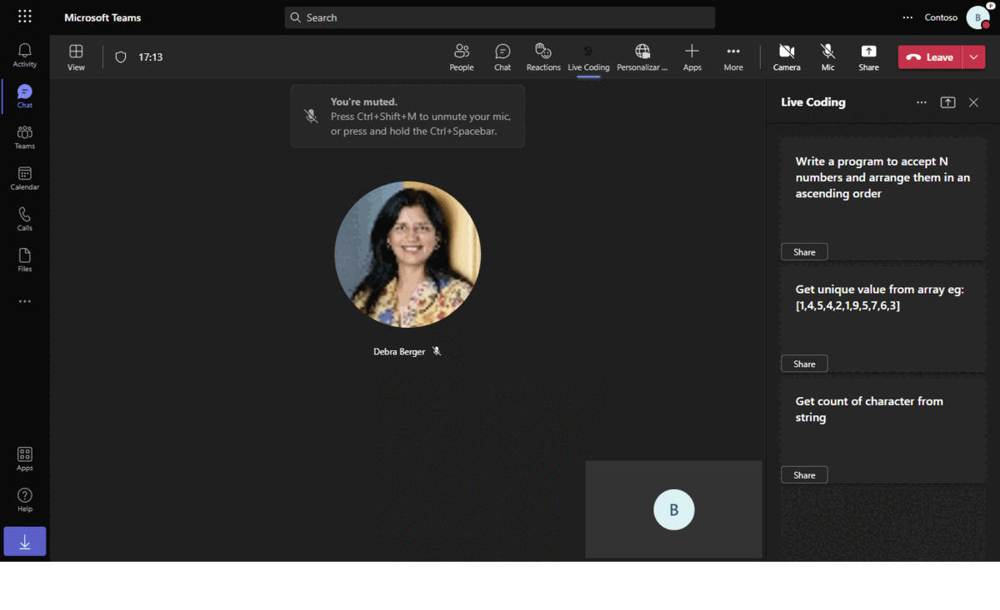
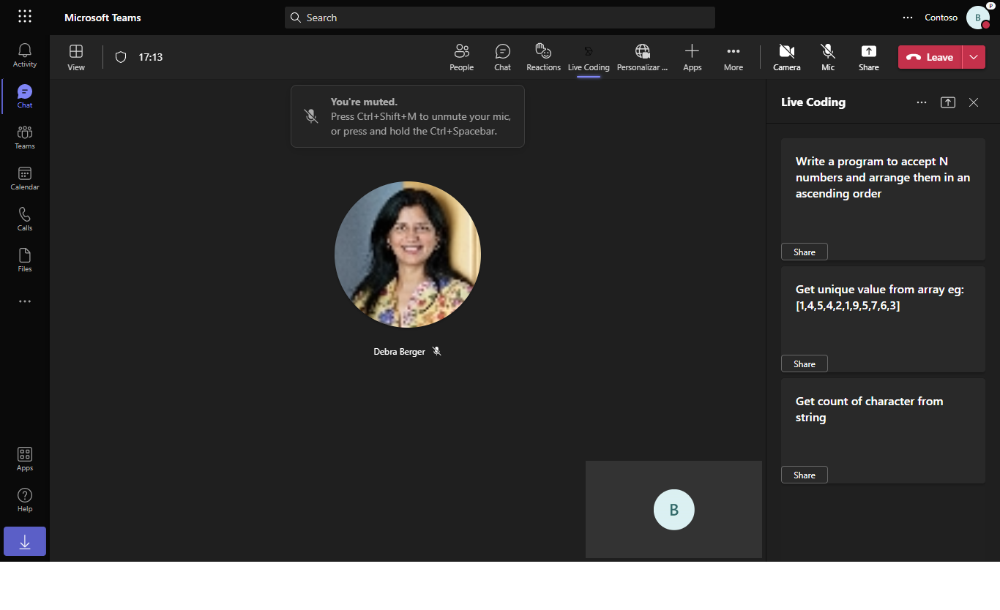
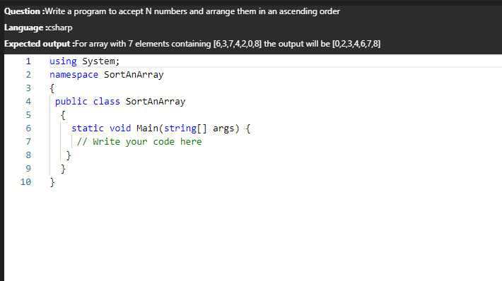
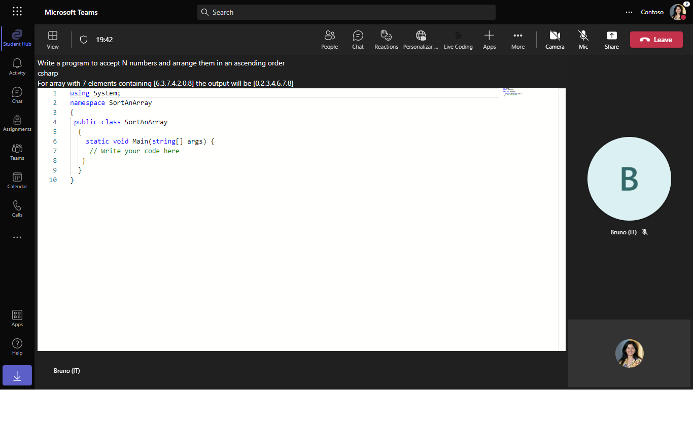

# Live coding interview using Shared meeting stage 

This sample application demonstrates how to conduct live coding interviews in Microsoft Teams using the Live Share SDK. Featuring a side panel for coding questions and real-time collaboration, this app allows participants to engage in interactive coding sessions, making it an ideal tool for remote technical interviews.

## Included Features
* Meeting Stage
* Meeting SidePanel
* Live Share SDK
* RSC Permissions

## Interaction with app



## Try it yourself - experience the App in your Microsoft Teams client
Please find below demo manifest which is deployed on Microsoft Azure and you can try it yourself by uploading the app manifest (.zip file link below) to your teams and/or as a personal app. (Uploading must be enabled for your tenant, [see steps here](https://docs.microsoft.com/microsoftteams/platform/concepts/build-and-test/prepare-your-o365-tenant#enable-custom-teams-apps-and-turn-on-custom-app-uploading)).

**Live coding interview using Shared meeting stage:** [Manifest](/samples/meetings-live-code-interview/csharp/demo-manifest/meetings-live-code-interview.zip)

## Prerequisites

- [.NET Core SDK](https://dotnet.microsoft.com/download) version 6.0

  ```bash
  # determine dotnet version
  dotnet --version
  ```
- [dev tunnel](https://learn.microsoft.com/en-us/azure/developer/dev-tunnels/get-started?tabs=windows) or [Ngrok](https://ngrok.com/download) (For local environment testing) latest version (any other tunneling software can also be used)
 - [Teams](https://teams.microsoft.com) Microsoft Teams is installed and you have an account.
 - [Microsoft 365 Agents Toolkit for Visual Studio](https://learn.microsoft.com/en-us/microsoftteams/platform/toolkit/toolkit-v4/install-teams-toolkit-vs?pivots=visual-studio-v17-7)

## Run the app (Using Microsoft 365 Agents Toolkit for Visual Studio)

The simplest way to run this sample in Teams is to use Microsoft 365 Agents Toolkit for Visual Studio.
1. Install Visual Studio 2022 **Version 17.14 or higher** [Visual Studio](https://visualstudio.microsoft.com/downloads/)
1. Install Microsoft 365 Agents Toolkit for Visual Studio [Microsoft 365 Agents Toolkit extension](https://learn.microsoft.com/en-us/microsoftteams/platform/toolkit/toolkit-v4/install-teams-toolkit-vs?pivots=visual-studio-v17-7)
1. In the debug dropdown menu of Visual Studio, select Dev Tunnels > Create A Tunnel (set authentication type to Public) or select an existing public dev tunnel.
1. In the debug dropdown menu of Visual Studio, select default startup project > **Microsoft Teams (browser)**
1. Right-click the 'M365Agent' project in Solution Explorer and select **Microsoft 365 Agents Toolkit > Select Microsoft 365 Account**
1. Sign in to Microsoft 365 Agents Toolkit with a **Microsoft 365 work or school account**
1. Set `Startup Item` as `Microsoft Teams (browser)`.
1. Press F5, or select Debug > Start Debugging menu in Visual Studio to start your app
    </br>
1. In the opened web browser, select Add button to install the app in Teams
> If you do not have permission to upload custom apps (uploading), Microsoft 365 Agents Toolkit will recommend creating and using a Microsoft 365 Developer Program account - a free program to get your own dev environment sandbox that includes Teams.

## Workflow

```mermaid

sequenceDiagram

    Teams User->>+Teams Client: Schedules a Teams Meeting with candidate

    Teams Client->>+Live Coding App: Installs the App

    Teams User->>+Teams Client: Starts the meeting

    Teams User->>+Live Coding App: Opens the Live coding app side panel

    Live Coding App->>+Side Panel: Load questions

    Side Panel-->>-Live Coding App: Loads predefined coding questions

    Teams User->>+Side Panel: Select the coding question to share to stage

    Side Panel-->>-Teams Client: Tells the team client to open a code editor on the stage

    Teams Client->>+Code Editor Stage: Tells the app which coding question to open

    Code Editor Stage-->>-Live Coding App: Shares the question to share to stage in the meeting
   ```
    
## Setup


2) App Registration

### Register your application with Azure AD

1. Register a new application in the [Microsoft Entra ID – App Registrations](https://go.microsoft.com/fwlink/?linkid=2083908) portal.
2. Select **New Registration** and on the *register an application page*, set following values:
  * Set **name** to your app name.
  * Choose the **supported account types** (any account type will work)
  * Leave **Redirect URI** empty.
  * Choose **Register**.
3. On the overview page, copy and save the **Application (client) ID, Directory (tenant) ID**. You'll need those later when updating your Teams application manifest and in the appsettings.json.
4. Navigate to **API Permissions**, and make sure to add the follow permissions:
  * Select Add a permission
  * Select Microsoft Graph -> Delegated permissions.
  * `User.Read` (enabled by default)
  * Click on Add permissions. Please make sure to grant the admin consent for the required permissions.

2. Setup NGROK
 - Run ngrok - point to port 3978

   ```bash
   ngrok http 3978 --host-header="localhost:3978"
   ```  

   Alternatively, you can also use the `dev tunnels`. Please follow [Create and host a dev tunnel](https://learn.microsoft.com/en-us/azure/developer/dev-tunnels/get-started?tabs=windows) and host the tunnel with anonymous user access command as shown below:

   ```bash
   devtunnel host -p 3978 --allow-anonymous
   ```

3. Setup for code

- Clone the repository

    ```bash
    git clone https://github.com/OfficeDev/Microsoft-Teams-Samples.git
    ```
    
     In a terminal, navigate to `samples/meeting-live-coding-interview/csharp`

    ```bash
    # change into project folder
    cd # MeetingLiveCoding
    
    Run the app from a terminal or from Visual Studio, choose option A or B.

  A) From a terminal

  ```bash
  # run the app
  dotnet run
  ```

  B) Or from Visual Studio

  - Launch Visual Studio
  - File -> Open -> Project/Solution
  - Navigate to `MeetingLiveCoding` folder
  - Select `MeetingLiveCoding.csproj` file
  - Press `F5` to run the project

- Inside ClientApp folder execute the below command.

    ```bash
    # npx @fluidframework/azure-local-service@latest
    ```
4. Setup Manifest for Teams
 - __*This step is specific to Teams.*__
    - **Edit** the `manifest.json` contained in the ./appPackage folder to replace your Microsoft App Id (that was created when you registered your app registration earlier) *everywhere* you see the place holder string `{{Microsoft-App-Id}}` (depending on the scenario the Microsoft App Id may occur multiple times in the `manifest.json`)
    - **Edit** the `manifest.json` for `validDomains` and replace `{{domain-name}}` with base Url of your domain. E.g. if you are using ngrok it would be `https://1234.ngrok-free.app` then your domain-name will be `1234.ngrok-free.app` and if you are using dev tunnels then your domain will be like: `12345.devtunnels.ms`.
    - **Zip** up the contents of the `appPackage` folder to create a `manifest.zip` (Make sure that zip file does not contains any subfolder otherwise you will get error while uploading your .zip package)

- Upload the manifest.zip to Teams (in the Apps view click "Upload a custom app")
   - Go to Microsoft Teams. From the lower left corner, select Apps
   - From the lower left corner, choose Upload a custom App
   - Go to your project directory, the ./appPackage folder, select the zip folder, and choose Open.
   - Select Add in the pop-up dialog box. Your app is uploaded to Teams.


**Note** Run the app on desktop client with developer preview on.   

## Running the sample

**Side panel view:**


**Question view on click of share:**


**Question view for other participant in meeting:**


## Further reading

- [Share-app-content-to-stage-api ](https://docs.microsoft.com/en-us/microsoftteams/platform/apps-in-teams-meetings/api-references?tabs=dotnet#share-app-content-to-stage-api)
- [Enable-and-configure-your-app-for-teams-meetings](https://docs.microsoft.com/en-us/microsoftteams/platform/apps-in-teams-meetings/enable-and-configure-your-app-for-teams-meetings)
- [Live-share-sdk-overview](https://docs.microsoft.com/en-us/microsoftteams/platform/apps-in-teams-meetings/teams-live-share-overview)

