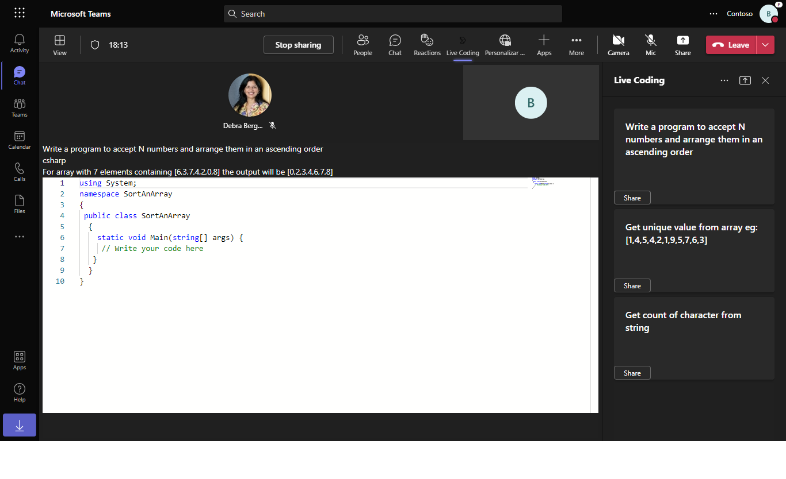
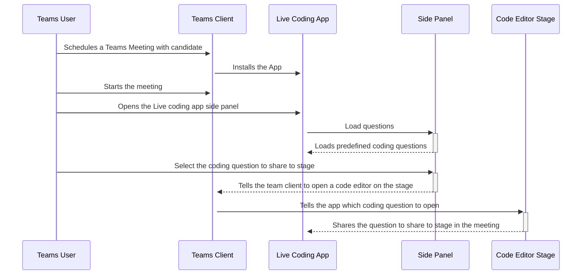

# Live coding interview using Shared meeting stage 

This sample demos live coding in a teams meeting. In side panel there is a list of question in specific coding language and on share click specific question with language code editor will be shared with other participant in meeting.
Now any participant in meeting can write code for the question and same will be updated to all the other participants in meeting.




## Workflow


## Prerequisites

- [.NET Core SDK](https://dotnet.microsoft.com/download) version 3.1

  ```bash
  # determine dotnet version
  dotnet --version
  ```

- [Ngrok](https://ngrok.com/download) (For local environment testing) Latest (any other tunneling software can also be used)
  ```bash
  # run ngrok locally
  ngrok http -host-header=localhost 3978
  ```

- [Teams](https://teams.microsoft.com) Microsoft Teams is installed and you have an account

## To try this sample

1) Clone the repository
   ```bash
   git clone https://github.com/OfficeDev/Microsoft-Teams-Samples.git
   ```

2) In a terminal, navigate to `samples/meeting-live-coding-interview/csharp`

    ```bash
    # change into project folder
    cd # MeetingLiveCoding
    ```
3) Run ngrok - point to port 3978

    ```bash
    # ngrok http -host-header=rewrite 3978
    ```
4) Modify the `manifest.json` in the `/AppPackage` folder and replace the following details
   - `<<App-ID>>` with some unique GUID   
   - `<<BASE-URL>>` with your application's base url, e.g. https://1234.ngrok.io
   - `<<VALID DOMAIN>>` with your app domain e.g. *.ngrok.io

5) Zip the contents of `AppPackage` folder into a `manifest.zip`, and use the `manifest.zip` to deploy in app store or add to Teams.

6) Run the app from a terminal or from Visual Studio, choose option A or B.

  A) From a terminal

  ```bash
  # run the app
  dotnet run
  ```

  B) Or from Visual Studio

  - Launch Visual Studio
  - File -> Open -> Project/Solution
  - Navigate to `MeetingLiveCoding` folder
  - Select `MeetingLiveCoding.csproj` file
  - Press `F5` to run the project

7) Upload the manifest.zip to Teams (in the Apps view click "Upload a custom app")
   - Go to Microsoft Teams. From the lower left corner, select Apps
   - From the lower left corner, choose Upload a custom App
   - Go to your project directory, the ./AppPackage folder, select the zip folder, and choose Open.

## Further reading

- [Share-app-content-to-stage-api ](https://docs.microsoft.com/en-us/microsoftteams/platform/apps-in-teams-meetings/api-references?tabs=dotnet#share-app-content-to-stage-api)
- [Enable-and-configure-your-app-for-teams-meetings](https://docs.microsoft.com/en-us/microsoftteams/platform/apps-in-teams-meetings/enable-and-configure-your-app-for-teams-meetings)

