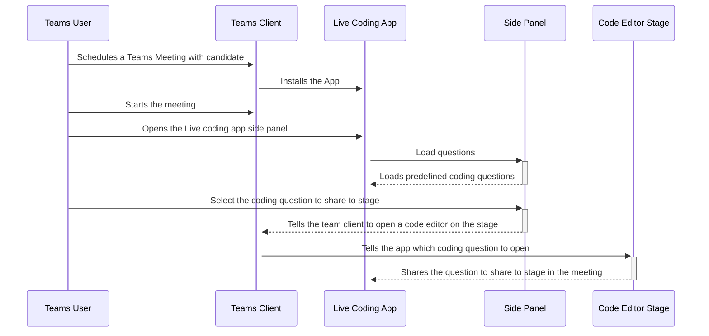

# Live coding interview using Shared meeting stage 

This sample demos a live coding in a teams meeting stage. In side panel there is a list of question in specific coding language and on share click specific question with language code editor will be shared with other participant in meeting.
Now any participant in meeting can write code for the question and same will be updated to all the other participants in meeting.  


## Workflow



## Prerequisites

- [NodeJS](https://nodejs.org/en/)
- [ngrok](https://ngrok.com/) or equivalent tunnelling solution
- [Teams](https://teams.microsoft.com) Microsoft Teams is installed and you have an account


## To try this sample

1) Clone the repository
   ```bash
   git clone https://github.com/OfficeDev/Microsoft-Teams-Samples.git
   ```
2) Install node modules

   Inside node js folder,  navigate to `samples/meetings-live-code-interview/nodejs/api` open your local terminal and run the below command to install node modules. You can do the same in Visual Studio code terminal by opening the project in Visual Studio code.

   - Repeat the same step in folder `samples/meetings-live-code-interview/nodejs/ClientApp`

    ```bash
    npm install
    ```
3) We have two different solutions to run so follow below steps:
 
   A) In a terminal, navigate to `samples/meetings-live-code-interview/nodejs/api`

   B) In a different terminal, navigate to `samples/meetings-live-code-interview/nodejs/ClientApp`

4) Run ngrok - point to port 3000 (pointing to ClientApp)

    ```bash
    # ngrok http -host-header=rewrite 3000
    ```
5) Modify the `manifest.json` in the `/AppPackage` folder and replace the following details
   - `{{Manifest-id}}` with some unique GUID.
   - `{{Domain Name}}` with your application's base url, e.g. https://1234.ngrok.io

6) Zip the contents of `AppPackage` folder into a `manifest.zip`, and use the `manifest.zip` to deploy in app store or add to Teams.

7) Run both solutions i.e. `samples/meetings-live-code-interview/nodejs/api` and `samples/meetings-live-code-interview/nodejs/clientapp`
    ```
    npm start
    ```
8) Upload the manifest.zip to Teams (in the Apps view click "Upload a custom app")
   - Go to Microsoft Teams. From the lower left corner, select Apps
   - From the lower left corner, choose Upload a custom App
   - Go to your project directory, the ./AppPackage folder, select the zip folder, and choose Open.
   - Select Add in the pop-up dialog box. Your app is uploaded to Teams.

## Testing the bot using Bot Framework Emulator

[Bot Framework Emulator](https://github.com/microsoft/botframework-emulator) is a desktop application that allows bot developers to test and debug their bots on localhost or running remotely through a tunnel.

- Install the Bot Framework Emulator version 4.5.0 or greater from [here](https://github.com/Microsoft/BotFramework-Emulator/releases)

## Further reading

- [Share-app-content-to-stage-api ](https://docs.microsoft.com/en-us/microsoftteams/platform/apps-in-teams-meetings/api-references?tabs=dotnet#share-app-content-to-stage-api)
- [Enable-and-configure-your-app-for-teams-meetings](https://docs.microsoft.com/en-us/microsoftteams/platform/apps-in-teams-meetings/enable-and-configure-your-app-for-teams-meetings)

