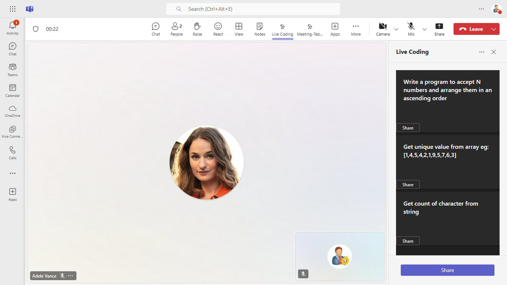
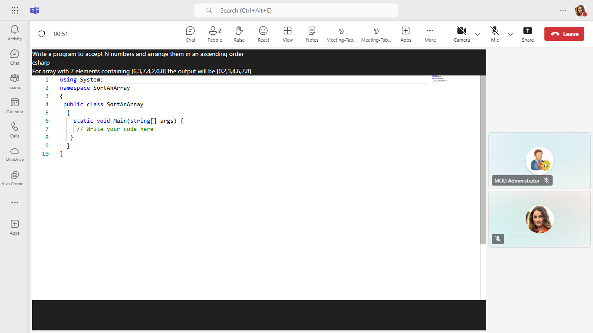

# Live coding interview using Shared meeting stage 

This sample demos a live coding in a Teams meeting stage using [Live Share SDK](https://aka.ms/livesharedocs). In side panel there is a list of question in specific coding language and on share click specific question with language code editor will be shared with other participant in meeting.
Now any participant in meeting can write code for the question and same will be updated to all the other participants in meeting.

## Included Features
* Meeting Stage
* Meeting SidePanel
* Live Share SDK
* RSC Permissions

## Interaction with app


## Try it yourself - experience the App in your Microsoft Teams client
Please find below demo manifest which is deployed on Microsoft Azure and you can try it yourself by uploading the app package (.zip file link below) to your teams and/or as a personal app. (Sideloading must be enabled for your tenant, [see steps here](https://docs.microsoft.com/microsoftteams/platform/concepts/build-and-test/prepare-your-o365-tenant#enable-custom-teams-apps-and-turn-on-custom-app-uploading)).

**Live coding interview using Shared meeting stage:** [Manifest](/samples/meetings-live-code-interview/csharp/demo-manifest/meetings-live-code-interview.zip)

## Prerequisites

 - Office 365 tenant. You can get a free tenant for development use by signing up for the [Office 365 Developer Program](https://developer.microsoft.com/en-us/microsoft-365/dev-program).

- To test locally, [NodeJS](https://nodejs.org/en/download/) must be installed on your development machine (version 16.14.2  or higher).

- [ngrok](https://ngrok.com/download) or equivalent tunnelling solution

## Workflow


## Setup

 1. Register a new application in the [Azure Active Directory – App Registrations](https://go.microsoft.com/fwlink/?linkid=2083908) portal.
 
    - Your app must be registered in the Azure AD portal to integrate with the Microsoft identity platform and call Microsoft Graph APIs. See [Register an application with the Microsoft identity platform](https://docs.microsoft.com/graph/auth-register-app-v2).
    - You need to add following permissions mentioned in the below screenshots to call respective Graph   API
 

**NOTE:** When you create app registration, you will create an App ID and App password - make sure you keep these for later.


2. Setup NGROK
   - Run ngrok - point to port 3978

    ```bash
    ngrok http 3978 --host-header="localhost:3978"
    ```
3. Setup for code

  - Clone the repository

    ```bash
    git clone https://github.com/OfficeDev/Microsoft-Teams-Samples.git
    ```
  
  Install node modules

   Inside node js folder,  navigate to `samples/meetings-live-code-interview/nodejs/api` open your local terminal and run the below command to install node modules. You can do the same in Visual Studio code terminal by opening the project in Visual Studio code.

   - Repeat the same step in folder `samples/meetings-live-code-interview/nodejs/ClientApp`

    ```bash
    npm install
    ```
  - We have two different solutions to run so follow below steps:

     A) In a terminal, navigate to `samples/meetings-live-code-interview/nodejs/api`

     B) In a different terminal, navigate to `samples/meetings-live-code-interview/nodejs/ClientApp`

 - Run both solutions i.e. `samples/meetings-live-code-interview/nodejs/api` and `samples/meetings-live-code-interview/nodejs/clientapp`
    ```
    npm start
    ``` 

4. Setup Manifest for Teams
- __*This step is specific to Teams.*__
    - **Edit** the `manifest.json` contained in the ./Manifest folder to replace your Microsoft App Id (that was created when you registered your app registration earlier) *everywhere* you see the place holder string `{{Microsoft-App-Id}}` (depending on the scenario the Microsoft App Id may occur multiple times in the `manifest.json`)
    - **Edit** the `manifest.json` for `validDomains` and replace `{{domain-name}}` with base Url of your domain. E.g. if you are using ngrok it would be `https://1234.ngrok-free.app` then your domain-name will be `1234.ngrok-free.app`.
    - **Zip** up the contents of the `Manifest` folder to create a `manifest.zip` (Make sure that zip file does not contains any subfolder otherwise you will get error while uploading your .zip package)

- Upload the manifest.zip to Teams (in the Apps view click "Upload a custom app")
   - Go to Microsoft Teams. From the lower left corner, select Apps
   - From the lower left corner, choose Upload a custom App
   - Go to your project directory, the ./Manifest folder, select the zip folder, and choose Open.
   - Select Add in the pop-up dialog box. Your app is uploaded to Teams.

**Note** Run the app on Teams with developer preview on.   

## Running the sample

**Side panel view:**


**Question view on click of share:**


**Question view for other participant in meeting:**


## Further reading

- [Share-app-content-to-stage-api ](https://docs.microsoft.com/en-us/microsoftteams/platform/apps-in-teams-meetings/api-references?tabs=dotnet#share-app-content-to-stage-api)
- [Enable-and-configure-your-app-for-teams-meetings](https://docs.microsoft.com/en-us/microsoftteams/platform/apps-in-teams-meetings/enable-and-configure-your-app-for-teams-meetings)
- [Live-share-sdk-overview](https://docs.microsoft.com/en-us/microsoftteams/platform/apps-in-teams-meetings/teams-live-share-overview)

