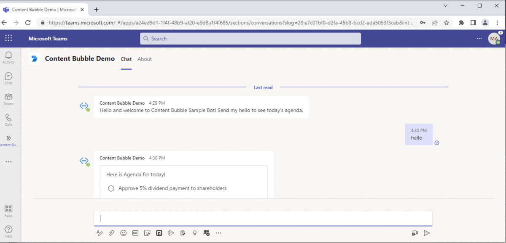
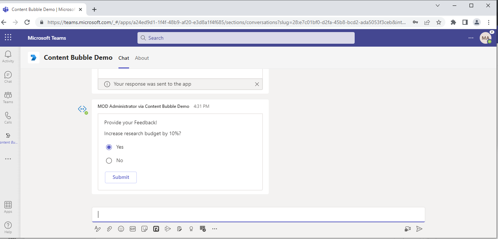
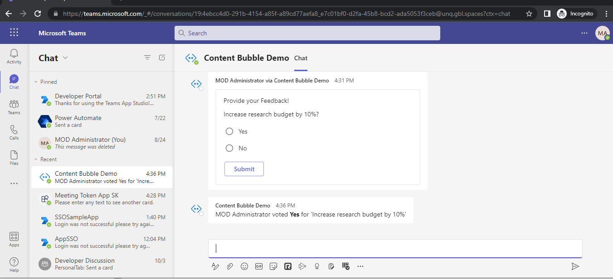
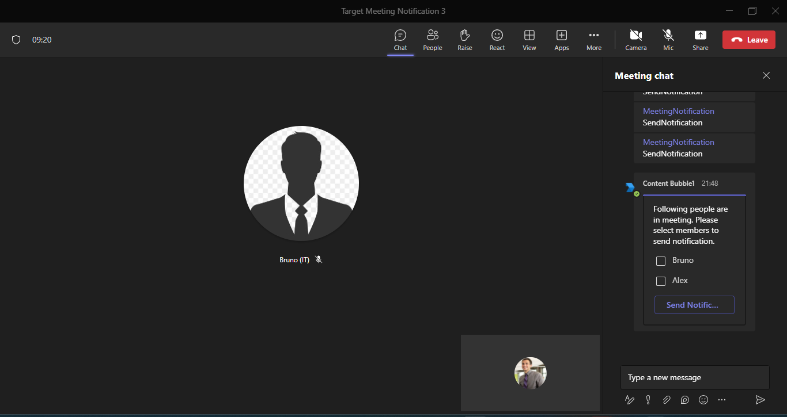

# Targeted In-Meeting Notification

This sample illustrates how to implement [Targeted In-Meeting Notification](https://learn.microsoft.com/en-us/microsoftteams/platform/apps-in-teams-meetings/meeting-apps-apis?branch=pr-en-us-7615&tabs=dotnet#targeted-meeting-notification-api)  In-Meeting Experience.

## Included Features
* Bots
* In-Meeting Notifications
* Adaptive Cards
* RSC Permissions

## Interaction with app



## Try it yourself - experience the App in your Microsoft Teams client
Please find below demo manifest which is deployed on Microsoft Azure and you can try it yourself by uploading the app package (.zip file link below) to your teams and/or as a personal app. (Sideloading must be enabled for your tenant, [see steps here](https://docs.microsoft.com/microsoftteams/platform/concepts/build-and-test/prepare-your-o365-tenant#enable-custom-teams-apps-and-turn-on-custom-app-uploading)).

**Meetings Content Bubble:** [Manifest](/samples/meetings-notification/csharp/demo-manifest/meetings-notification.zip)

## Prerequisites

- Microsoft Teams is installed and you have an account
- [.NET Core SDK](https://dotnet.microsoft.com/download) version 6.0
- [ngrok](https://ngrok.com/) or equivalent tunnelling solution

## Setup

1. Register a new application in the [Azure Active Directory – App Registrations](https://go.microsoft.com/fwlink/?linkid=2083908) portal.

2. Setup for Bot	
	- Also, register a bot with Azure Bot Service, following the instructions [here](https://docs.microsoft.com/azure/bot-service/bot-service-quickstart-registration?view=azure-bot-service-3.0).
	- Ensure that you've [enabled the Teams Channel](https://docs.microsoft.com/azure/bot-service/channel-connect-teams?view=azure-bot-service-4.0)
	- While registering the bot, use `https://<your_ngrok_url>/api/messages` as the messaging endpoint.

    > NOTE: When you create your app registration, you will create an App ID and App password - make sure you keep these for later.

3. Setup NGROK
      - Run ngrok - point to port 3978

	```bash
	# ngrok http -host-header=rewrite 3978
	```
4. Setup for code
- Clone the repository

    ```bash
    git clone https://github.com/OfficeDev/Microsoft-Teams-Samples.git
    ```

- Modify the `/appsettings.json` and fill in the following details:
  - `{{MICROSOFT_APP_ID}}` - Generated from Step 1 while doing AAd app registration in Azure portal.
  - `{{ MICROSOFT_APP_PASSWORD}}` - Generated from Step 1, also referred to as Client secret
  - `{{ BaseURL }}` - Your application's base url. E.g. https://12345.ngrok.io if you are using ngrok.

- If you are using Visual Studio
  - Launch Visual Studio
  - File -> Open -> Project/Solution
  - Navigate to `samples\meetings-notification\csharp` folder
  - Select `TargetedNotifications.sln` file

5. Setup Manifest for Teams
- __*This step is specific to Teams.*__
    - **Edit** the `manifest.json` contained in the ./Manifest folder to replace your Microsoft App Id (that was created when you registered your app registration earlier) *everywhere* you see the place holder string `{{Microsoft-App-Id}}` (depending on the scenario the Microsoft App Id may occur multiple times in the `manifest.json`)
    - **Edit** the `manifest.json` for `validDomains` and replace `{{domain-name}}` with base Url of your domain. E.g. if you are using ngrok it would be `https://1234.ngrok.io` then your domain-name will be `1234.ngrok.io`.
    - **Zip** up the contents of the `Manifest` folder to create a `manifest.zip` (Make sure that zip file does not contains any subfolder otherwise you will get error while uploading your .zip package)

- Upload the manifest.zip to Teams (in the Apps view click "Upload a custom app")
   - Go to Microsoft Teams. From the lower left corner, select Apps
   - From the lower left corner, choose Upload a custom App
   - Go to your project directory, the ./Manifest folder, select the zip folder, and choose Open.
   - Select Add in the pop-up dialog box. Your app is uploaded to Teams.

**Note**: If you are facing any issue in your app, please uncomment [this](https://github.com/OfficeDev/Microsoft-Teams-Samples/blob/main/samples/meetings-content-bubble/csharp/ContentBubble/AdapterWithErrorHandler.cs#L26) line and put your debugger for local debug.

## Interacting with the app in Teams Meeting

Message the Bot by @ mentioning to interact with the content bubble.
1. You will see agenda items listed in an Adaptive Card.
1. Select any option and click on Push Agenda button
1. You can submit your feedback on either Content Bubble/Adaptive card sent in chat.

## Running the sample







## Send targeted meeting notification



## Further Reading

- [Meeting apps APIs](https://learn.microsoft.com/microsoftteams/platform/apps-in-teams-meetings/meeting-apps-apis?tabs=dotnet)
- [Meeting content bubble](https://learn.microsoft.com/microsoftteams/platform/sbs-meeting-content-bubble)
- [Build tabs for meeting](https://learn.microsoft.com/microsoftteams/platform/apps-in-teams-meetings/build-tabs-for-meeting?tabs=desktop)
- [Build in-meeting notification for Teams meeting](https://learn.microsoft.com/microsoftteams/platform/apps-in-teams-meetings/in-meeting-notification-for-meeting)