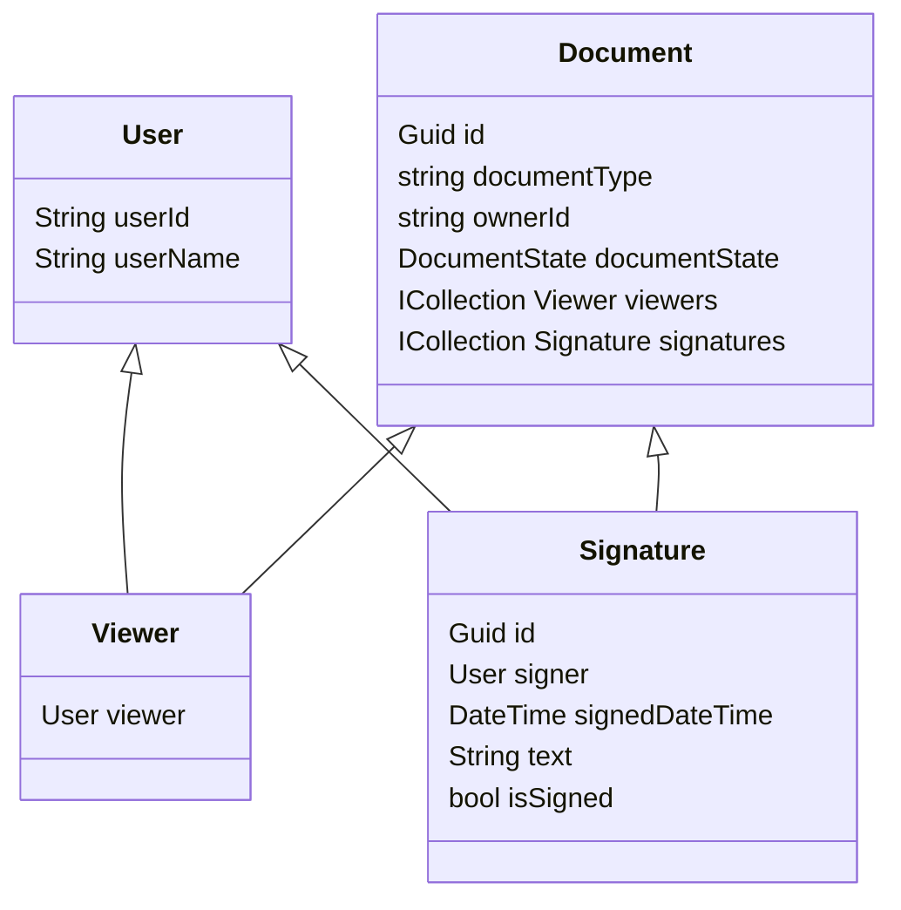

# In-Meeting Document Signing - Mermaid flow diagrams
The below is a data model describing the data flow of our backend system.

*If viewing locally, install the Visual Studio Code "[Markdown Preview Mermaid Support](https://marketplace.visualstudio.com/items?itemName=bierner.markdown-mermaid)" extension for the best experience*

# Backend data models
