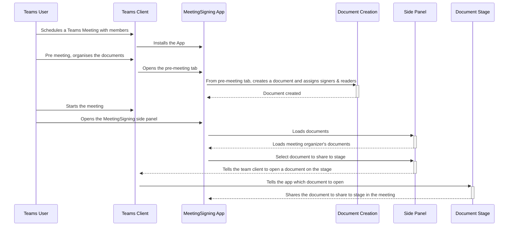
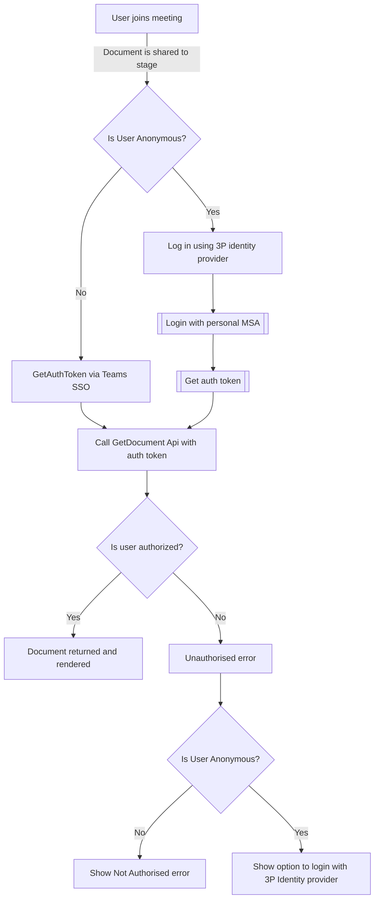

# In-Meeting Document Signing
Meeting Signing is a Teams sample app that demonstrates the scenario of enabling users to [sign documents in real time](https://learn.microsoft.com/microsoftteams/platform/apps-in-teams-meetings/build-apps-for-teams-meeting-stage#build-an-in-meeting-document-signing-app) during meetings making possible to review and sign documents in a single session. This sample lets users electronically sign documents with their current tenant identity. Some example documents that can be signed during meetings are Purchase Agreements and Purchase Orders. This template is also applicable, and could be adapted for other scenarios like reviewing and approving code reviews or collaborative reviewing of documents.

The sample app could be customized to incorporate other kind of signatures like handwritten signatures or certificate based signatures. 

## Personas: 

This sample has 3 main personas: 

* Document creator: this role can add their own documents to be signed using the app 
* Signer: this role will be able to sign documents reviewed during the meeting 
* Reader: this role will only be able to read the documents reviewed during the meeting 

## Scenarios: 

* Add documents to be reviewed during a meeting 
* Share documents to be reviewed to main stage 
* Sign documents using the signer’s identity

## Included Features
* Teams SSO
* Programmatic sharing of content to stage
* Stage app view depends on the authentication of the user
* Adaptive Cards
* People Picker
* Anonymouse User support
* MSAL.js 2.0 support

## Interaction with app


## Workflow

## Prerequisites

- [.NET Core SDK](https://dotnet.microsoft.com/download) version 6.0

  ```bash
  # determine dotnet version
  dotnet --version
  ```
- Publicly addressable https url or tunnel such as [dev tunnel](https://learn.microsoft.com/en-us/azure/developer/dev-tunnels/get-started?tabs=windows) or [ngrok](https://ngrok.com/) latest version or [Tunnel Relay](https://github.com/OfficeDev/microsoft-teams-tunnelrelay) 

## Setup
> NOTE: The free ngrok plan will generate a new URL every time you run it, which requires you to update your Azure AD registration, the Teams app manifest, and the project configuration. A paid account with a permanent ngrok URL is recommended.

- Ensure that you've [enabled the Teams Channel](https://docs.microsoft.com/en-us/azure/bot-service/channel-connect-teams?view=azure-bot-service-4.0)

    > NOTE: When you create your bot you will create an App ID and App password - make sure you keep these for later.

### 2. Setup for app registration 
- Make sure to copy and save the `https` url (if you are using Ngrok it should look like `https://<randomsubdomain>.ngrok-free.app`)

- Register an App in AzureAD that can be used for Teams SSO](https://docs.microsoft.com/en-us/microsoftteams/platform/tabs/how-to/authentication/tab-sso-register-aad)

- Once the app is registered update Redirect Uris under the Authentication section with the tunnel url, followed by /auth-end (Eg : https://<randomsubdomain>.ngrok-free.app/auth-end)

- Ensure the following API permissions are granted to the app for Microsoft Graph access
    - email
    - offline_access,
    - openid,
    - profile, 
    - User.Read,
    - User.ReadBasic.All

- After you create an AzureAD app, under *Certificates & secrets* create a new  *Client secret*. Copy the secret value and set it in `appSettings.json`    

- *Note: if you restart Ngrok you may have to update any fully qualified domain name you have set in your AzureAD App*

### 2a. Setup app registration for Anonymous users
- For anonymous users we authorize who the user is by having them log in to a Microsoft Personal account. You can use the same AzureAD App as above, but we have separated the apps so things are clearer.
- [Register an App in AzureAD that can be used for Microsoft Personal account users](https://docs.microsoft.com/en-us/microsoftteams/platform/tabs/how-to/authentication/tab-sso-register-aad#to-register-a-new-app-in-azure-ad)
    - Register the app
        - We tested with an app that supports "Accounts in any organizational directory (Any Azure AD directory - Multi-tenant) and personal Microsoft accounts"
        - Expose the API
        - Configure the API scopes
        - You do not need "To configure authorized client application"
    - Ensure the following API permissions are granted to the app for Microsoft Graph access - email, openid
    - *Note: if you restart Ngrok you may have to update any fully qualified domain name you have set in your AzureAD App*
    - After you create an AzureAD app, under *Certificates & secrets* create a new  *Client secret*. Copy the secret value and set it in `appSettings.json`

### 3. Setup NGROK
1) Run ngrok - point to port 44326

   ```bash
   ngrok http 44326 --host-header="localhost:44326"
   ```  

   Alternatively, you can also use the `dev tunnels`. Please follow [Create and host a dev tunnel](https://learn.microsoft.com/en-us/azure/developer/dev-tunnels/get-started?tabs=windows) and host the tunnel with anonymous user access command as shown below:

   ```bash
   devtunnel host -p 44326 --allow-anonymous
   ```

### 4. Project Structure
    - The sample contains 3 projects
        * `Web` - Exposes REST APIs for documents and signing scenarios supported in this POC.  
            * `Web\ClientApp` contains the Front End code to support document sharing in a meeting via share to stage. 
        * `Domain` - Contains the business logic to support the REST APIs.
        * `Infrastructure` - Fulfils `Domain`'s dependencies like data repositories, graph support needed.

### 5. Setup for code
- Clone the repository

    ```bash
    git clone https://github.com/OfficeDev/Microsoft-Teams-Samples.git
    ```

- Install modules
 navigate to `samples/meetings-share-to-stage-signing/csharp/Source/MeetingSigning/ClientApp`

    ```bash
    npm install
    ```
- In `appSettings.json`, `manifest.json` and `.env` replace:
    * `<<deployment-url>>` with your tunnel url, minus the https://.
    * `<<aad-id>>` with your AzureAD Application (Client) Id.
    * `<<client secret>>` with the client secret you created above.
    * `<<msa-only-aad-client-id>>` with the Application (Client) Id from the AzureAD App for personal users
    * `<<msa-only-aad-client-secret>>` with the client secret from the AzureAD App for personal users that you created above
    * `<<msa-only-scope>>` `api://<<deployment-url>>/<<msa-only-aad-client-id>>/access_as_user email openid`

- Run the bot from a terminal, Visual Studio or Docker choose one of the following options:

    ### Locally using .NET SDK
    * Point tunnel to port 5001: Eg : `ngrok http -host-header=rewrite 5001`
    * In a terminal, navigate to `samples/meetings-share-to-stage-signing/csharp/Source/MeetingSigning`
    * Run `dotnet run`

    ### Locally in Visual Studio
    * Point tunnel to port 44326: Eg: `ngrok http 44326 --host-header="localhost:44326"`
    * Launch Visual Studio
    * File -> Open -> Project/Solution
    * Navigate to `samples/meetings-share-to-stage-signing/csharp/Source` folder
    * Select `MeetingSigning.sln` file
    * Ensure the start-up project is set to `Microsoft.Teams.Samples.MeetingSigning.Web`
    * Press `F5` to start Debugging using IIS Express

    ### Docker
    *Note the below instructions are using [Podman](https://podman.io/), but Docker's commands are similar. [There are instructions for setting up Podman on WSL2 here](docs/installing-podman-on-wsl2.md)*
    * From this directory build the Docker image `podman build -f Deployment/Dockerfile --ignorefile Deployment/.dockerignore ./Source --build-arg REACT_APP_AAD_CLIENT_ID --build-arg REACT_APP_MSA_ONLY_CLIENT_ID --build-arg REACT_APP_MSA_ONLY_SCOPE`
    * Wait for the container to build
    * Run `podman images` to view available images, copy the Image ID
    * Point tunnel to port 8080: Eg: `ngrok http -host-header=rewrite 8080`
    * Run `podman run -d -p 8080:80 --name MeetingSigning <IMAGE_ID>` to start the container
    * Open [http://localhost:8080/](http://localhost:8080/) to view the service running

### 4. Setup Manifest for Teams

- **This step is specific to Teams.**

    - **Edit** the `manifest.json` contained in the  `Source\MeetingSigning.Web\Manifest` folder to replace your Microsoft App Id (that was created when you registered your bot earlier) *everywhere* you see the place holder string `<<Your Microsoft App Id>>` (depending on the scenario the Microsoft App Id may occur multiple times in the `manifest.json`)
    - **Edit** the `manifest.json` for `configurationUrl` inside `configurableTabs` . Replace `<your_tunnel_domain>` with base Url domain. E.g. if you are using ngrok it would be `https://1234.ngrok-free.app` then your domain-name will be `1234.ngrok-free.app` and if you are using dev tunnels then your domain will be like: `12345.devtunnels.ms`.
    - **Edit** the `manifest.json` for `validDomains` with base Url domain. E.g. if you are using ngrok it would be `https://1234.ngrok-free.app` then your domain-name will be `1234.ngrok-free.app` and if you are using dev tunnels then your domain will be like: `12345.devtunnels.ms`.
    - **Zip** up the contents of the `Source\MeetingSigning.Web\Manifest` folder to create a `manifest.zip` (Make sure that zip file does not contains any subfolder otherwise you will get error while uploading your .zip package)
    - **Upload** the `manifest.zip` to Teams (In Teams Apps/Manage your apps click "Upload an app". Browse to and Open the .zip file. At the next dialog, click the Add button.)

## Running the sample

**Install app:**


**Add Meeting Signing:**


**Create documents:**


**Empty create documents UI:**


**Create documents UI:**


**Documents created success:**


**Join call and add app:**


**App meeting side panel:**


**Click Share Meeting:**


**Click to sign:**


**Click done:**


**Create multiple document:**


**Create multiple signing and document:**


**Multiple document UI:**


**Multiple share meeting UI:**


## Usage
* Sideload the app to a meeting.
* In the meeting group chat, add the *Meeting Signing* app as a new Tab.
* In the pre-meeting tab, create a test document so you can test the meeting share to stage APIs.
* Provide one-time consent to the app for Graph permissions while creating the document.
* Start the meeting.
    * In the bar at the top, select *Meeting Signing* to open the sidepanel.
    * You will see any documents you created here
    * Select *Share to Meeting* on a document you want to share to stage.
    * All participants of the meeting will see the app being shared to the stage. Participants who are either signers, viewers or document creators will be able to see the document. Participants not a signer, viewer or creator will see an error stating they do not have permissions to view the document.
    * Signers are able to sign a document, and all viewers will have their view of their document updated to include that signature.
* Anonymous Users
    * When you join the meeting, if a document is shared to stage, you will be prompted to log in to your personal Microsoft account.
    * Once you log in, if your email matches those defined in the document details you will be able to view the document.

## User specific views
* A user/meeting attendee can be either a viewer or a signer. If neither, an error message "you aren't allowed to see this document" will be displayed.
* A viewer can only view the document.
* All signers can view and sign a document.

## Live Share integration
We have added Live Share to this demo to showcase some features of the SDK. The examples we are showing are scroll syncing, taking control and shared cursors.

* Scroll Offset Syncing, when the person in control scrolls their view of the document, everyone following will see their document scroll too. We the controller scrolls we send an LiveEvent that viewers listen for, and if the viewer is following the controller their view will update. If the viewer has scrolled to a different part of the document, their following of the controller will be suspended until they follow the controller again.
* Take Control allows for other viewers to become the scroll controller. Only those that have an approved role (in our example Organiser and Presenter) will be able to claim control. 
* Shared Cursors shares presenters cursors across every attendees screen. The approach we are using is primitive and uses DOM manipulation to position the cursors. If you plan to implement cursor support in your app using the [live-share-canvas SDK](https://github.com/microsoft/live-share-sdk/tree/main/packages/live-share-canvas) is recommended.

*[We have discussed some more thoughts on Live Share here](docs/live-share.md)*

## Known issues
### Feature Rollout
Currently, this app is not fully supported in the following scenarios:
* Mobile
    * We are tracking two separate issues that cause issues with opening of the task module and the submitting of the adaptive card used for signing to not work on iOS and Android.
    * People Picker is used in Document Creation. [As of March 2022, people picker on mobile is in public developer preview.](https://docs.microsoft.com/en-us/microsoftteams/platform/task-modules-and-cards/cards/people-picker?tabs=mobile)
* The current generally available Teams for Web does not support meeting apps.

### User Permissions
* Tenant - If assigned by the document creator, the User will be  able to see and sign the document. 
* Federated/Guest Users:
    * The people picker does not allow users outside of the tenant to be selected. Similarly, if a federated user creates the document, they are only able to select people in their tenant as signers/viewers, and nobody from outside their tenant can view the document.
* Anonymous Users
    * Coming soon! When creating a document you can declare the emails of the anonymous users who should view or sign the document. The app prompts anonymous meeting participants to sign in with their Microsoft account, then uses the login information to validate that their email address is allowed to access the document. You can extend this approach to support other identity providers.

Below is a diagram on how the auth flow works for anonymous and non-anonymous users (AzureAD in-tenant, federated and guest)


### Common Problems
* When the solution is run on a local web browser (anywhere outside of Teams), it will load an expected error message stating that 
" Unable to get information about the App.
This happens if you are running the application in a normal browser, and not inside Teams. Install the app inside teams to test this application. To upload the app to Teams follow the instructions on https://docs.microsoft.com/en-us/microsoftteams/platform/concepts/deploy-and-publish/apps-upload"
* "Something went wrong" when opening the app in the meeting. If you have yet to authorise the application, and you open the app in the meeting, Teams doesn't seem to prompt for you to authorise the application. To solve this, if you create a document in the pre-meeting flow, you should be prompted to auth there and the app will be able to get a token when in a meeting next time.
* Anonymous users in private windows are asked to login multiple times.
    * We use MSAL.js with localStorage to log anonymous users in and to save the login details between contexts (e.g. SidePanel and Stage). However, in private windows third-party cookies and localStorage can not be set, and as the Teams app model is to iframe the tab, the application is considered a third-party.


## Code Tours
This repository uses VSCode [Code Tours](https://marketplace.visualstudio.com/items?itemName=vsls-contrib.codetour#:~:text=A%20%22code%20tour%22%20is%20simply%20a%20series%20of,CONTRIBUTING.md%20file%20and%2For%20rely%20on%20help%20from%20others.) to explain _how_ the code works. 

The tour files can be found in the `.tours` directory.

## Additional links
* [Share to stage](https://docs.microsoft.com/en-us/microsoftteams/platform/apps-in-teams-meetings/enable-and-configure-your-app-for-teams-meetings) 

## Further reading

- [Build an in-meeting document signing app](https://learn.microsoft.com/en-us/microsoftteams/platform/apps-in-teams-meetings/build-apps-for-teams-meeting-stage#build-an-in-meeting-document-signing-app)
- [Build tabs for meeting](https://learn.microsoft.com/microsoftteams/platform/apps-in-teams-meetings/build-tabs-for-meeting?tabs=desktop)
- [Azure Portal](https://portal.azure.com)
- [Microsoft Teams Developer Platform](https://docs.microsoft.com/en-us/microsoftteams/platform/)


