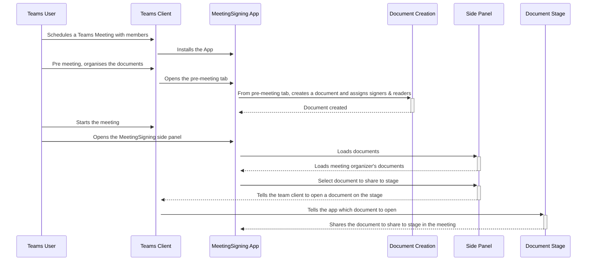

# In-Meeting Document Signing
This proof of concept demonstrates the use case of sharing a document on Teams Share to Stage with live signing feature in a meeting.

## Included Features
* Teams SSO
* Programmatic sharing of content to stage
* Stage app view depends on the authentication of the user
* Adaptive Cards

<!-- Include a video documenting the sharing to stage here. -->


## Workflow


## Usage
* Sideload the app to a meeting.
* In the meeting group chat, add the *Meeting Signing* app as a new Tab.
* In the pre-meeting tab, create a test document so you can test the meeting share to stage APIs.
* Provide one-time consent to the app for Graph permissions while creating the document.
* Start the meeting.
    * In the bar at the top, select *Meeting Signing* to open the sidepanel.
    * You will see any documents you created here
    * Select *Share to Meeting* on a document you want to share to stage.
    * All participants of the meeting will see the app being shared to the stage. Participants who are either signers, viewers or document creators will be able to see the document. Participants not a signer, viewer or creator will see an error stating they do not have permissions to view the document.
    * Signers are able to sign a document, and all viewers will have their view of their document updated to include that signature.

## User specific views
* A user/meeting attendee can be either a viewer or a signer. If neither, an error message "you aren't allowed to see this document" will be displayed.
* A viewer can only view the document.
* All signers can view and sign a document.

## Known issues
### Feature Rollout
Currently, this app is not fully supported in the following scenarios:
* Mobile
    * We are tracking two separate issues that cause issues with opening of the task module and the submitting of the adaptive card used for signing to not work on iOS and Android.
    * People Picker is used in Document Creation. [As of March 2022, people picker on mobile is in public developer preview.](https://docs.microsoft.com/en-us/microsoftteams/platform/task-modules-and-cards/cards/people-picker?tabs=mobile)
* The current generally available Teams for Web does not support meeting apps.

### User Permissions
* Tenant - If assigned by the document creator, the User will be  able to see and sign the document. 
* Federated/Guest Users:
    * The app loads but it's not possible to be authenticated to load the document. This is due to [a bug in Teams SSO](https://github.com/OfficeDev/microsoft-teams-library-js/issues/675)
    * The people picker does not allow users outside of the tenant to be selected. Similarly, if a federated user creates the document, they are only able to select people in their tenant as signers/viewers, and nobody from outside their tenant can view the document.
* Anonymous Users - Does not work because apps can't get an SSO token for anonymous users.

### Common Problems
* When the solution is run on a local web browser (anywhere outside of Teams), it will load an expected error message stating that 
" Unable to get information about the App.
This happens if you are running the application in a normal browser, and not inside Teams. Install the app inside teams to test this application. To upload the app to Teams follow the instructions on https://docs.microsoft.com/en-us/microsoftteams/platform/concepts/deploy-and-publish/apps-upload"

## Prerequisites
* Make sure you have an active [Azure subscription](https://azure.microsoft.com/en-us/free/).
* Make sure [Publish to organization's app store](https://docs.microsoft.com/en-us/MicrosoftTeams/manage-apps?toc=%2Fmicrosoftteams%2Fplatform%2Ftoc.json&bc=%2Fmicrosoftteams%2Fplatform%2Fbreadcrumb%2Ftoc.json#publish-a-custom-app-to-your-organizations-app-store) is available in Teams.
[Publish a custom app](https://docs.microsoft.com/en-us/MicrosoftTeams/submit-approve-custom-apps) to publish the custom app. 
* Install [Visual Studio](https://docs.microsoft.com/en-us/visualstudio/install/install-visual-studio?view=vs-2022) or [Visual Studio Code](https://code.visualstudio.com/download) to run and debug the sample code.
  * [.NET Core SDK](https://dotnet.microsoft.com/download) version 6.0
* Install [ngrok](https://ngrok.com/download) for local setup. (or any other tunneling solution)

## Steps
* Start Ngrok
* Create an Azure AAD App Registration
* Update URL in Manifest
* Build C# App
* Deploy to Teams

## Set up
* Run Ngrok
    * Run ngrok and point it to the port the Web App is listening on.
    ```bash
    ngrok http https://localhost:44326 -host-header=localhost:44326 # For Visual Studio
    ```
    * Make sure to copy and save the `https` url (it should look like `https://<randomsubdomain>.ngrok.io`).
* [Register an App in AAD that can be used for Teams SSO](https://docs.microsoft.com/en-us/microsoftteams/platform/tabs/how-to/authentication/auth-aad-sso?tabs=dotnet#develop-an-sso-microsoft-teams-tab)
    * Once the app is registered update Redirect Uris under the Authentication section with the ngrok url, followed by /auth-end (https://<randomsubdomain>.ngrok.io/auth-end)
    * Ensure the following API permissions are granted to the app for Microsoft Graph access - email, offline_access, openid, profile, User.Read, User.ReadBasic.All
    * *Note: if you restart Ngrok you may have to update any fully qualified domain name you have set in your AAD App*
    * After you create an AAD app, under *Certificates & secrets* create a new  *Client secret*. Copy the secret value and set it in `appSettings.json`
* In `appSettings.json`, `manifest.json` and `.env` replace:
    * `<<deployment-url>>` with your ngrok url, minus the https://.
    * `<<aad-id>>` with your AAD Application (Client) Id.
    * `<<client secret>>` with the client secret you created above.
* Project Structure
    * The sample contains 3 projects
        * `Web` - Exposes REST APIs for documents and signing scenarios supported in this POC.  
            * `Web\ClientApp` contains the Front End code to support document sharing in a meeting via share to stage. 
        * `Domain` - Contains the business logic to support the REST APIs.
        * `Infrastructure` - Fulfils `Domain`'s dependencies like data repositories, graph support needed.
* Deploying
    * There are detailed instructions for deploying locally below.
* Sideloading the App
    * Create a zip containing `manifest.json`, `colorIcon.png` and `outlineIcon.png` from `Source\MeetingSigning.Web\Manifest`.
    * [You can upload you app by following these instructions](https://docs.microsoft.com/en-us/microsoftteams/platform/concepts/deploy-and-publish/apps-upload)

## Deployment
### Locally in Visual Studio
* Point Ngrok to port 44326: `ngrok http https://localhost:44326 -host-header=localhost:44326`
* Open the solution in Visual Studio.
* Ensure the start-up project is set to `Microsoft.Teams.Samples.MeetingSigning.Web`
* Start Debugging using IIS Express

### Locally using .NET SDK
* Point Ngrok to port 5001: `ngrok http -host-header=rewrite 5001`
* In a terminal, navigate to `Source\MeetingSigning.Web`
* Run `dotnet run`

### Docker
*Note the below instructions are using [Podman](https://podman.io/), but Docker's commands are similar. [There are instructions for setting up Podman on WSL2 here](docs/installing-podman-on-wsl2.md)*
* From this directory build the Docker image `podman build -f Deployment/Dockerfile
--ignorefile Deployment/.dockerignore ./Source --build-arg REACT_APP_AAD_CLIENT_ID`
* Wait for the container to build
* Run `podman images` to view available images, copy the Image ID
* Point Ngrok to port 8080: `ngrok http -host-header=rewrite 8080`
* Run `podman run -d -p 8080:80 --name MeetingSigning <IMAGE_ID>` to start the container
* Open [http://localhost:8080/](http://localhost:8080/) to view the service running

## Additional links
* [Share to stage](https://docs.microsoft.com/en-us/microsoftteams/platform/apps-in-teams-meetings/enable-and-configure-your-app-for-teams-meetings) 