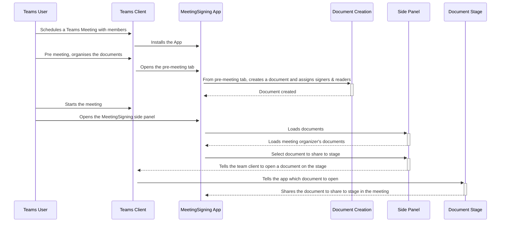

# In-Meeting Document Signing
Meeting Signing is a Teams sample app that demonstrates the scenario of enabling users to sign documents in real time during meetings making possible to review and sign documents in a single session. This sample lets users electronically sign documents with their current tenant identity. Some example documents that can be signed during meetings are Purchase Agreements and Purchase Orders. This template is also applicable, and could be adapted for other scenarios like reviewing and approving code reviews or collaborative reviewing of documents 

The sample app could be customized to incorporate other kind of signatures like handwritten signatures or certificate based signatures. 

## Personas: 

This sample has 3 main personas: 

* Document creator: this role can add their own documents to be signed using the app 
* Signer: this role will be able to sign documents reviewed during the meeting 
* Reader: this role will only be able to read the documents reviewed during the meeting 

## Scenarios: 

* Add documents to be reviewed during a meeting 
* Share documents to be reviewed to main stage 
* Sign documents using the signer’s identity

## Included Features
* Teams SSO
* Programmatic sharing of content to stage
* Stage app view depends on the authentication of the user
* Adaptive Cards
* People Picker

## Interaction with app


## Workflow

## Prerequisites

- [.NET Core SDK](https://dotnet.microsoft.com/download) version 6.0

  ```bash
  # determine dotnet version
  dotnet --version
  ```
- Publicly addressable https url or tunnel such as [ngrok](https://ngrok.com/) or [Tunnel Relay](https://github.com/OfficeDev/microsoft-teams-tunnelrelay) 

## Setup
> NOTE: The free ngrok plan will generate a new URL every time you run it, which requires you to update your Azure AD registration, the Teams app manifest, and the project configuration. A paid account with a permanent ngrok URL is recommended.

- Ensure that you've [enabled the Teams Channel](https://docs.microsoft.com/en-us/azure/bot-service/channel-connect-teams?view=azure-bot-service-4.0)

    > NOTE: When you create your bot you will create an App ID and App password - make sure you keep these for later.

### 2. Setup for app registration 
- Make sure to copy and save the `https` url (it should look like `https://<randomsubdomain>.ngrok.io`)

- Register an App in AAD that can be used for Teams SSO](https://docs.microsoft.com/en-us/microsoftteams/platform/tabs/how-to/authentication/tab-sso-register-aad)

- Once the app is registered update Redirect Uris under the Authentication section with the ngrok url, followed by /auth-end (https://<randomsubdomain>.ngrok.io/auth-end)

- Ensure the following API permissions are granted to the app for Microsoft Graph access
    - email
    - offline_access,
    - openid,
    - profile, 
    - User.Read,
    - User.ReadBasic.All

- After you create an AAD app, under *Certificates & secrets* create a new  *Client secret*. Copy the secret value and set it in `appSettings.json`    

- *Note: if you restart Ngrok you may have to update any fully qualified domain name you have set in your AAD App*

### 3. Setup NGROK
```bash
# ngrok http -host-header=rewrite 44326
```
### 4. Project Structure
    - The sample contains 3 projects
        * `Web` - Exposes REST APIs for documents and signing scenarios supported in this POC.  
            * `Web\ClientApp` contains the Front End code to support document sharing in a meeting via share to stage. 
        * `Domain` - Contains the business logic to support the REST APIs.
        * `Infrastructure` - Fulfils `Domain`'s dependencies like data repositories, graph support needed.

### 5. Setup for code
- Clone the repository

    ```bash
    git clone https://github.com/OfficeDev/Microsoft-Teams-Samples.git
    ```

- Install modules
 navigate to `samples/meetings-share-to-stage-signing/csharp/Source/MeetingSigning/ClientApp`

    ```bash
    npm install
    ```
- In `appSettings.json`, `manifest.json` and `.env` replace:
    * `<<deployment-url>>` with your ngrok url, minus the https://.
    * `<<aad-id>>` with your AAD Application (Client) Id.
    * `<<client secret>>` with the client secret you created above.

- Run the bot from a terminal or from Visual Studio, choose option A or B:

  A) From a terminal, navigate to `samples/meetings-share-to-stage-signing/csharp/Source/MeetingSigning`

  ```bash
  # run the bot
  dotnet run
  ```
  B) Or from Visual Studio

  - Launch Visual Studio
  - File -> Open -> Project/Solution
  - Navigate to `samples/meetings-share-to-stage-signing/csharp/Source` folder
  - Select `MeetingSigning.sln` file
  - Press `F5` to run the project

### 4. Setup Manifest for Teams

- **This step is specific to Teams.**

    - **Edit** the `manifest.json` contained in the  `Source\MeetingSigning.Web\Manifest` folder to replace your Microsoft App Id (that was created when you registered your bot earlier) *everywhere* you see the place holder string `<<Your Microsoft App Id>>` (depending on the scenario the Microsoft App Id may occur multiple times in the `manifest.json`)
    - **Edit** the `manifest.json` for `configurationUrl` inside `configurableTabs` . Replace `<yourNgrok.ngrok.io>` with base Url domain. E.g. if you are using ngrok it would be `https://1234.ngrok.io` then your domain-name will be `1234.ngrok.io`.
    - **Edit** the `manifest.json` for `validDomains` with base Url domain. E.g. if you are using ngrok it would be `https://1234.ngrok.io` then your domain-name will be `1234.ngrok.io`.
    - **Zip** up the contents of the `Source\MeetingSigning.Web\Manifest` folder to create a `manifest.zip` (Make sure that zip file does not contains any subfolder otherwise you will get error while uploading your .zip package)
    - **Upload** the `manifest.zip` to Teams (In Teams Apps/Manage your apps click "Upload an app". Browse to and Open the .zip file. At the next dialog, click the Add button.)

## Running the sample

**Install app:**


**Add Meeting Signing:**


**Create documents:**


**Empty create documents UI:**


**Create documents UI:**


**Documents created success:**


**Join call and add app:**


**App install success UI:**


**Click Share Meeting:**


**Click to sign:**


**Click done:**


**Create multiple document:**


**Create multiple signing and document:**


**Multiple document UI:**


**Multiple share meeting UI:**


## Usage
* Sideload the app to a meeting.
* In the meeting group chat, add the *Meeting Signing* app as a new Tab.
* In the pre-meeting tab, create a test document so you can test the meeting share to stage APIs.
* Provide one-time consent to the app for Graph permissions while creating the document.
* Start the meeting.
    * In the bar at the top, select *Meeting Signing* to open the sidepanel.
    * You will see any documents you created here
    * Select *Share to Meeting* on a document you want to share to stage.
    * All participants of the meeting will see the app being shared to the stage. Participants who are either signers, viewers or document creators will be able to see the document. Participants not a signer, viewer or creator will see an error stating they do not have permissions to view the document.
    * Signers are able to sign a document, and all viewers will have their view of their document updated to include that signature.

## User specific views
* A user/meeting attendee can be either a viewer or a signer. If neither, an error message "you aren't allowed to see this document" will be displayed.
* A viewer can only view the document.
* All signers can view and sign a document.

## Live Share integration
We have added Live Share to this demo to showcase some features of the SDK. The examples we are showing are scroll syncing, taking control and shared cursors.

* Scroll Offset Syncing, when the person in control scrolls their view of the document, everyone following will see their document scroll too. We the controller scrolls we send an EphemeralEvent that viewers listen for, and if the viewer is following the controller their view will update. If the viewer has scrolled to a different part of the document, their following of the controller will be suspended until they follow the controller again.
* Take Control allows for other viewers to become the scroll controller. Only those that have an approved role (in our example Organiser and Presenter) will be able to claim control. 
* Shared Cursors shares presenters cursors across every attendees screen. The approach we are using is primitive and uses DOM manipulation to position the cursors. If you plan to implement cursor support in your app using the [live-share-canvas SDK](https://github.com/microsoft/live-share-sdk/tree/main/packages/live-share-canvas) is recommended.

*[We have discussed some more thoughts on Live Share here](docs/live-share.md)*

## Known issues
### Feature Rollout
Currently, this app is not fully supported in the following scenarios:
* Mobile
    * We are tracking two separate issues that cause issues with opening of the task module and the submitting of the adaptive card used for signing to not work on iOS and Android.
    * People Picker is used in Document Creation. [As of March 2022, people picker on mobile is in public developer preview.](https://docs.microsoft.com/en-us/microsoftteams/platform/task-modules-and-cards/cards/people-picker?tabs=mobile)
* The current generally available Teams for Web does not support meeting apps.

### User Permissions
* Tenant - If assigned by the document creator, the User will be  able to see and sign the document. 
* Federated/Guest Users:
    * The people picker does not allow users outside of the tenant to be selected. Similarly, if a federated user creates the document, they are only able to select people in their tenant as signers/viewers, and nobody from outside their tenant can view the document.
* Anonymous Users - Does not work because apps can't get an SSO token for anonymous users.

### Common Problems
* When the solution is run on a local web browser (anywhere outside of Teams), it will load an expected error message stating that 
" Unable to get information about the App.
This happens if you are running the application in a normal browser, and not inside Teams. Install the app inside teams to test this application. To upload the app to Teams follow the instructions on https://docs.microsoft.com/en-us/microsoftteams/platform/concepts/deploy-and-publish/apps-upload"

## Deployment
### Locally in Visual Studio
* Point Ngrok to port 44326: `ngrok http https://localhost:44326 -host-header=localhost:44326`
* Open the solution in Visual Studio.
* Ensure the start-up project is set to `Microsoft.Teams.Samples.MeetingSigning.Web`
* Start Debugging using IIS Express

### Locally using .NET SDK
* Point Ngrok to port 5001: `ngrok http -host-header=rewrite 5001`
* In a terminal, navigate to `Source\MeetingSigning.Web`
* Run `dotnet run`

### Docker
*Note the below instructions are using [Podman](https://podman.io/), but Docker's commands are similar. [There are instructions for setting up Podman on WSL2 here](docs/installing-podman-on-wsl2.md)*
* From this directory build the Docker image `podman build -f Deployment/Dockerfile
--ignorefile Deployment/.dockerignore ./Source --build-arg REACT_APP_AAD_CLIENT_ID`
* Wait for the container to build
* Run `podman images` to view available images, copy the Image ID
* Point Ngrok to port 8080: `ngrok http -host-header=rewrite 8080`
* Run `podman run -d -p 8080:80 --name MeetingSigning <IMAGE_ID>` to start the container
* Open [http://localhost:8080/](http://localhost:8080/) to view the service running

## Additional links
* [Share to stage](https://docs.microsoft.com/en-us/microsoftteams/platform/apps-in-teams-meetings/enable-and-configure-your-app-for-teams-meetings) 


## Further reading

- [Bot Framework Documentation](https://docs.botframework.com)
- [Bot Basics](https://docs.microsoft.com/azure/bot-service/bot-builder-basics?view=azure-bot-service-4.0)
- [User Specific Views](https://docs.microsoft.com/en-us/microsoftteams/platform/task-modules-and-cards/cards/universal-actions-for-adaptive-cards/user-specific-views)
- [Sequential Workflows](https://docs.microsoft.com/en-us/microsoftteams/platform/task-modules-and-cards/cards/universal-actions-for-adaptive-cards/sequential-workflows)
- [Up to date cards](https://docs.microsoft.com/en-us/microsoftteams/platform/task-modules-and-cards/cards/universal-actions-for-adaptive-cards/up-to-date-views)
- [Universal Bot Action Model](https://docs.microsoft.com/en-us/adaptive-cards/authoring-cards/universal-action-model#actionexecute)
- [Azure Portal](https://portal.azure.com)
- [Activity processing](https://docs.microsoft.com/en-us/azure/bot-service/bot-builder-concept-activity-processing?view=azure-bot-service-4.0)
- [Azure Bot Service Introduction](https://docs.microsoft.com/azure/bot-service/bot-service-overview-introduction?view=azure-bot-service-4.0)
- [Azure Bot Service Documentation](https://docs.microsoft.com/azure/bot-service/?view=azure-bot-service-4.0)
- [Azure CLI](https://docs.microsoft.com/cli/azure/?view=azure-cli-latest)
- [Azure Portal](https://portal.azure.com)
- [Language Understanding using LUIS](https://docs.microsoft.com/en-us/azure/cognitive-services/luis/)
- [Channels and Bot Connector Service](https://docs.microsoft.com/en-us/azure/bot-service/bot-concepts?view=azure-bot-service-4.0)
- [dotenv](https://www.npmjs.com/package/dotenv)
- [Microsoft Teams Developer Platform](https://docs.microsoft.com/en-us/microsoftteams/platform/)
