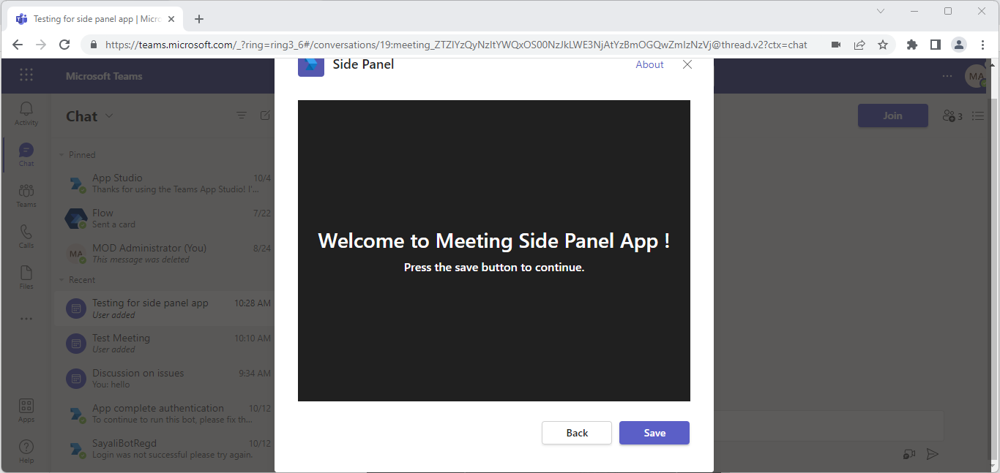
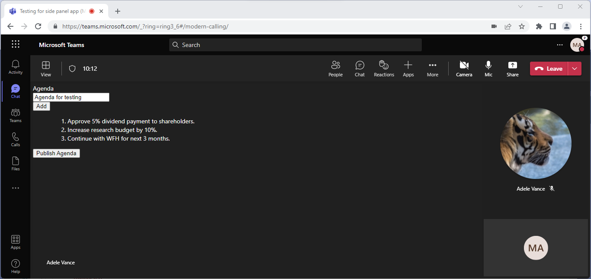
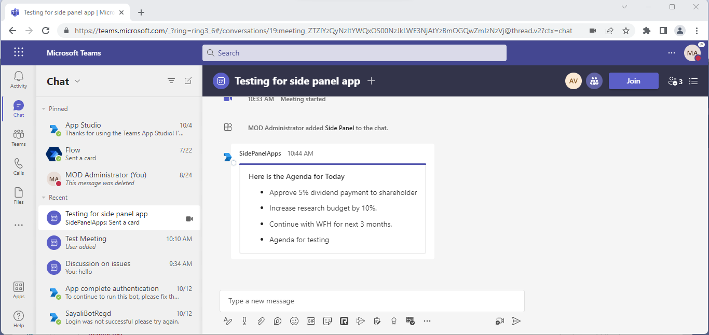

# Meetings SidePanel

This sample illustrates how to implement [Side Panel](https://docs.microsoft.com/en-us/microsoftteams/platform/apps-in-teams-meetings/create-apps-for-teams-meetings?view=msteams-client-js-latest&tabs=dotnet#notificationsignal-api) In-Meeting Experience and uses [Live Share SDK](https://aka.ms/livesharedocs) to share data in realtime.

## Included Features
* Meeting Stage
* Meeting SidePanel
* Live Share SDK
* Adaptive Cards
* RSC Permissions

## Interaction with app


## Prerequisites

- [.NET Core SDK](https://dotnet.microsoft.com/download) version 6.0
  ```bash
  # determine dotnet version
  dotnet --version
  ```

- [Teams](https://teams.microsoft.com) Microsoft Teams is installed and you have an account
- [Ngrok](https://ngrok.com/download) (For local environment testing) Latest (any other tunneling software can also be used)

## Setup.

1. Run ngrok - point to port 3978
   ```ngrok http 3978 --host-header="localhost:3978"```

2. Create AAD app registration in Azure portal and also register a bot with Azure Bot Service, following the instructions [here](https://docs.microsoft.com/en-us/azure/bot-service/bot-service-quickstart-registration?view=azure-bot-service-3.0).
    - Ensure that you've [enabled the Teams Channel](https://docs.microsoft.com/en-us/azure/bot-service/channel-connect-teams?view=azure-bot-service-4.0)
    - While registering the bot, use `https://<your_ngrok_url>/api/messages` as the messaging endpoint.
        > NOTE: When you create your bot you will create an App ID and App password - make sure you keep these for later.

3. Clone the repository
   ```bash
   git clone https://github.com/OfficeDev/Microsoft-Teams-Samples.git
   ```

4. If you are using Visual Studio
- Launch Visual Studio
- File -> Open -> Project/Solution
- Navigate to ```samples\meetings-sidepanel\csharp``` folder
- Select ```SidePanel.sln``` file and open the solution

5. Setup and run the bot from Visual Studio: 
   Modify the `appsettings.json` and fill in the following details:
   - `<<Microsoft-App-ID>>` - Generated from Step 2 (Application (client) ID) is the application app id
   - `<<Microsoft-App-Secret>>` - Generated from Step 2, also referred to as Client secret
   - `<<Your_Domain_URL>>` - Your application's base url. E.g. https://12345.ngrok-free.app if you are using ngrok.

6. Modify the `manifest.json` in the `/AppPackage` folder and replace the following details:
   - <<Manifest-id>> with any random GUID or your MicrosoftAppId from AAD app registration.
   - `<<YOUR-MICROSOFT-APP-ID>>` with Application id generated from Step 2
   - `{{Base_URL}}` with base Url domain. E.g. if you are using ngrok it would be `https://1234.ngrok-free.app` then your domain-name will be `1234.ngrok-free.app`.
   - `{{domain-name}}` with base Url domain. E.g. if you are using ngrok it would be `https://1234.ngrok-free.app` then your domain-name will be `1234.ngrok-free.app`.

7. Run your app, either from Visual Studio with ```F5``` or using ```dotnet run``` in the appropriate folder.

8. Navigate to ```samples\meetings-sidepanel\csharp\ClientApp``` folder and execute the below command.

    ```bash
    # npx @fluidframework/azure-local-service@latest
    ```

9. Upload the manifest.zip to Teams (in the Apps view click "Upload a custom app")
   - Go to Microsoft Teams. From the lower left corner, select Apps
   - From the lower left corner, choose Upload a custom App
   - Go to your project directory, the ./AppPackage folder, select the zip folder, and choose Open.

**Note**: If you are facing any issue in your app, [please uncomment this line](https://github.com/OfficeDev/Microsoft-Teams-Samples/blob/main/samples/meetings-sidepanel/csharp/SidePanel/AdapterWithErrorHandler.cs#L26) and put your debugger for local debug.

## Running the sample
User interactions(Meeting Organizer)
- **Add New Agenda Item** - Gives provision to add new Agenda point.
- **Add** - Adds the agenda from Textinput to the SidePanel agenda list.
- **Publish Agenda** - Sends the agenda list to the meeting chat.

1. Welcome image to added side panel.


2. Screen ready to added the agenda.


3. On click of "Add" button, agenda point will be added to the agenda list.


4. On click of "Publish Agenda", the agenda list will be sent to the meeting chat.


## Deploy the bot to Azure

-  To learn more about deploying a bot to Azure, see [Deploy your bot to Azure](https://aka.ms/azuredeployment) for a complete list of deployment instructions.

## Further reading

- [Meeting apps APIs](https://learn.microsoft.com/en-us/microsoftteams/platform/apps-in-teams-meetings/meeting-apps-apis?tabs=dotnet)
- [Meeting Side Panel](https://learn.microsoft.com/en-us/microsoftteams/platform/sbs-meetings-sidepanel?tabs=vs)
- [Build tabs for meeting](https://learn.microsoft.com/microsoftteams/platform/apps-in-teams-meetings/build-tabs-for-meeting?tabs=desktop)
- [Install the App in Teams Meeting](https://docs.microsoft.com/en-us/microsoftteams/platform/apps-in-teams-meetings/teams-apps-in-meetings?view=msteams-client-js-latest#meeting-lifecycle-scenarios)


