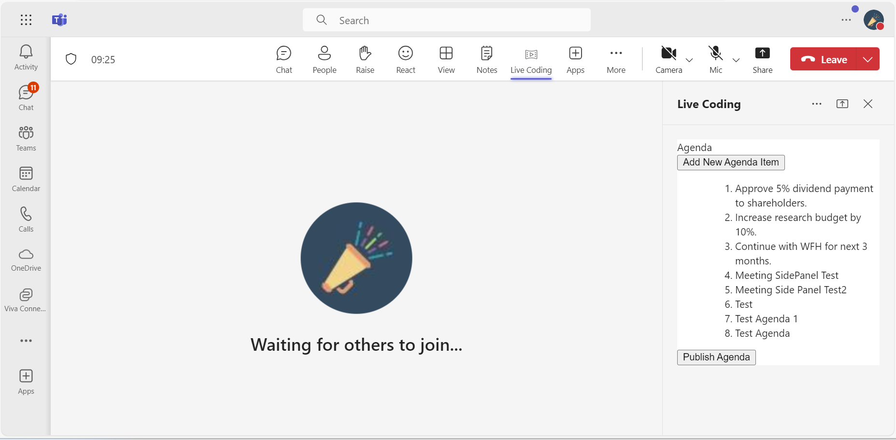

# Meetings SidePanel

This sample application demonstrates the implementation of a [Side Panel](https://docs.microsoft.com/en-us/microsoftteams/platform/apps-in-teams-meetings/create-apps-for-teams-meetings?view=msteams-client-js-latest&tabs=dotnet#notificationsignal-api) in Microsoft Teams meetings, leveraging the Live Share SDK for real-time data sharing. Users can add agenda items, publish them to the meeting chat, and interact with the app through adaptive cards and customizable themes, enhancing the overall meeting experience.

## Included Features
* Meeting Stage
* Meeting SidePanel
* Live Share SDK
* Adaptive Cards
* RSC Permissions
* App Theme

## Interaction with app


## Interaction with app theme


## Prerequisites

- [.NET Core SDK](https://dotnet.microsoft.com/download) version 6.0
  ```bash
  # determine dotnet version
  dotnet --version
  ```
- [Node.js 18.x](https://nodejs.org/download/release/v18.18.2/)
- [Teams](https://teams.microsoft.com) Microsoft Teams is installed and you have an account
- [dev tunnel](https://learn.microsoft.com/en-us/azure/developer/dev-tunnels/get-started?tabs=windows) or [Ngrok](https://ngrok.com/download) (For local environment testing) latest version (any other tunneling software can also be used)
- [Microsoft 365 Agents Toolkit for Visual Studio](https://learn.microsoft.com/en-us/microsoftteams/platform/toolkit/toolkit-v4/install-teams-toolkit-vs?pivots=visual-studio-v17-7)

## Run the app (Using Microsoft 365 Agents Toolkit for Visual Studio)

The simplest way to run this sample in Teams is to use Microsoft 365 Agents Toolkit for Visual Studio.
1. Install Visual Studio 2022 **Version 17.14 or higher** [Visual Studio](https://visualstudio.microsoft.com/downloads/)
1. Install Microsoft 365 Agents Toolkit for Visual Studio [Microsoft 365 Agents Toolkit extension](https://learn.microsoft.com/en-us/microsoftteams/platform/toolkit/toolkit-v4/install-teams-toolkit-vs?pivots=visual-studio-v17-7)
1. In the debug dropdown menu of Visual Studio, select Dev Tunnels > Create A Tunnel (set authentication type to Public) or select an existing public dev tunnel.
1. In the debug dropdown menu of Visual Studio, select default startup project > **Microsoft Teams (browser)**
1. Right-click the 'M365Agent' project in Solution Explorer and select **Microsoft 365 Agents Toolkit > Select Microsoft 365 Account**
1. Sign in to Microsoft 365 Agents Toolkit with a **Microsoft 365 work or school account**
1. Set `Startup Item` as `Microsoft Teams (browser)`.
1. Press F5, or select Debug > Start Debugging menu in Visual Studio to start your app
    </br>
1. In the opened web browser, select Add button to install the app in Teams
> If you do not have permission to upload custom apps (uploading), Microsoft 365 Agents Toolkit will recommend creating and using a Microsoft 365 Developer Program account - a free program to get your own dev environment sandbox that includes Teams.

## Manually Setup and use the sample locally.

1) Run ngrok - point to port 5130

   ```bash
   ngrok http 5130 --host-header="localhost:5130"
   ```  

   Alternatively, you can also use the `dev tunnels`. Please follow [Create and host a dev tunnel](https://learn.microsoft.com/en-us/azure/developer/dev-tunnels/get-started?tabs=windows) and host the tunnel with anonymous user access command as shown below:

   ```bash
   devtunnel host -p 5130 --allow-anonymous
   ```

2) App Registration

### Register your application with Azure AD

1. Register a new application in the [Microsoft Entra ID – App Registrations](https://go.microsoft.com/fwlink/?linkid=2083908) portal.
2. Select **New Registration** and on the *register an application page*, set following values:
    * Set **name** to your app name.
    * Choose the **supported account types** (any account type will work)
    * Leave **Redirect URI** empty.
    * Choose **Register**.
3. On the overview page, copy and save the **Application (client) ID, Directory (tenant) ID**. You'll need those later when updating your Teams application manifest and in the appsettings.json.
4. Navigate to **API Permissions**, and make sure to add the follow permissions:
    * Select Add a permission
    * Select Microsoft Graph -> Delegated permissions.
    * `User.Read` (enabled by default)
    * Click on Add permissions. Please make sure to grant the admin consent for the required permissions.

3. Create Microsoft Entra ID app registration in Azure portal and also register a bot with Azure Bot Service, following the instructions [here](https://docs.microsoft.com/en-us/azure/bot-service/bot-service-quickstart-registration?view=azure-bot-service-3.0).
    - Ensure that you've [enabled the Teams Channel](https://docs.microsoft.com/en-us/azure/bot-service/channel-connect-teams?view=azure-bot-service-4.0)
    - While registering the bot, use `https://<your_tunnel_domain>/api/messages` as the messaging endpoint.
        > NOTE: When you create your bot you will create an App ID and App password - make sure you keep these for later.

4. Clone the repository
   ```bash
   git clone https://github.com/OfficeDev/Microsoft-Teams-Samples.git
   ```

5. If you are using Visual Studio
- Launch Visual Studio
- File -> Open -> Project/Solution
- Navigate to ```samples\meetings-sidepanel\csharp``` folder
- Select ```SidePanel.sln``` file and open the solution

**Note** : In the debug dropdown menu of Visual Studio, select default startup project > **SidePanel**

6. Setup and run the bot from Visual Studio: 
   Modify the `appsettings.json` and fill in the following details:
   - `<<MicrosoftAppId>>` - Generated from Step 2 (Application (client) ID) is the application app id
   - `<<MicrosoftAppPassword>>` - Generated from Step 3, also referred to as Client secret
   - `<<BaseUrl>>` - Your application's base url. E.g. https://12345.ngrok-free.app if you are using ngrok and if you are using dev tunnels, your URL will be like: https://12345.devtunnels.ms.

7. Modify the `manifest.json` in the `/appPackage` folder and replace the following details:
   - <<Manifest-id>> with any random GUID or your MicrosoftAppId from Microsoft Entra ID app registration.
   - `<<YOUR-MICROSOFT-APP-ID>>` with Application id generated from Step 3
   - `{{Base_URL}}` with base Url domain. E.g. if you are using ngrok it would be `https://1234.ngrok-free.app` then your domain-name will be `1234.ngrok-free.app` and if you are using dev tunnels then your domain will be like: `12345.devtunnels.ms`.
   - `{{domain-name}}` with base Url domain. E.g. if you are using ngrok it would be `https://1234.ngrok-free.app` then your domain-name will be `1234.ngrok-free.app` and if you are using dev tunnels then your domain will be like: `12345.devtunnels.ms`.

8. Run your app, either from Visual Studio with ```F5``` or using ```dotnet run``` in the appropriate folder.

9. Navigate to ```samples\meetings-sidepanel\csharp\ClientApp``` folder and execute the below command.

    ```bash
    npm install
    npm start
    ```
10. Upload the manifest.zip to Teams (in the Apps view click "Upload a custom app")
   - Go to Microsoft Teams. From the lower left corner, select Apps
   - From the lower left corner, choose Upload a custom App
   - Go to your project directory, the ./appPackage folder, select the zip folder, and choose Open.

**Note**: If you are facing any issue in your app, [please uncomment this line](https://github.com/OfficeDev/Microsoft-Teams-Samples/blob/main/samples/meetings-sidepanel/csharp/SidePanel/AdapterWithErrorHandler.cs#L26) and put your debugger for local debug.

## Running the sample
User interactions(Meeting Organizer)
- **Add New Agenda Item** - Gives provision to add new Agenda point.
- **Add** - Adds the agenda from Textinput to the SidePanel agenda list.
- **Publish Agenda** - Sends the agenda list to the meeting chat.

## Installation and setup meetings sidepanel.


1. Welcome image to added side panel.


2. Screen ready to added the agenda.


3. On click of "Add" button, agenda point will be added to the agenda list.


4. On click of "Publish Agenda", the agenda list will be sent to the meeting chat.


## Interaction with app theme when Teams theme changes.


## Deploy the bot to Azure

-  To learn more about deploying a bot to Azure, see [Deploy your bot to Azure](https://aka.ms/azuredeployment) for a complete list of deployment instructions.

## Further reading

- [Meeting apps APIs](https://learn.microsoft.com/en-us/microsoftteams/platform/apps-in-teams-meetings/meeting-apps-apis?tabs=dotnet)
- [Meeting Side Panel](https://learn.microsoft.com/en-us/microsoftteams/platform/sbs-meetings-sidepanel?tabs=vs)
- [Build tabs for meeting](https://learn.microsoft.com/microsoftteams/platform/apps-in-teams-meetings/build-tabs-for-meeting?tabs=desktop)
- [Install the App in Teams Meeting](https://docs.microsoft.com/en-us/microsoftteams/platform/apps-in-teams-meetings/teams-apps-in-meetings?view=msteams-client-js-latest#meeting-lifecycle-scenarios)
- [Handle theme change](https://learn.microsoft.com/en-us/microsoftteams/platform/tabs/how-to/access-teams-context?tabs=Json-v2%2Cteamsjs-v2%2Cdefault#handle-theme-change)


