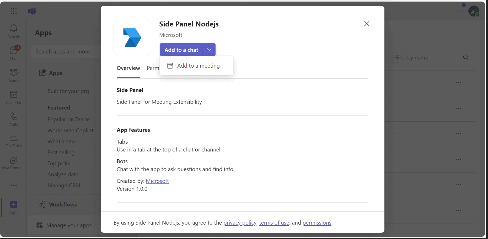

# Meetings SidePanel

This sample application illustrates how to create an interactive [Side Panel](https://docs.microsoft.com/en-us/microsoftteams/platform/apps-in-teams-meetings/create-apps-for-teams-meetings?view=msteams-client-js-latest&tabs=dotnet#notificationsignal-api) for Microsoft Teams meetings, allowing organizers to manage and publish meeting agendas in real-time. Utilizing the Live Share SDK and adaptive cards, this app provides a seamless experience for users to enhance collaboration, while also supporting theme customization for a tailored look and feel.

## Included Features
* Meeting Stage
* Meeting SidePanel
* Live Share SDK
* Adaptive Cards
* RSC Permissions
* App Theme

## Interaction with app



## Interaction with app theme


## Prerequisites

- [Node.js](https://nodejs.org) version 10.14 or higher

    ```bash
    # determine node version
    node --version
    ```
    
- [Teams](https://teams.microsoft.com) Microsoft Teams is installed and you have an account
- [Microsoft 365 Agents Toolkit for VS Code](https://marketplace.visualstudio.com/items?itemName=TeamsDevApp.ms-teams-vscode-extension) or [TeamsFx CLI](https://learn.microsoft.com/microsoftteams/platform/toolkit/teamsfx-cli?pivots=version-one)

## Run the app (Using Microsoft 365 Agents Toolkit for Visual Studio Code)

The simplest way to run this sample in Teams is to use Microsoft 365 Agents Toolkit for Visual Studio Code.
1. Ensure you have downloaded and installed [Visual Studio Code](https://code.visualstudio.com/docs/setup/setup-overview)
1. Install the [Microsoft 365 Agents Toolkit extension](https://marketplace.visualstudio.com/items?itemName=TeamsDevApp.ms-teams-vscode-extension)
1. Select **File > Open Folder** in VS Code and choose this samples directory from the repo
1. Using the extension, sign in with your Microsoft 365 account where you have permissions to upload custom apps
1. Select **Debug > Start Debugging** or **F5** to run the app in a Teams web client.
1. In the browser that launches, select the **Add** button to install the app to Teams.
> If you do not have permission to upload custom apps (uploading), Microsoft 365 Agents Toolkit will recommend creating and using a Microsoft 365 Developer Program account - a free program to get your own dev environment sandbox that includes Teams.

## Setup
- Register an Microsoft Entra ID app in Azure portal and also register a bot with Azure Bot Service, following the instructions [here](https://docs.microsoft.com/en-us/azure/bot-service/bot-service-quickstart-registration?view=azure-bot-service-3.0).

- Ensure that you've [enabled the Teams Channel](https://docs.microsoft.com/en-us/azure/bot-service/channel-connect-teams?view=azure-bot-service-4.0)

- While registering the bot, use `https://<your_tunnel_domain>/api/messages` as the messaging endpoint.
    > NOTE: When you create your bot you will create an App ID and App password - make sure you keep these for later.

1. Run ngrok - point to port 3001 (pointing to ClientApp)

   ```bash
   ngrok http 3001 --host-header="localhost:3001"
   ```  

   Alternatively, you can also use the `dev tunnels`. Please follow [Create and host a dev tunnel](https://learn.microsoft.com/en-us/azure/developer/dev-tunnels/get-started?tabs=windows) and host the tunnel with anonymous user access command as shown below:

   ```bash
   devtunnel host -p 3001 --allow-anonymous
   ```

2) App Registration

### Register your application with Azure AD

1. Register a new application in the [Microsoft Entra ID – App Registrations](https://go.microsoft.com/fwlink/?linkid=2083908) portal.
2. Select **New Registration** and on the *register an application page*, set following values:
    * Set **name** to your app name.
    * Choose the **supported account types** (any account type will work)
    * Leave **Redirect URI** empty.
    * Choose **Register**.
3. On the overview page, copy and save the **Application (client) ID, Directory (tenant) ID**. You'll need those later when updating your Teams application manifest and in the appsettings.json.
4. Navigate to **API Permissions**, and make sure to add the follow permissions:
    * Select Add a permission
    * Select Microsoft Graph -> Delegated permissions.
    * `User.Read` (enabled by default)
    * Click on Add permissions. Please make sure to grant the admin consent for the required permissions.

3. Clone the repository
      ```bash
      git clone https://github.com/OfficeDev/Microsoft-Teams-Samples.git
      ```

4. Open .env file from this path folder (samples/meetings-sidepanel/nodejs/server) and update ```MicrosoftAppId```,  ```MicrosoftAppPassword``` information with values generated values while doing Microsoft Entra ID App Registration.
- Update ```BaseURL``` with your application domain URL like ngrok URL: https://xxxx.ngrok-free.app and if you are using dev tunnels, your URL will be like: https://12345.devtunnels.ms.

5. Install node modules

   Inside node js folder,  navigate to `samples/meetings-sidepanel/nodejs/server` open your local terminal and run the below command to install node modules. You can do the same in Visual Studio code terminal by opening the project in Visual Studio code.

   - Repeat the same step in folder `samples/meetings-sidepanel/nodejs/ClientApp`

    ```bash
    npm install
    ```

6. We have two different solutions to run, so follow below steps:
 
- In a terminal, navigate to `samples/meetings-sidepanel/nodejs/server` folder, Open your local terminal and run the below command to install node modules. You can do the same in Visual studio code terminal by opening the project in Visual studio code
```bash
npm install
```

```bash
npm start
```

If you face any dependency error while installing node modules, try using below command

```bash
npm install --legacy-peer-deps
```

- In a different terminal, navigate to `samples/meetings-sidepanel/nodejs/ClientApp` folder, Open your local terminal and run the below command to install node modules. You can do the same in Visual studio code terminal by opening the project in Visual studio code 
```bash
cd client
npm install
```

```bash
npm start
```

If you face any dependency error while installing node modules, try using below command

```bash
npm install --legacy-peer-deps
```

7. Run your app, either from Visual Studio code  with ``` npm start``` or using ``` Run``` in the Terminal.

8) Setup Manifest for Teams (__*This step is specific to Teams.*__)
    - **Edit** the `manifest.json` contained in the `appManifest` folder and replace your Microsoft App Id (that was created when you registered your app earlier) *everywhere* you see the place holder string `<<YOUR-MICROSOFT-APP-ID>>` (depending on the scenario the Microsoft App Id may occur multiple times in the `manifest.json`)
    - **Edit** the `manifest.json` for `configurationUrl` inside `configurableTabs` . Replace `{{BASE-URL}}` with base Url domain. E.g. if you are using ngrok it would be `https://1234.ngrok-free.app` then your domain-name will be `1234.ngrok-free.app` and if you are using dev tunnels then your domain will be like: `12345.devtunnels.ms`.
    - **Update** the `manifest.json` for `validDomains` with base Url domain. E.g. if you are using ngrok it would be `https://1234.ngrok-free.app` then your domain-name will be `1234.ngrok-free.app` and if you are using dev tunnels then your domain will be like: `12345.devtunnels.ms`.
    - **Update** the `manifest.json` for `<<Manifest-id>>` with any GUID or with your MicrosoftAppId, generated during App registration in Azure portal.

    - **Zip** up the contents of the `appManifest` folder to create a `manifest.zip` (Make sure that zip file does not contains any subfolder otherwise you will get error while uploading your .zip package)
    - **Upload** the `manifest.zip` to Teams (In Teams Apps/Manage your apps click "Upload an app". Browse to and Open the .zip file. At the next dialog, click the Add button.)

**Note**: If you are facing any issue in your app, [please uncomment this line](https://github.com/OfficeDev/Microsoft-Teams-Samples/blob/main/samples/meetings-sidepanel/nodejs/server/index.js#L48) and put your debugger for local debug.

## Running the sample

**Interacting with the app in Teams Meeting**

Interact with SidePanel by clicking on the App icon present on the top menu beside the "more actions" during a meeting.

1. Once the app is clicked, sidepanel appears with the default agenda list. Only organizer gets the feasibility to add new agenda points to the list using "Add New Agenda Item" button.

## Installation and setup meetings sidepanel.


2. On click of "Add" button, agenda point will be added to the agenda list by organizer.


3. On click of "Publish Agenda", the agenda list will be sent to the meeting chat.


**User interactions(Meeting Organizer)**
- **Add New Agenda Item** - Gives provision to add new Agenda point.
- **Add** - Adds the agenda from Textinput to the SidePanel agenda list.
- **Publish Agenda** - Sends the agenda list to the meeting chat.


## Interaction with app theme when Teams theme changes.


## Deploy the bot to Azure

-  To learn more about deploying a bot to Azure, see [Deploy your bot to Azure](https://aka.ms/azuredeployment) for a complete list of deployment instructions.

## Further reading.

- [Meeting apps APIs](https://learn.microsoft.com/en-us/microsoftteams/platform/apps-in-teams-meetings/meeting-apps-apis?tabs=dotnet)
- [Meeting Side Panel](https://learn.microsoft.com/en-us/microsoftteams/platform/sbs-meetings-sidepanel?tabs=vs)
- [Build tabs for meeting](https://learn.microsoft.com/microsoftteams/platform/apps-in-teams-meetings/build-tabs-for-meeting?tabs=desktop)
- [Install the App in Teams Meeting](https://docs.microsoft.com/en-us/microsoftteams/platform/apps-in-teams-meetings/teams-apps-in-meetings?view=msteams-client-js-latest#meeting-lifecycle-scenarios)
- [Handle theme change](https://learn.microsoft.com/en-us/microsoftteams/platform/tabs/how-to/access-teams-context?tabs=Json-v2%2Cteamsjs-v2%2Cdefault#handle-theme-change)

