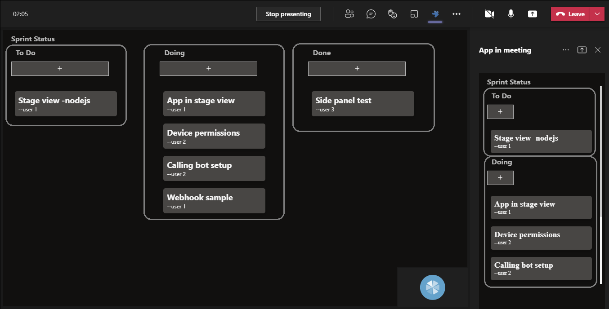
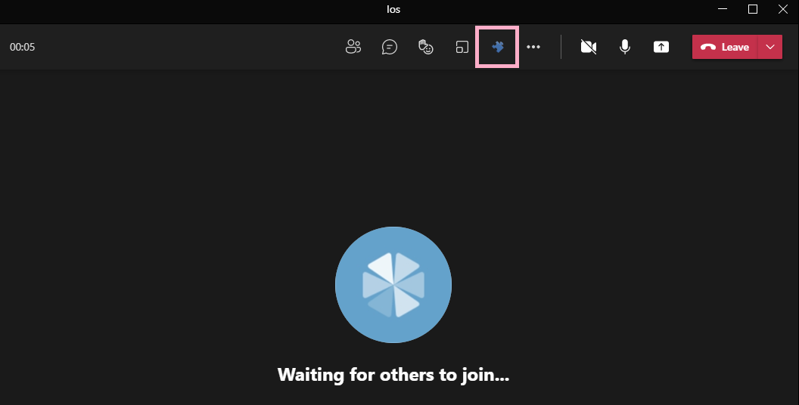
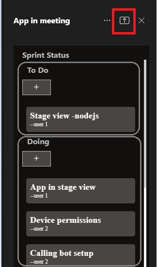
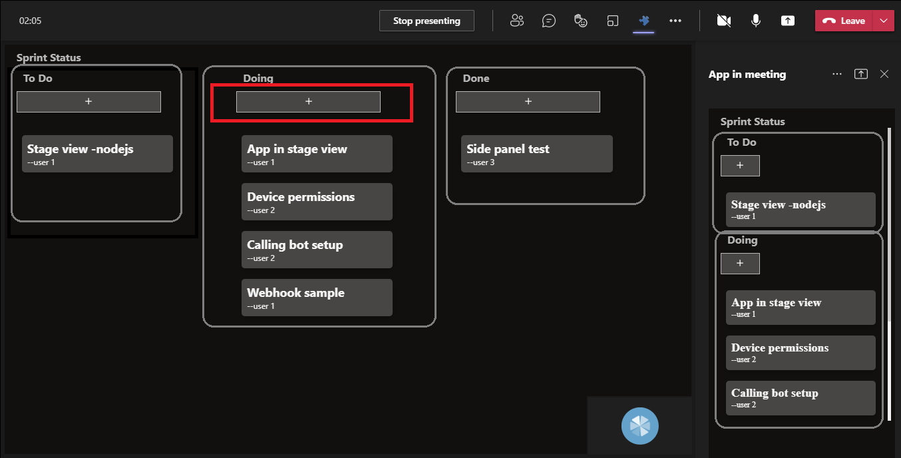
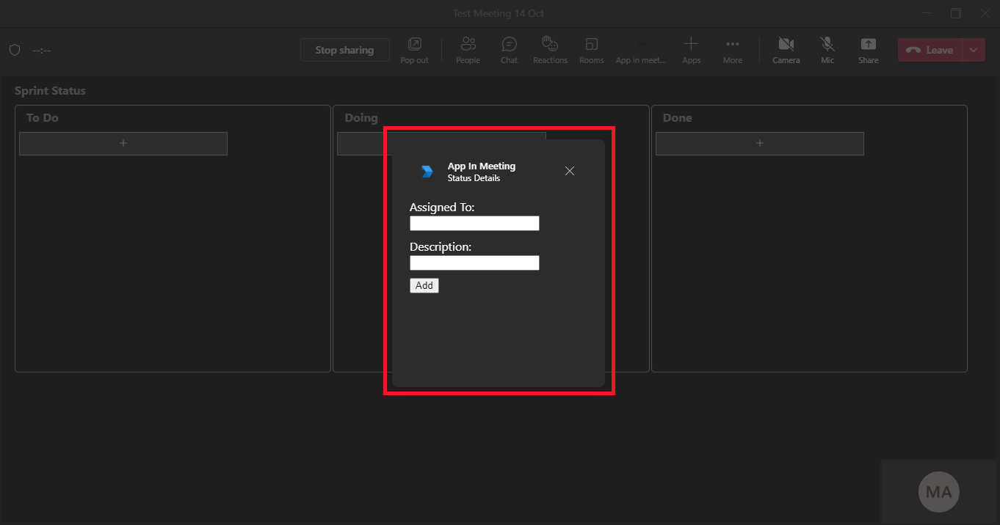

# Meetings Stage View

This App helps to enable and configure your apps for Teams meetings. This app covers Shared meeting stage.
For reference please check [Enable and configure your apps for Teams meetings](https://docs.microsoft.com/en-us/microsoftteams/platform/apps-in-teams-meetings/enable-and-configure-your-app-for-teams-meetings)

This capability is currently available in developer preview only.

- App in stage view.



## Prerequisites

- [.NET Core SDK](https://dotnet.microsoft.com/download) version 3.1

  ```bash
  # determine dotnet version
  dotnet --version
  ```
- Publicly addressable https url or tunnel such as [ngrok](https://ngrok.com/) or [Tunnel Relay](https://github.com/OfficeDev/microsoft-teams-tunnelrelay) 
    
## To try this sample
-  Clone the repository

    ```bash
    git clone https://github.com/OfficeDev/Microsoft-Teams-Samples.git
    ```
- In a terminal, navigate to `samples/meetings-stage-view/csharp`

    ```bash
    # change into project folder
    cd # AppInMeeting
    ```

- Run ngrok - point to port 3978

```bash
# ngrok http -host-header=rewrite 3978
```
- Run the app from a terminal or from Visual Studio, choose option A or B.

  A) From a terminal

  ```bash
  # run the app
  dotnet run
  ```

  B) Or from Visual Studio

  - Launch Visual Studio
  - File -> Open -> Project/Solution
  - Navigate to `AppInMeeting` folder
  - Select `AppInMeeting.csproj` file
  - Press `F5` to run the project


- Modify the `manifest.json` in the `/AppPackage` folder and replace the following details
   - `<<App-ID>>` with some unique GUID   
   - `<<BASE-URL>>` with your application's base url, e.g. https://1234.ngrok.io
   - `<<VALID DOMAIN>>` with your app domain e.g. *.ngrok.io

- Zip the contents of `AppPackage` folder into a `manifest.zip`, and use the `manifest.zip` to deploy in app store or add to Teams as in step 4.

- Upload the manifest.zip to Teams (in the Apps view click "Upload a custom app")
   - Go to Microsoft Teams. From the lower left corner, select Apps
   - From the lower left corner, choose Upload a custom App
   - Go to your project directory, the ./appPackage folder, select the zip folder, and choose Open.
   - Select Add in the pop-up dialog box. Your tab is uploaded to Teams.

## Interacting with the app in Teams
    You can use this app by following the below steps:
    - Edit a meeting and select `+` icon at the top right corner.


    - Search for your app `App in meeting` and add it.


    - Join the meeting and click on the app icon at the top.
    - This will open a sidepanel with `Share` icon at top to share the app for collaboration.





    - You can now interact with the app.


## Features of this sample


- Add Details for collaboration.





- App in sidepanel.


