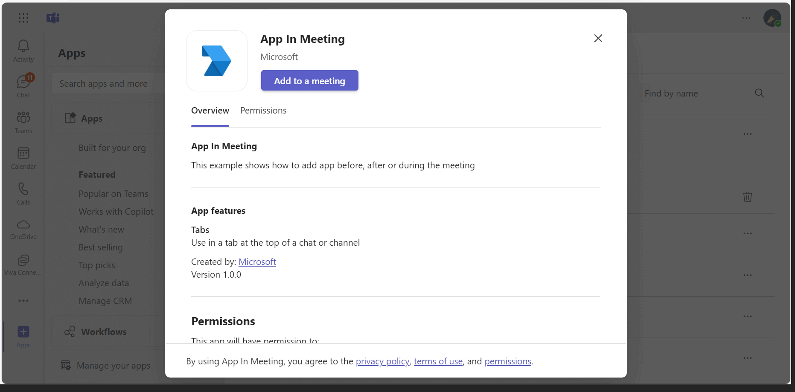
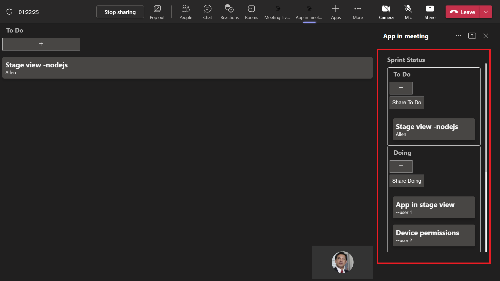
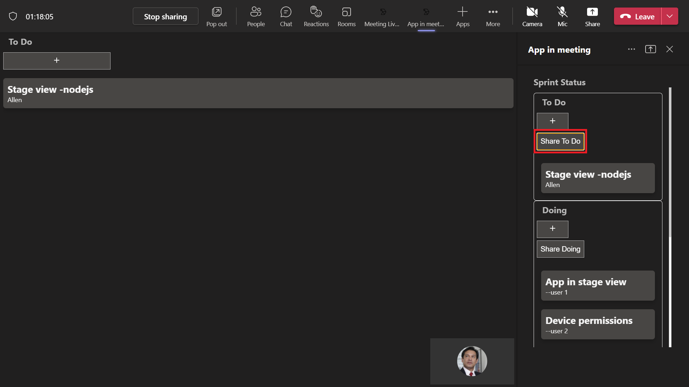

# Meetings Stage View

This App helps to enable and configure your apps for Teams meetings. This app covers Shared meeting stage using [Live Share SDK](https://aka.ms/livesharedocs).
For reference please check [Enable and configure your apps for Teams meetings](https://docs.microsoft.com/microsoftteams/platform/apps-in-teams-meetings/enable-and-configure-your-app-for-teams-meetings)

## Included Features
* Meeting Stage
* Meeting SidePanel
* Live Share SDK
* RSC Permissions

## Interact with app- Mobile



## Interact with app- Web


## Try it yourself - experience the App in your Microsoft Teams client
Please find below demo manifest which is deployed on Microsoft Azure and you can try it yourself by uploading the app package (.zip file link below) to your teams and/or as a personal app. (Sideloading must be enabled for your tenant, [see steps here](https://docs.microsoft.com/microsoftteams/platform/concepts/build-and-test/prepare-your-o365-tenant#enable-custom-teams-apps-and-turn-on-custom-app-uploading)).

**Realtime meeting stage view:** [Manifest](/samples/meetings-stage-view/csharp/demo-manifest/Meeting-stage-view.zip)

## Prerequisites

- [NodeJS](https://nodejs.org/en/)
- [ngrok](https://ngrok.com/) or equivalent tunnelling solution
- Publicly addressable https url or tunnel such as [ngrok](https://ngrok.com/download) or [Tunnel Relay](https://github.com/OfficeDev/microsoft-teams-tunnelrelay) 
    

This sample also shows how to share specific parts of your app to the meeting stage.
For reference please check [Share app content to stage API](https://docs.microsoft.com/microsoftteams/platform/apps-in-teams-meetings/api-references?tabs=dotnet#share-app-content-to-stage-api)

- [Live-share-sdk-overview](https://docs.microsoft.com/microsoftteams/platform/apps-in-teams-meetings/teams-live-share-overview)

## Setup

**This capability is currently available in developer preview only.**


1. Register a new application in the [Azure Active Directory – App Registrations](https://go.microsoft.com/fwlink/?linkid=2083908) portal. 
    **NOTE:** When you create app registration, you will create an App ID and App password - make sure you keep these for later.

2. Setup NGROK
   - Run ngrok - point to port 3978

    ```bash
    ngrok http 3978 --host-header="localhost:3978"
    ```
3. Setup for code

  - Clone the repository

    ```bash
    git clone https://github.com/OfficeDev/Microsoft-Teams-Samples.git
    ```
  	
- In a terminal, navigate to `samples/meetings-stage-view/nodejs`

- Install modules

    ```
    npm install
    ```
 - Run both solutions i.e. samples/meetings-stage-view/nodejs/ and samples/meetings-stage-view/nodejs/Clientapp

    ```
    npm start
    ```

## Getting the App id for share to stage deeplink.

1) Navigate to [Teams admin portal]("https://admin.teams.microsoft.com/dashboard")

2) Under Teams Apps section, select Manage apps.

3) Search the uploaded app and copy the `App ID`


4) Navigate to `samples/samples/meetings-stage-view/nodejs/ClientApp/src/components/app-in-meeting.jsx`

5) On line 41, replace `<<App id>>` with `Id` obtained in step 3.

6) Navigate to `samples/samples/meetings-stage-view/nodejs/ClientApp/src/components/share-to-meeting.jsx`

7) On line 25, replace `<Application-Base-URL>` with your application's base url whrre app is running. E.g. if you are using ngrok it would be something like `https://1234.ngrok-free.app`.

8) On line 26, replace `<<Application-ID>>` with `Id` obtained in step 3.

9) When the app is running, the home page will contain a `share to teams` button. Clicking it will share the page content directly to meeting. (Make sure the app's base url is added in manifest's valid domains section and app is published to store).

4. Setup Manifest for Teams
- __*This step is specific to Teams.*__
    - **Edit** the `manifest.json` contained in the ./Manifest folder to replace your Microsoft App Id (that was created when you registered your app registration earlier) *everywhere* you see the place holder string `{{Microsoft-App-Id}}` (depending on the scenario the Microsoft App Id may occur multiple times in the `manifest.json`)
    - **Edit** the `manifest.json` for `validDomains` and replace `{{domain-name}}` with base Url of your domain. E.g. if you are using ngrok it would be `https://1234.ngrok-free.app` then your domain-name will be `1234.ngrok-free.app`.
    - **Zip** up the contents of the `Manifest` folder to create a `manifest.zip` (Make sure that zip file does not contains any subfolder otherwise you will get error while uploading your .zip package)

- Upload the manifest.zip to Teams (in the Apps view click "Upload a custom app")
   - Go to Microsoft Teams. From the lower left corner, select Apps
   - From the lower left corner, choose Upload a custom App
   - Go to your project directory, the ./Manifest folder, select the zip folder, and choose Open.
   - Select Add in the pop-up dialog box. Your app is uploaded to Teams.
    
## Running the sample.

You can use this app by following the below steps:
    - Edit a meeting and select `+` icon at the top right corner.

- Default home page


- It will redirect to consent popup to share screen


- The page will be shared in meeting


- App in stage view.


- Sharing specific part of your app to the meeting stage.


**NOTE: Currently Live Share SDK is not supported in mobiles.**

## IOS Meeting Side panel and stage view.


## Android Meeting Side panel and stage view.


    - Search for your app `App in meeting` and add it.


    - Join the meeting and click on the app icon at the top
    - This will open a sidepanel with `Share` icon at top to share the app for collaboration in stage view.


    - You can now interact with the app.


- Add Details for collaboration.


- App in sidepanel.



- Sharing specific parts of app.



## Further reading

- [Build apps for Teams meeting stage](https://learn.microsoft.com/en-us/microsoftteams/platform/apps-in-teams-meetings/build-apps-for-teams-meeting-stage)
- [Build tabs for meeting](https://learn.microsoft.com/en-us/microsoftteams/platform/apps-in-teams-meetings/build-tabs-for-meeting?tabs=desktop)
- [Meeting stage view](https://learn.microsoft.com/microsoftteams/platform/sbs-meetings-stage-view)
- [Enable Share to Meeting](https://learn.microsoft.com/microsoftteams/platform/concepts/build-and-test/share-in-meeting?tabs=method-1#enable-share-in-meeting)
- [Deeplink to meeting share to stage](https://learn.microsoft.com/microsoftteams/platform/concepts/build-and-test/share-in-meeting?tabs=method-1#generate-a-deep-link-to-share-content-to-stage-in-meetings)


