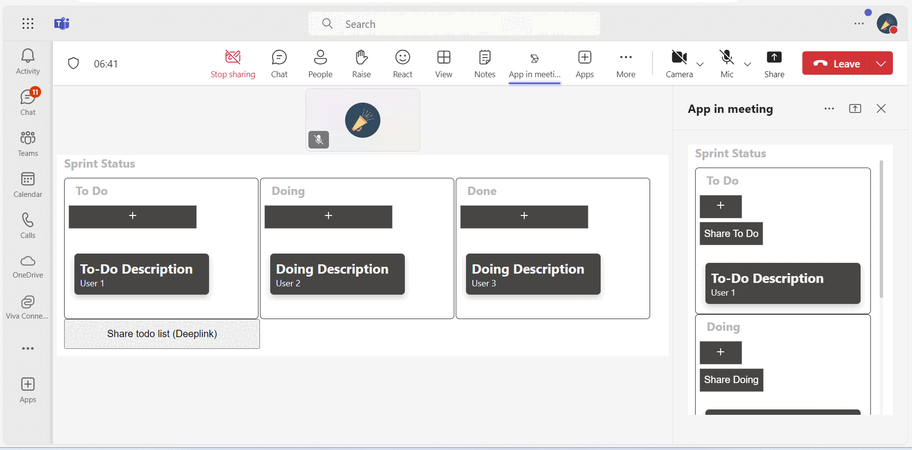
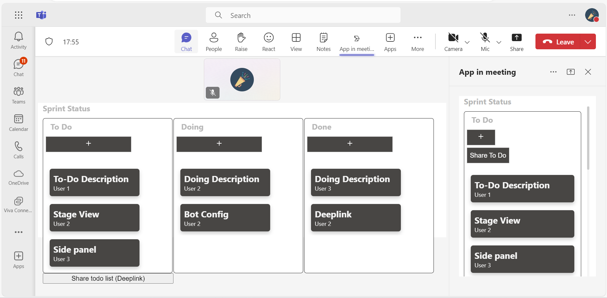
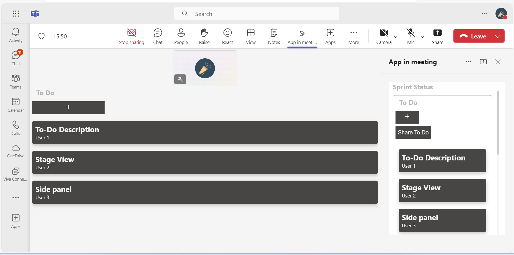
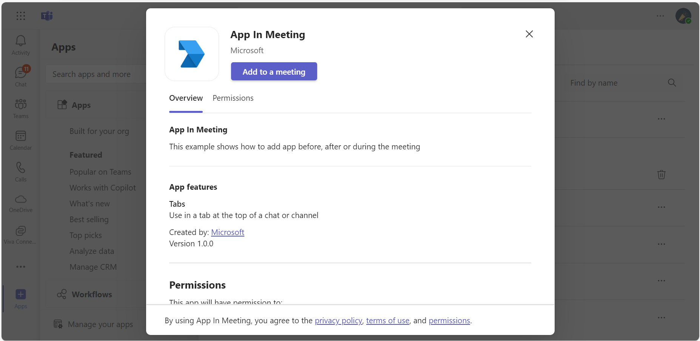
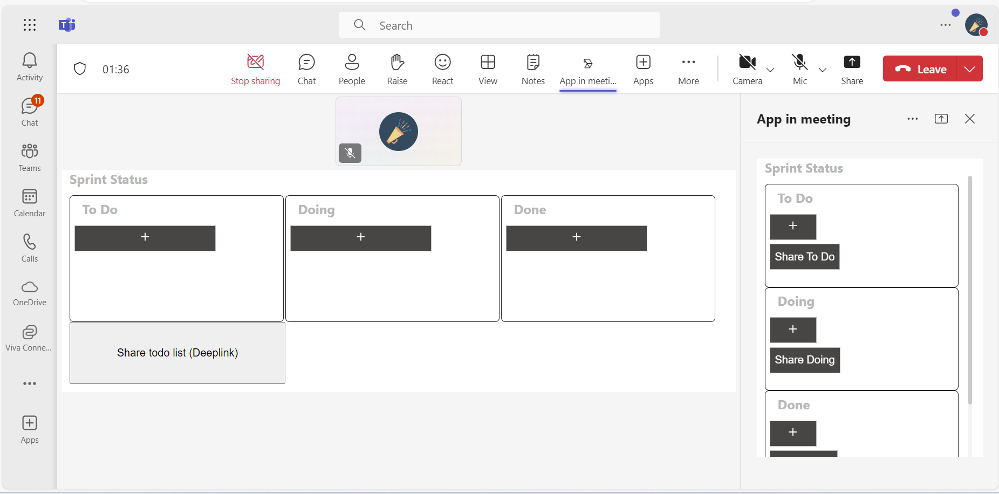
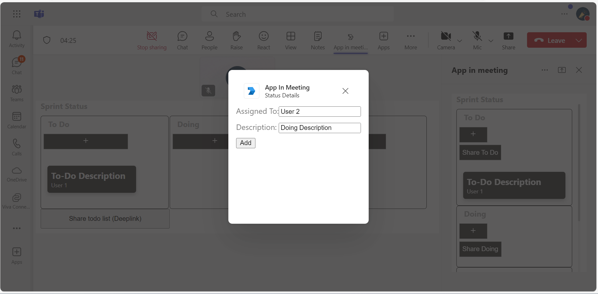
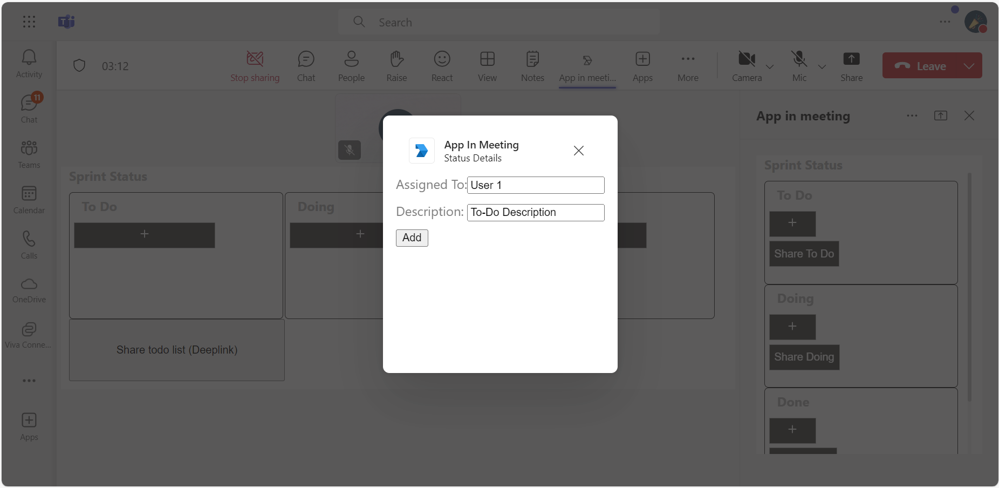
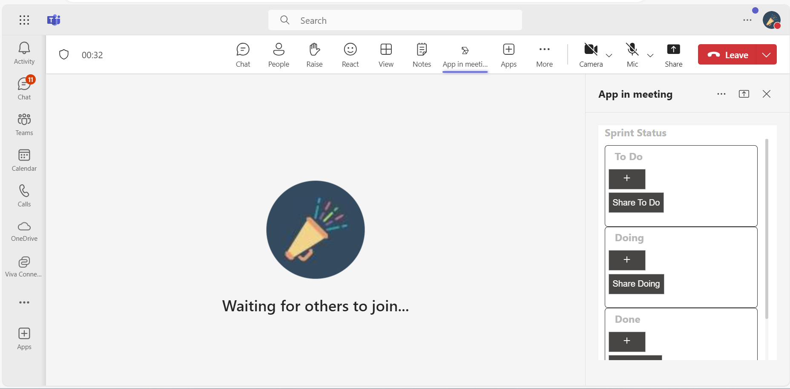
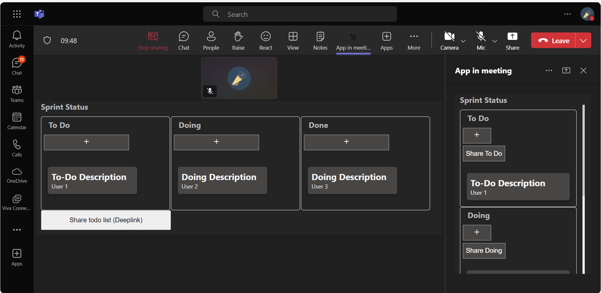
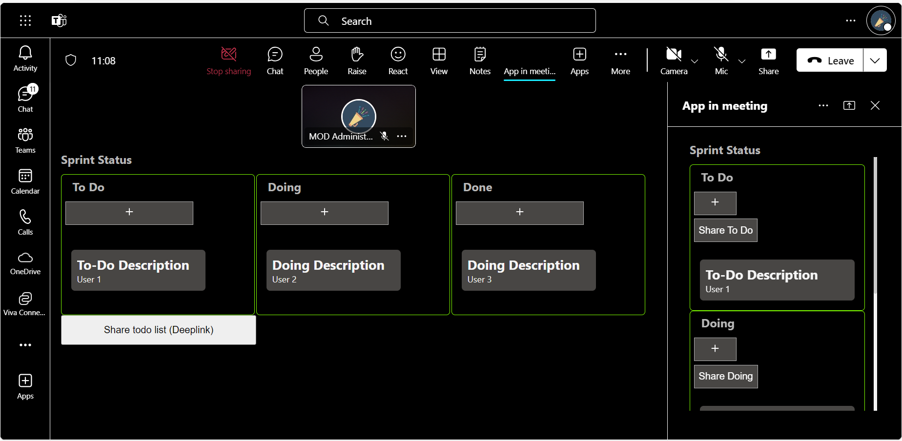

# Meetings Stage View


This sample application [Enables the configuration](https://docs.microsoft.com/microsoftteams/platform/apps-in-teams-meetings/enable-and-configure-your-app-for-teams-meetings) of shared meeting stages within Microsoft Teams, leveraging the [Live Share SDK](https://aka.ms/livesharedocs) for real-time collaboration. It includes features like a meeting side panel and customizable themes, providing users with a dynamic experience during meetings. The demo manifest is available for testing in your Microsoft Teams client.


## Included Features
* Meeting Stage
* Meeting SidePanel
* Live Share SDK
* RSC Permissions

## Interact with app - Web


## Interact with app - Mobile


## Interaction with app theme



## Try it yourself - experience the App in your Microsoft Teams client
Please find below demo manifest which is deployed on Microsoft Azure and you can try it yourself by uploading the app package (.zip file link below) to your teams and/or as a personal app. (Uploading must be enabled for your tenant, [see steps here](https://docs.microsoft.com/microsoftteams/platform/concepts/build-and-test/prepare-your-o365-tenant#enable-custom-teams-apps-and-turn-on-custom-app-uploading)).

**Realtime meeting stage view:** [Manifest](/samples/meetings-stage-view/csharp/demo-manifest/Meeting-stage-view.zip)

## Prerequisites

- [NodeJS](https://nodejs.org/en/)
- [dev tunnel](https://learn.microsoft.com/en-us/azure/developer/dev-tunnels/get-started?tabs=windows) or [ngrok](https://ngrok.com/) latest version or equivalent tunnelling solution
- [Microsoft 365 Agents Toolkit for VS Code](https://marketplace.visualstudio.com/items?itemName=TeamsDevApp.ms-teams-vscode-extension) or [TeamsFx CLI](https://learn.microsoft.com/microsoftteams/platform/toolkit/teamsfx-cli?pivots=version-one)

## Run the app (Using Microsoft 365 Agents Toolkit for Visual Studio Code)

The simplest way to run this sample in Teams is to use Microsoft 365 Agents Toolkit for Visual Studio Code.

1. Ensure you have downloaded and installed [Visual Studio Code](https://code.visualstudio.com/docs/setup/setup-overview)
1. Install the [Microsoft 365 Agents Toolkit extension](https://marketplace.visualstudio.com/items?itemName=TeamsDevApp.ms-teams-vscode-extension)
1. Select **File > Open Folder** in VS Code and choose this samples directory from the repo
1. Using the extension, sign in with your Microsoft 365 account where you have permissions to upload custom apps
1. Select **Debug > Start Debugging** or **F5** to run the app in a Teams web client.
1. In the browser that launches, select the **Add** button to install the app to Teams.
    

This sample also shows how to share specific parts of your app to the meeting stage.
For reference please check [Share app content to stage API](https://docs.microsoft.com/microsoftteams/platform/apps-in-teams-meetings/api-references?tabs=dotnet#share-app-content-to-stage-api)

- [Live-share-sdk-overview](https://docs.microsoft.com/microsoftteams/platform/apps-in-teams-meetings/teams-live-share-overview)

## Setup

**This capability is currently available in developer preview only.**

2) App Registration

### Register your application with Azure AD

1. Register a new application in the [Microsoft Entra ID – App Registrations](https://go.microsoft.com/fwlink/?linkid=2083908) portal.
2. Select **New Registration** and on the *register an application page*, set following values:
    * Set **name** to your app name.
    * Choose the **supported account types** (any account type will work)
    * Leave **Redirect URI** empty.
    * Choose **Register**.
3. On the overview page, copy and save the **Application (client) ID, Directory (tenant) ID**. You'll need those later when updating your Teams application manifest and in the appsettings.json.
4. Navigate to **API Permissions**, and make sure to add the follow permissions:
    * Select Add a permission
    * Select Microsoft Graph -> Delegated permissions.
    * `User.Read` (enabled by default)
    * Click on Add permissions. Please make sure to grant the admin consent for the required permissions.

2. Setup NGROK
-  Run ngrok - point to port 3978

   ```bash
   ngrok http 3978 --host-header="localhost:3978"
   ```  

   Alternatively, you can also use the `dev tunnels`. Please follow [Create and host a dev tunnel](https://learn.microsoft.com/en-us/azure/developer/dev-tunnels/get-started?tabs=windows) and host the tunnel with anonymous user access command as shown below:

   ```bash
   devtunnel host -p 3978 --allow-anonymous
   ```

3. Setup for code

  - Clone the repository

    ```bash
    git clone https://github.com/OfficeDev/Microsoft-Teams-Samples.git
    ```
  	
- In a terminal, navigate to `samples/meetings-stage-view/nodejs`

- Install modules

    ```
    npm install
    ```
 - Run both solutions i.e. samples/meetings-stage-view/nodejs/ and samples/meetings-stage-view/nodejs/Clientapp

    ```
    npm start
    ```

## Getting the App id for share to stage deeplink.

1) Navigate to [Teams admin portal]("https://admin.teams.microsoft.com/dashboard")

2) Under Teams Apps section, select Manage apps.

3) Search the uploaded app and copy the `App ID`


4) Navigate to `samples/samples/meetings-stage-view/nodejs/ClientApp/src/components/app-in-meeting.jsx`

5) On line 74, replace `<<App id>>` with `Id` obtained in step 3.

6) Navigate to `samples/samples/meetings-stage-view/nodejs/ClientApp/src/components/share-to-meeting.jsx`

7) On line 25, replace `<Application-Base-URL>` with your application's base url whrre app is running. E.g. if you are using ngrok it would be something like `https://1234.ngrok-free.app` and if you are using dev tunnels, your URL will be like: https://12345.devtunnels.ms.

8) On line 26, replace `<<Application-ID>>` with `Id` obtained in step 3.

9) When the app is running, the home page will contain a `share to teams` button. Clicking it will share the page content directly to meeting. (Make sure the app's base url is added in manifest's valid domains section and app is published to store).

4. Setup Manifest for Teams
- __*This step is specific to Teams.*__
    - **Edit** the `manifest.json` contained in the ./appManifest folder to replace your Microsoft App Id (that was created when you registered your app registration earlier) *everywhere* you see the place holder string `{{Microsoft-App-Id}}` (depending on the scenario the Microsoft App Id may occur multiple times in the `manifest.json`)
    - **Edit** the `manifest.json` for `validDomains` and replace `{{domain-name}}` with base Url of your domain. E.g. if you are using ngrok it would be `https://1234.ngrok-free.app` then your domain-name will be `1234.ngrok-free.app` and if you are using dev tunnels then your domain will be like: `12345.devtunnels.ms`.
    - **Zip** up the contents of the `appManifest` folder to create a `manifest.zip` (Make sure that zip file does not contains any subfolder otherwise you will get error while uploading your .zip package)

- Upload the manifest.zip to Teams (in the Apps view click "Upload a custom app")
   - Go to Microsoft Teams. From the lower left corner, select Apps
   - From the lower left corner, choose Upload a custom App
   - Go to your project directory, the ./appManifest folder, select the zip folder, and choose Open.
   - Select Add in the pop-up dialog box. Your app is uploaded to Teams.
    
## Running the sample.

You can use this app by following the below steps:
    - Edit a meeting and select `+` icon at the top right corner.

- Default home page


- It will redirect to consent popup to share screen


- The page will be shared in meeting


- App in stage view.



- Sharing specific part of your app to the meeting stage.



**NOTE: Currently Live Share SDK is not supported in mobiles.**

## IOS Meeting Side panel and stage view.


## Android Meeting Side panel and stage view.


    - Search for your app `App in meeting` and add it.



    - Join the meeting and click on the app icon at the top
    - This will open a sidepanel with `Share` icon at top to share the app for collaboration in stage view.



    - You can now interact with the app.


- Add Details for collaboration.





- App in sidepanel.



- Sharing specific parts of app.


## Interaction with App theme when Teams Theme changes.






## Further reading

- [Build apps for Teams meeting stage](https://learn.microsoft.com/en-us/microsoftteams/platform/apps-in-teams-meetings/build-apps-for-teams-meeting-stage)
- [Build tabs for meeting](https://learn.microsoft.com/en-us/microsoftteams/platform/apps-in-teams-meetings/build-tabs-for-meeting?tabs=desktop)
- [Meeting stage view](https://learn.microsoft.com/microsoftteams/platform/sbs-meetings-stage-view)
- [Enable Share to Meeting](https://learn.microsoft.com/microsoftteams/platform/concepts/build-and-test/share-in-meeting?tabs=method-1#enable-share-in-meeting)
- [Deeplink to meeting share to stage](https://learn.microsoft.com/microsoftteams/platform/concepts/build-and-test/share-in-meeting?tabs=method-1#generate-a-deep-link-to-share-content-to-stage-in-meetings)
- [Handle theme change](https://learn.microsoft.com/en-us/microsoftteams/platform/tabs/how-to/access-teams-context?tabs=Json-v2%2Cteamsjs-v2%2Cdefault#handle-theme-change)

