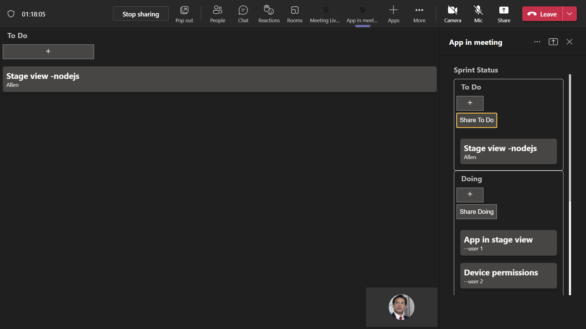

# Meetings Stage View

This App helps to enable and configure your apps for Teams meetings. This app covers Shared meeting stage.
For reference please check [Enable and configure your apps for Teams meetings](https://docs.microsoft.com/en-us/microsoftteams/platform/apps-in-teams-meetings/enable-and-configure-your-app-for-teams-meetings)

This sample also shows how to share specific parts of your app to the meeting stage.
For reference please check [Share app content to stage API](https://docs.microsoft.com/en-us/microsoftteams/platform/apps-in-teams-meetings/api-references?tabs=dotnet#share-app-content-to-stage-api)

This capability is currently available in developer preview only.

- App in stage view.


- Sharing specific part of your app to the meeting stage.



## Prerequisites

- [NodeJS](https://nodejs.org/en/)
- [ngrok](https://ngrok.com/) or equivalent tunnelling solution
- Publicly addressable https url or tunnel such as [ngrok](https://ngrok.com/) or [Tunnel Relay](https://github.com/OfficeDev/microsoft-teams-tunnelrelay) 
    
## To try this sample
-  Clone the repository

    ```bash
    git clone https://github.com/OfficeDev/Microsoft-Teams-Samples.git
    ```

- In a terminal, navigate to `samples/meetings-stage-view/nodejs`

- Install modules

    ```
    npm install
    ```
- Run ngrok - point to port 3978

    ```
    ngrok http 3978 -host-header=localhost:3978
    ```    
- Modify the `manifest.json` in the `/AppPackage` folder and replace the following details
   - `<<App-ID>>` with some unique GUID   
   - `<<BASE-URL>>` with your application's base url, e.g. https://1234.ngrok.io
   - `<<VALID DOMAIN>>` with your app domain e.g. *.ngrok.io

 - Run solution

    ```
    npm start
    ```

- Zip the contents of `AppPackage` folder into a `manifest.zip`, and use the `manifest.zip` to deploy in app store or add to Teams as in step 4.

- Upload the manifest.zip to Teams (in the Apps view click "Upload a custom app")
   - Go to Microsoft Teams. From the lower left corner, select Apps
   - From the lower left corner, choose Upload a custom App
   - Go to your project directory, the ./appPackage folder, select the zip folder, and choose Open.
   - Select Add in the pop-up dialog box. Your tab is uploaded to Teams.

## Interacting with the app in Teams
    You can use this app by following the below steps:
    - Edit a meeting and select `+` icon at the top right corner.


    - Search for your app `App in meeting` and add it.


    - Join the meeting and click on the app icon at the top
    - This will open a sidepanel with `Share` icon at top to share the app for collaboration in stage view.


    - You can now interact with the app.


## Features of this sample


- Add Details for collaboration.


- App in sidepanel.


- Sharing specific parts of app.


