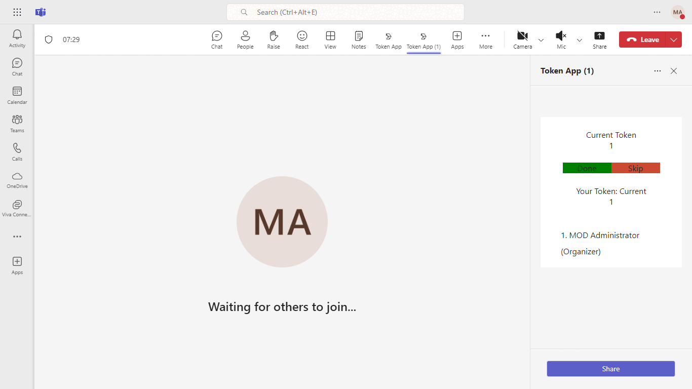
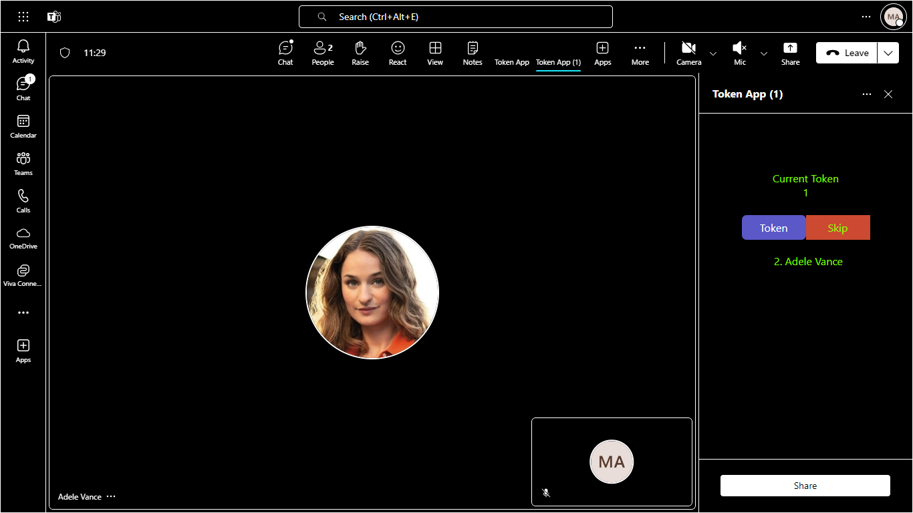

# Meeting Token Generator

The Meeting Token Generator is a sample application designed to extend Microsoft Teams meetings by enabling participants to request interaction tokens. This app utilizes the Live Share SDK for real-time updates and includes features like meeting chat and a side panel for enhanced collaboration. The demo manifest is available for testing in your Microsoft Teams client..

- [Live-share-sdk-overview](https://docs.microsoft.com/microsoftteams/platform/apps-in-teams-meetings/teams-live-share-overview)
- [Build tabs for meeting](https://learn.microsoft.com/microsoftteams/platform/apps-in-teams-meetings/build-tabs-for-meeting?tabs=desktop)

## Included Features
* Meeting Chat
* Meeting Details
* Meeting SidePanel
* Live Share SDK
* RSC Permissions
* Theme Handler

**NOTE: This capability is currently available in developer preview only.**

### Key features
 - Display the current token that is being serviced in the meeting
 - Display the user list sorted by the token number in ascending order
 - Generate a token for the user upon request
 - Display the current user's token number
 - Mark a token as done by the user
 - Skip the current token for the organizer of the meeting

 

 

 

 

## Interaction with app theme

 

 ## Try it yourself - experience the App in your Microsoft Teams client
Please find below demo manifest which is deployed on Microsoft Azure and you can try it yourself by uploading the app package (.zip file link below) to your teams and/or as a personal app. (Uploading must be enabled for your tenant, [see steps here](https://docs.microsoft.com/microsoftteams/platform/concepts/build-and-test/prepare-your-o365-tenant#enable-custom-teams-apps-and-turn-on-custom-app-uploading)).

**Meetings Token App:** [Manifest](/samples/meetings-token-app/csharp/demo-manifest/meetings-token-app.zip)

  
## Prerequisites

### Tools

- [Nodejs](https://nodejs.org/en/download/) version 10.21.0+ (use the LTS version)
  ```bash
  # determine dotnet version
  node --version
  ```
- [dev tunnel](https://learn.microsoft.com/en-us/azure/developer/dev-tunnels/get-started?tabs=windows) or [ngrok](https://ngrok.com/download) (For local environment testing) latest version (any other tunneling software can also be used)

- [dev tunnel](https://learn.microsoft.com/en-us/azure/developer/dev-tunnels/get-started?tabs=windows) or [Ngrok](https://ngrok.com/download) (Only for devbox testing) Latest (any other tunneling software can also be used)

## Run the app (Using Microsoft 365 Agents Toolkit for Visual Studio Code)

The simplest way to run this sample in Teams is to use Microsoft 365 Agents Toolkit for Visual Studio Code.

1. Ensure you have downloaded and installed [Visual Studio Code](https://code.visualstudio.com/docs/setup/setup-overview)
1. Install the [Microsoft 365 Agents Toolkit extension](https://marketplace.visualstudio.com/items?itemName=TeamsDevApp.ms-teams-vscode-extension)
1. Select **File > Open Folder** in VS Code and choose this samples directory from the repo
1. Using the extension, sign in with your Microsoft 365 account where you have permissions to upload custom apps
1. Select **Debug > Start Debugging** or **F5** to run the app in a Teams web client.
1. In the browser that launches, select the **Add** button to install the app to Teams.

> If you do not have permission to upload custom apps (uploading), Microsoft 365 Agents Toolkit will recommend creating and using a Microsoft 365 Developer Program account - a free program to get your own dev environment sandbox that includes Teams.

### Technologies

We assume working knowledge of the following technologies to gain full understanding of the app
- [React.JS](https://reactjs.org/tutorial/tutorial.html) version 16+ 

The app uses the Teams extensibility features described on the following pages:
- [Apps in Teams meetings](https://docs.microsoft.com/microsoftteams/platform/apps-in-teams-meetings/teams-apps-in-meetings)
- [Create apps for Teams meetings](https://docs.microsoft.com/microsoftteams/platform/apps-in-teams-meetings/create-apps-for-teams-meetings?tabs=json)

**Note**: If you are facing any issue in your app, please uncomment [this](https://github.com/OfficeDev/Microsoft-Teams-Samples/blob/main/samples/meetings-token-app/nodejs/server/api/botController.js#L25) line and put your debugger for local debug.

## Setup

### Step 1: Register Azure AD applications
1. Start an ngrok session as indicated above. Note the ngrok domain, as you will use this in the registration steps below, where it will be the value of `WebAppDomain`.

2) App Registration

### Register your application with Azure AD

1. Register a new application in the [Microsoft Entra ID – App Registrations](https://go.microsoft.com/fwlink/?linkid=2083908) portal.
2. Select **New Registration** and on the *register an application page*, set following values:
    * Set **name** to your app name.
    * Choose the **supported account types** (any account type will work)
    * Leave **Redirect URI** empty.
    * Choose **Register**.
3. On the overview page, copy and save the **Application (client) ID, Directory (tenant) ID**. You'll need those later when updating your Teams application manifest and in the appsettings.json.
4. Navigate to **API Permissions**, and make sure to add the follow permissions:
    * Select Add a permission
    * Select Microsoft Graph -> Delegated permissions.
    * `User.Read` (enabled by default)
    * Click on Add permissions. Please make sure to grant the admin consent for the required permissions.

3. Register your bot with Azure Bot Service, following the instructions [here](https://docs.microsoft.com/azure/bot-service/bot-service-quickstart-registration?view=azure-bot-service-3.0).
- Ensure that you've [enabled the Teams Channel](https://docs.microsoft.com/azure/bot-service/channel-connect-teams?view=azure-bot-service-4.0)
4. Update the Microsoft Entra ID app registration for tab SSO, following the  instructions [here](Wiki/auth-aad-sso.md). The "fully qualified domain name" in the instructions will be your ngrok domain.
5. Set up the .env with the following keys:
    - `"BotId"` : Application (Bot) ID of the bot's Azure AD application
    - `"BotPassword"` : client secret of the bot's Azure AD application
    - `"clientId"` : Application (client) ID of the bot's Azure AD application
    - `"clientSecret"` : client secret of the Azure AD application
    - `"baseUrl"` : Base URI of the Application
> If your Bot and Azure Application are same then the `'BotId'` & `'clientId'` will be same and `'BotPassword'` & `'clientSecret'` will be same 

### Step 3: Add the following entry to the manifest.json ([schema reference](https://docs.microsoft.com/microsoftteams/platform/resources/schema/manifest-schema))
1. Add your bot configuration, with the app id of the bot generated from the previous steps
2. Fill-in the following `webApplicationInfo` section, using `MicrosoftAppId` and `WebAppDomain` values from the previous section.
    ```json
    "webApplicationInfo": {  
      "id": "[MicrosoftAppId]",  
      "resource": "api://[WebAppDomainName]/[MicrosoftAppId]"  
    }
    ```

### Step 4: Run Ngrok or Dev Tunnel
1. The application (client) will run on port 3978
2. Run ngrok - point to port 3978

   ```bash
   ngrok http 3978 --host-header="localhost:3978"
   ```  

   Alternatively, you can also use the `dev tunnels`. Please follow [Create and host a dev tunnel](https://learn.microsoft.com/en-us/azure/developer/dev-tunnels/get-started?tabs=windows) and host the tunnel with anonymous user access command as shown below:

   ```bash
   devtunnel host -p 3978 --allow-anonymous
   ```

### Step 5: Run Client & the Server
You can build and run the project from the command line or an IDE:

1. Navigate to the Project root folder
2. Build Client
    - Open terminal
    - npm run build
3. Run Client
    - Open new terminal
    - npm run client
    - The client will start running on 3978 port
4. Run Server
    - Open new terminal
    - npm run server
    - The server will start running on 3000 port
5. Update the manifest .zip file under appManifest folder
    - npm run manifest
6. Now your application is running and ready to upload

### Step 6: Enable developer preview in your desktop Teams client
Follow [these instructions](https://docs.microsoft.com/microsoftteams/platform/resources/dev-preview/developer-preview-intro#enable-developer-preview) to enable developer preview. Note that Developer preview mode must be enabled on each Teams client app or browser.

Note: Open the meeting chat section and type @MeetingTokenApp Hello (It will send back the required information to you).

> In-meeting tabs are only available in the Teams desktop client. They will not be visible when you run Teams in a web browser.

### Step 7: Upload the app in a Teams desktop client
1. Create a .zip using the below files, which are in the `appManifest` folder.
  - manifest.json
  - icon-outline.png
  - icon-color.png
1. Create a meeting with few test participants, ideally with a mix of Presenters and Attendees.
1. Once meeting is created, go to the meeting details page and click on the "Add tab" (+) button.
1. In the pop-up that opens, click on "Manage apps".
1. Click on "Upload a custom app" and upload the .zip file that was created in the previous steps. This adds the app to the meeting.
1. Click on the "Add tab" button again. Now in the app selection page, the app should be visible as a "Meeting optimized tab".
1. Select the Meeting Token app.
1. Now the app will be visible in the meeting chat.
1. Start the meeting and the icon should be visible in the meeting control bar.

## Running the sample
### User interactions
- **Token** - Requests a token for the user

- **Done** - Acknowledges that the user is done with the token

- **Skip** - Skips the current user and moves on to the next person in line for a token. This button is only shown to users with the meeting Organizer role.


### Interactions with app theme
 

 

 


## Troubleshooting
The sample app uses an in-memory store to maintain token information and the service URL for the tenant. If you restart the project, you must run the following command to recapture the service URL: `@[BotName] reset`

In your own projects, please use a durable storage mechanism to store the service URL for the tenant.

## Deploy to Azure

Deploy your project to Azure by following these steps:

| From Visual Studio Code                                                                                                                                                                                                                                                                                                                                                  | From TeamsFx CLI                                                                                                                                                                                                                    |
| :----------------------------------------------------------------------------------------------------------------------------------------------------------------------------------------------------------------------------------------------------------------------------------------------------------------------------------------------------------------------- | :---------------------------------------------------------------------------------------------------------------------------------------------------------------------------------------------------------------------------------- |
| <ul><li>Open Microsoft 365 Agents Toolkit, and sign into Azure by clicking the `Sign in to Azure` under the `ACCOUNTS` section from sidebar.</li> <li>After you signed in, select a subscription under your account.</li><li>Open the Microsoft 365 Agents Toolkit and click `Provision` from DEPLOYMENT section or open the command palette and select: `Teams: Provision`.</li><li>Open the Microsoft 365 Agents Toolkit and click `Deploy` or open the command palette and select: `Teams: Deploy`.</li></ul> | <ul> <li>Run command `teamsfx account login azure`.</li> <li>Run command `teamsfx provision --env dev`.</li> <li>Run command: `teamsfx deploy --env dev`. </li></ul> |

> Note: Provisioning and deployment may incur charges to your Azure Subscription.

## Further reading

- [Meeting apps APIs](https://learn.microsoft.com/microsoftteams/platform/apps-in-teams-meetings/meeting-apps-apis?tabs=dotnet)
- [Build tabs for meeting](https://learn.microsoft.com/microsoftteams/platform/apps-in-teams-meetings/build-tabs-for-meeting?tabs=desktop)
- [Teams Tabs experience](https://docs.microsoft.com/microsoftteams/platform/tabs/what-are-tabs)
- [Tabs SSO](https://docs.microsoft.com/microsoftteams/platform/tabs/how-to/authentication/auth-aad-sso)
- [Azure Bot Service Introduction](https://docs.microsoft.com/azure/bot-service/bot-service-overview-introduction?view=azure-bot-service-4.0)
- [Azure Bot Service Documentation](https://docs.microsoft.com/azure/bot-service/?view=azure-bot-service-4.0)
- [Azure Portal](https://portal.azure.com)
- [Handle theme change](https://learn.microsoft.com/en-us/microsoftteams/platform/tabs/how-to/access-teams-context?tabs=Json-v2%2Cteamsjs-v2%2Cdefault#handle-theme-change)

# Contributing

This project welcomes contributions and suggestions.  Most contributions require you to agree to a
Contributor License Agreement (CLA) declaring that you have the right to, and actually do, grant us
the rights to use your contribution. For details, visit https://cla.opensource.microsoft.com.

When you submit a pull request, a CLA bot will automatically determine whether you need to provide
a CLA and decorate the PR appropriately (e.g., status check, comment). Simply follow the instructions
provided by the bot. You will only need to do this once across all repos using our CLA.

This project has adopted the [Microsoft Open Source Code of Conduct](https://opensource.microsoft.com/codeofconduct/).
For more information see the [Code of Conduct FAQ](https://opensource.microsoft.com/codeofconduct/faq/) or
contact [opencode@microsoft.com](mailto:opencode@microsoft.com) with any additional questions or comments.


