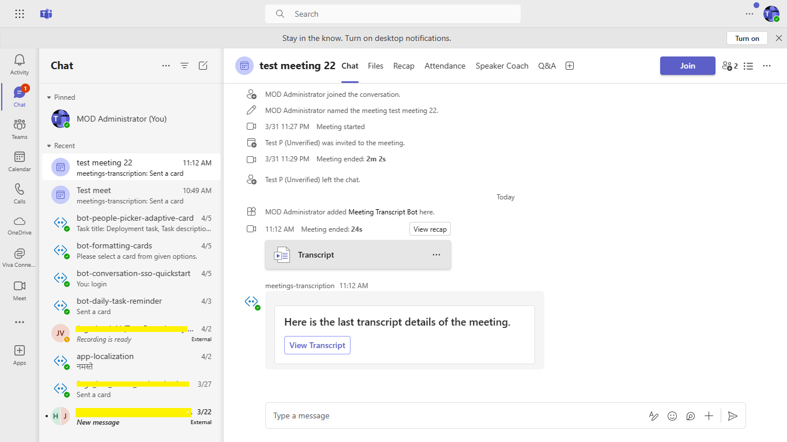
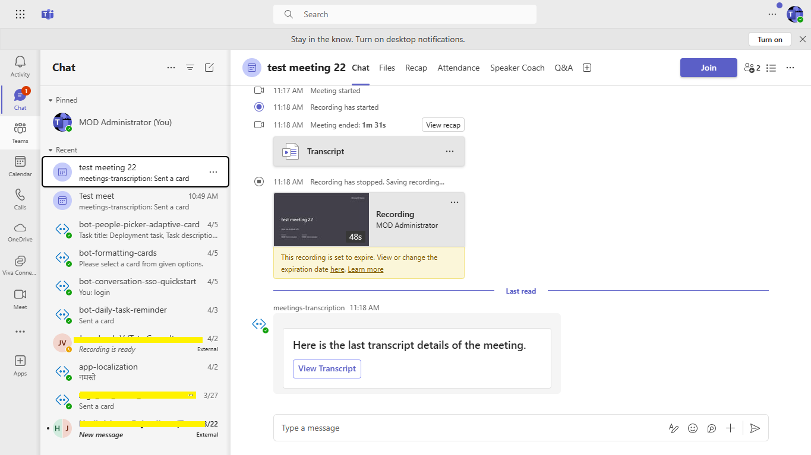
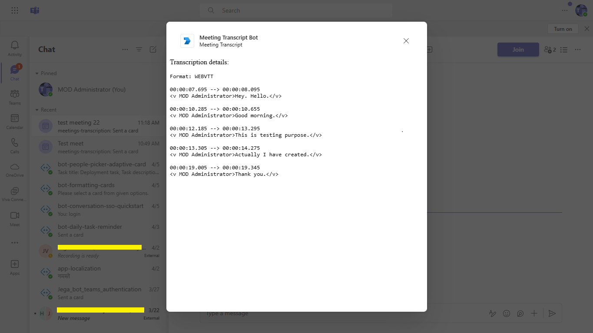

# Bot to show the transcript of the meeting using Microsoft Graph API.

The Meeting Transcript Bot uses Microsoft Graph API to fetch and present meeting transcripts within a Teams task module. It features adaptive cards and bot interactions for seamless user engagement during meetings.

## Included Features
* Bots
* Adaptive Cards
* Task Modules
* RSC Permissions

## Interaction with app


## Try it yourself - experience the App in your Microsoft Teams client
Please find below demo manifest which is deployed on Microsoft Azure and you can try it yourself by uploading the app manifest (.zip file link below) to your teams and/or as a personal app. (Sideloading must be enabled for your tenant, [see steps here](https://docs.microsoft.com/microsoftteams/platform/concepts/build-and-test/prepare-your-o365-tenant#enable-custom-teams-apps-and-turn-on-custom-app-uploading)).

**Meeting Transcript Bot uses Microsoft Graph API:** [Manifest](/samples/meetings-transcription/csharp/demo-manifest/meetings-transcription.zip)

## Prerequisites

- [.NET Core SDK](https://dotnet.microsoft.com/download) version 6.0

  ```bash
  # determine dotnet version
  dotnet --version
  ```
- Publicly addressable https url or tunnel such as [dev tunnel](https://learn.microsoft.com/en-us/azure/developer/dev-tunnels/get-started?tabs=windows) or [ngrok](https://ngrok.com/) latest version or [Tunnel Relay](https://github.com/OfficeDev/microsoft-teams-tunnelrelay) 

-  [Microsoft 365 Agents Toolkit for Visual Studio](https://learn.microsoft.com/en-us/microsoftteams/platform/toolkit/toolkit-v4/install-teams-toolkit-vs?pivots=visual-studio-v17-7)

## Run the app (Using Microsoft 365 Agents Toolkit for Visual Studio)

The simplest way to run this sample in Teams is to use Microsoft 365 Agents Toolkit for Visual Studio.
1. Install Visual Studio 2022 **Version 17.14 or higher** [Visual Studio](https://visualstudio.microsoft.com/downloads/)
1. Install Microsoft 365 Agents Toolkit for Visual Studio [Microsoft 365 Agents Toolkit extension](https://learn.microsoft.com/en-us/microsoftteams/platform/toolkit/toolkit-v4/install-teams-toolkit-vs?pivots=visual-studio-v17-7)
1. In the debug dropdown menu of Visual Studio, select Dev Tunnels > Create A Tunnel (set authentication type to Public) or select an existing public dev tunnel.
1. Right-click the 'M365Agent' project in Solution Explorer and select **Microsoft 365 Agents Toolkit > Select Microsoft 365 Account**
1. Sign in to Microsoft 365 Agents Toolkit with a **Microsoft 365 work or school account**
1. Set `Startup Item` as `Microsoft Teams (browser)`.
1. Press F5, or select Debug > Start Debugging menu in Visual Studio to start your app
    </br>
1. In the opened web browser, select Add button to install the app in Teams
> If you do not have permission to upload custom apps (uploading), Microsoft 365 Agents Toolkit will recommend creating and using a Microsoft 365 Developer Program account - a free program to get your own dev environment sandbox that includes Teams.

## Setup

**NOTE: The feature is only available only be used from the desktop app*

1. Register a new application in the [Microsoft Entra ID – App Registrations](https://go.microsoft.com/fwlink/?linkid=2083908) portal.
    
  -  Register one Azure AD application in your tenant's directory: for the bot and tab app authentication.

  -  Log in to the Azure portal from your subscription, and go to the "App registrations" blade  [here](https://portal.azure.com/#blade/Microsoft_AAD_IAM/ActiveDirectoryMenuBlade/RegisteredApps). Ensure that you use a tenant where admin consent for API permissions can be provided.

 -  Click on "New registration", and create an Azure AD application.

 -  **Name:**  The name of your Teams app - if you are following the template for a default deployment, we recommend "App catalog lifecycle".

 -  **Supported account types:**  Select "Accounts in any organizational directory"

 -  Leave the "Redirect URL" field blank.   

 - Click on the "Register" button.

 - When the app is registered, you'll be taken to the app's "Overview" page. Copy the  **Application (client) ID**; we will need it later. Verify that the "Supported account types" is set to  **Multiple organizations**.

 - Navigate to **API Permissions**, and make sure to add the follow permissions:
    * Select Add a permission
    * Select Microsoft Graph -> Delegated permissions.
    * `User.Read` (enabled by default)
    * Click on Add permissions. Please make sure to grant the admin consent for the required permissions.


 -  On the side rail in the Manage section, navigate to the "Certificates & secrets" section. In the Client secrets section, click on "+ New client secret". Add a description for the secret and select Expires as "Never". Click "Add".

 -  Once the client secret is created, copy its  **Value**, please take a note of the secret as it will be required later.


 - At this point you have 3 unique values:
 -   Application (client) ID which will be later used during Azure bot creation
 -   Client secret for the bot which will be later used during Azure bot creation
 - Directory (tenant) ID
       We recommend that you copy these values into a text file, using an application like Notepad. We will need these values later.

  -  Under left menu, navigate to  **API Permissions**, and make sure to add the following permissions of Microsoft Graph API > Application permissions:
     -  OnlineMeetings.Read.All
     -  OnlineMeetingTranscript.Read.All

       Click on Add Permissions to commit your changes.

   - If you are logged in as the Global Administrator, click on the Grant admin consent for %tenant-name% button to grant admin consent else, inform your admin to do the same through the portal or follow the steps provided here to create a link and send it to your admin for consent.

 - Global Administrator can grant consent using following link:  [https://login.microsoftonline.com/common/adminconsent?client_id=](https://login.microsoftonline.com/common/adminconsent?client_id=)<%appId%> 
    
2. Setup for Bot
- Register a bot with Azure Bot Service, following the instructions [here](https://docs.microsoft.com/en-us/azure/bot-service/bot-service-quickstart-registration?view=azure-bot-service-3.0)

- Ensure that you've [enabled the Teams Channel](https://docs.microsoft.com/en-us/azure/bot-service/channel-connect-teams?view=azure-bot-service-4.0)

- While registering the bot, use `https://<your_tunnel_domain>/api/messages` as the messaging endpoint.
    > NOTE: When you create your bot you will create an App ID and App password - make sure you keep these for later.

3. Setup NGROK

1) Run ngrok - point to port 3978

   ```bash
   ngrok http 3978 --host-header="localhost:3978"
   ```  

   Alternatively, you can also use the `dev tunnels`. Please follow [Create and host a dev tunnel](https://learn.microsoft.com/en-us/azure/developer/dev-tunnels/get-started?tabs=windows) and host the tunnel with anonymous user access command as shown below:

   ```bash
   devtunnel host -p 3978 --allow-anonymous
   ```

- If you are using Ngrok, once started you should see URL  `https://41ed-abcd-e125.ngrok-free.app`. Copy it, this is your baseUrl that will used as endpoint for Azure bot and webhook.

4. Setup for code
- Clone the repository

    ```bash
    git clone https://github.com/OfficeDev/Microsoft-Teams-Samples.git
    ```

-  Update the `appsettings.json` configuration for the bot to use the `MicrosoftAppId` and `MicrosoftAppPassword` and `MicrosoftAppTenantId` and `AppBaseUrl` and `UserId` (Note that the MicrosoftAppId is the AppId created in step 1 , the MicrosoftAppPassword is referred to as the "client secret" in step 1 and you can always create a new client secret anytime., MicrosoftAppTenantId is reffered to as Directory tenant Id in step 1, AppBaseUrl is the URL that you get in step 3 after running the tunnel, UserId of the user used while granting the policy in step 5). 

- Run the bot from a terminal or from Visual Studio:
  A) From a terminal, navigate to `MeetingTranscription`

  ```bash
  # run the bot
  dotnet run
  ```

  B) Or from Visual Studio

  - Launch Visual Studio
  - File -> Open -> Project/Solution
  - Navigate to `samples/meetings-transcription/csharp` folder
  - Select `MeetingTranscription.csproj` file
  - Press `F5` to run the project

**NOTE: If you are not getting option to start transcript. Make sure it is enabled from [Teams Admin center](https://admin.teams.microsoft.com). Under `Meetings -> Meeting Policies -> Applied policy(Default is Global)-> Recording & Transcription -> Transcription`**

**NOTE: The feature is only available only be used from the desktop app*


5. Allow applications to access online meetings on behalf of a user

- Follow this link- [Configure application access policy](https://docs.microsoft.com/en-us/graph/cloud-communication-online-meeting-application-access-policy)

- **Note**: Copy the User Id you used to granting the policy. You need while configuring the appsettings.json file.


# RSC Enable Configuration  

To enable **Resource Specific Consent (RSC)**, please update the following configuration files:  

---

## 1. Update App Manifest Schema  

In your `manifest.json`, update the schema version:  

```json
"$schema": "https://developer.microsoft.com/json-schemas/teams/v1.23/MicrosoftTeams.schema.json",
"manifestVersion": "1.23",
```

## Add Authorization Permissions  

Add the following permissions inside the **authorization** section of your `manifest.json`:  

```json
"authorization": {
  "permissions": {
    "resourceSpecific": [
      {
        "name": "OnlineMeeting.ReadBasic.Chat",
        "type": "Application"
      },
      {
        "name": "OnlineMeetingTranscript.Read.Chat",
        "type": "Application"
      }
    ]
  }
}
```
## Update `m365agents.local.yml`  

- In the file `m365agents.local.yml`:  

- **Comment out** the section for `aad.manifest.json` (lines **52–55**).  
- **Comment out** the section for validating `appPackage` (lines **57–61**).


6. Setup Manifest for Teams
- __*This step is specific to Teams.*__
    - **Edit** the `manifest.json` contained in the ./appPackage folder to replace your Microsoft App Id (that was created when you registered your app registration earlier) *everywhere* you see the place holder string `{{Microsoft-App-Id}}` (depending on the scenario the Microsoft App Id may occur multiple times in the `manifest.json`)
    - **Edit** the `manifest.json` for `validDomains` and replace `{{domain-name}}` with base Url of your domain. E.g. if you are using ngrok it would be `https://1234.ngrok-free.app` then your domain-name will be `1234.ngrok-free.app` and if you are using dev tunnels then your domain will be like: `12345.devtunnels.ms`.
    - **Zip** up the contents of the `appPackage` folder to create a `manifest.zip` (Make sure that zip file does not contains any subfolder otherwise you will get error while uploading your .zip package)

- Upload the manifest.zip to Teams (in the Apps view click "Upload a custom app")
   - Go to Microsoft Teams. From the lower left corner, select Apps
   - From the lower left corner, choose Upload a custom App
   - Go to your project directory, the ./appPackage folder, select the zip folder, and choose Open.
   - Select Add in the pop-up dialog box. Your app is uploaded to Teams.

**Note**: If you are facing any issue in your app, please uncomment [this](https://github.com/OfficeDev/Microsoft-Teams-Samples/blob/main/samples/meetings-transcription/csharp/MeetingTranscription/AdapterWithErrorHandler.cs#L23) line and put your debugger for local debug.

## Running the sample.

1. Schedule the meeting and add Meeting Transcript Bot from `Apps` section in that particular scheduled meeting.




2. Once meeting started, start the Transcript for the meeting.


3. Once the transcription has started, you can see the live transcription it the meeting UI.


4. Once the Meeting ended, Meeting Transcript Bot will sent a card having a button to open task module.


5. After clicking on `View Transcript` button, you will see the recorded Transcript in the opened Task Module.


## Interacting with the bot.
- After uploading the manifest add the bot into meeting.
- Join meeting and `Start Transcript`
- Once done, leave the meeting.
- You will get the card to open task module and see the transcript created.

## Deploy the bot to Azure
To learn more about deploying a bot to Azure, see [Deploy your bot to Azure](https://aka.ms/azuredeployment) for a complete list of deployment instructions.

## Further reading
- [List Meeting Attendance Reports](https://docs.microsoft.com/en-us/graph/api/meetingattendancereport-list?view=graph-rest-1.0&tabs=http)
- [List Attendance Records](https://docs.microsoft.com/en-us/graph/api/attendancerecord-list?view=graph-rest-1.0&tabs=http)
- [Configure application access policy](https://docs.microsoft.com/en-us/graph/cloud-communication-online-meeting-application-access-policy)
- [Bot Framework Documentation](https://docs.botframework.com)
- [Bot Basics](https://docs.microsoft.com/azure/bot-service/bot-builder-basics?view=azure-bot-service-4.0)
- [Azure Portal](https://portal.azure.com)
- [Add Authentication to Your Bot Via Azure Bot Service](https://docs.microsoft.com/en-us/azure/bot-service/bot-builder-authentication?view=azure-bot-service-4.0&tabs=csharp)
- [Activity processing](https://docs.microsoft.com/en-us/azure/bot-service/bot-builder-concept-activity-processing?view=azure-bot-service-4.0)
- [Azure Bot Service Introduction](https://docs.microsoft.com/azure/bot-service/bot-service-overview-introduction?view=azure-bot-service-4.0)
- [Azure Bot Service Documentation](https://docs.microsoft.com/azure/bot-service/?view=azure-bot-service-4.0)
- [.NET Core CLI tools](https://docs.microsoft.com/en-us/dotnet/core/tools/?tabs=netcore2x)
- [Azure CLI](https://docs.microsoft.com/cli/azure/?view=azure-cli-latest)
- [Azure Portal](https://portal.azure.com)
- [Language Understanding using LUIS](https://docs.microsoft.com/en-us/azure/cognitive-services/luis/)
- [Channels and Bot Connector Service](https://docs.microsoft.com/en-us/azure/bot-service/bot-concepts?view=azure-bot-service-4.0)
- [Microsoft Teams Developer Platform](https://docs.microsoft.com/en-us/microsoftteams/platform/)


